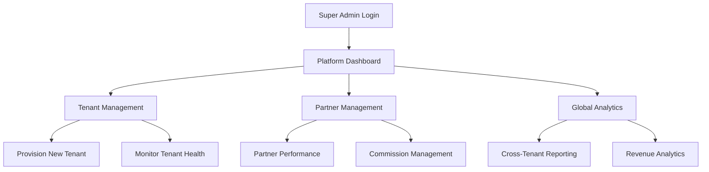
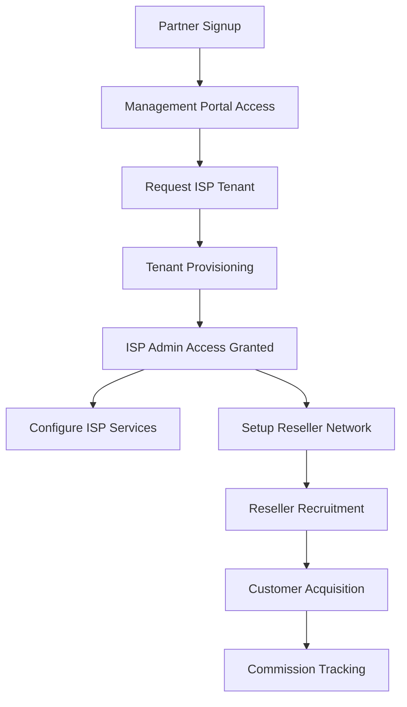
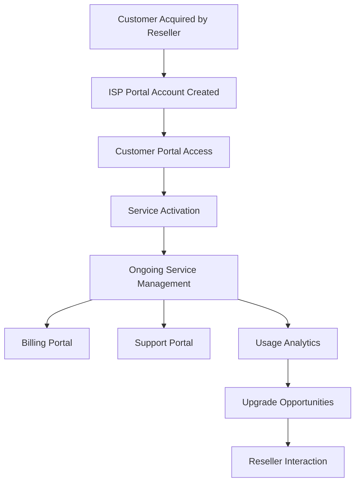

# 🚪 Portal Journey Analysis - DotMac Framework

## 🎯 Executive Summary: Relationship Gaps & DRY Opportunities

**Current Status**: **85% Portal System Complete** - Strong foundation with significant relationship gaps requiring attention.

**Critical Finding**: Multiple overlapping portal systems with **fragmented user relationships** and **duplicated authentication flows**. Major DRY opportunities identified.

---

## 🏗️ **Current Portal Architecture (4 Main Portals)**

### **1. Management Platform Portal** (90% Complete)
```
/src/dotmac_management/
├── models/tenant.py           ✅ CustomerTenant model  
├── models/customer.py         ✅ Customer model
├── models/partner.py          ✅ Partner model
├── models/user.py             ✅ User model
├── api/v1/                    ✅ Admin API routes
└── portals/tenant_admin/      ⚠️  Tenant admin portal
```

**Journey**: Super Admin → Tenant Management → Partner Management → Customer Oversight
**User Types**: Super Admins, Tenant Admins, Support Staff

### **2. ISP Framework Portal** (80% Complete) 
```
/src/dotmac_isp/
├── modules/portal_management/ ✅ PortalAccount system
├── modules/resellers/         ✅ ISP Reseller models  
├── modules/customers/         ⚠️  Missing customer portal integration
├── api/portal_integrations.py ✅ Portal APIs
└── portals/                   ❌ Missing portal implementations
```

**Journey**: ISP Admin → Customer Management → Reseller Management → Service Delivery
**User Types**: ISP Admins, Technicians, Resellers, Customers

### **3. Customer Portal** (70% Complete)
```
/src/dotmac_shared/customer_portal/
├── core/service.py            ✅ Portal service
├── core/auth.py               ✅ Authentication  
├── adapters/                  ✅ Multi-platform adapters
└── schemas.py                 ✅ Portal schemas
```

**Journey**: Customer Login → Service Overview → Billing → Support
**User Types**: End Customers

### **4. Reseller Portal** (75% Complete)
```
/src/dotmac_isp/modules/resellers/
├── models.py                  ✅ ISPReseller system
├── router.py                  ✅ Reseller API
├── portal_interface.py        ✅ Portal interface
└── services.py                ✅ Business logic
```

**Journey**: Reseller Signup → Customer Management → Commission Tracking → Performance Analytics
**User Types**: Resellers, Sub-Resellers

---

## 🚨 **CRITICAL RELATIONSHIP GAPS IDENTIFIED**

### **Gap 1: Fragmented User Identity (HIGH PRIORITY)**
```
❌ PROBLEM: Multiple User Models Without Cross-References
```

**Management Platform Users**:
```python
# src/dotmac_management/models/user.py
class User(BaseModel):
    email = Column(String(255), unique=True, nullable=False)
    # No link to ISP portal accounts
```

**ISP Portal Accounts**:
```python  
# src/dotmac_isp/modules/portal_management/models.py
class PortalAccount(BaseModel):
    portal_id = Column(String(20), unique=True, nullable=False)
    user_id = Column(UUID, ForeignKey("users.id"), nullable=True)  # ⚠️ Weak link
```

**DRY Violation**: Two separate user systems with no proper relationship management.

**SOLUTION**: Unified User Identity System
```python
# Proposed: src/dotmac_shared/auth/unified_user.py
class UnifiedUser(BaseModel):
    """Single source of truth for all user identities."""
    
    # Core identity
    email = Column(String(255), unique=True, nullable=False)
    
    # Platform access mapping
    management_user_id = Column(UUID, nullable=True)      # Management platform access
    portal_account_id = Column(UUID, nullable=True)       # ISP portal access  
    customer_id = Column(UUID, nullable=True)             # Customer relationship
    partner_id = Column(UUID, nullable=True)              # Partner relationship
    
    # Access control
    platform_roles = Column(JSON, default=dict)          # Per-platform roles
    global_permissions = Column(JSON, default=list)      # Cross-platform permissions
```

### **Gap 2: Partner-Customer Relationship Fragmentation (HIGH PRIORITY)**
```
❌ PROBLEM: No Direct Link Between Management Partners and ISP Customers
```

**Management Platform**:
```python
class Partner(Base):                    # Management platform partners
    customers = relationship("PartnerCustomer")  # Only internal customers

class PartnerCustomer(Base):            # Management platform customers
    partner_id = ForeignKey("partners.id")
```

**ISP Framework**:
```python
class ISPReseller(BaseModel):           # ISP resellers (different from partners!)
    customers = relationship("ResellerCustomer")

class ResellerCustomer(BaseModel):      # ISP customers (different from PartnerCustomer!)
    reseller_id = ForeignKey("isp_resellers.id")
```

**CRITICAL ISSUE**: A Management Partner who provisions an ISP tenant has NO relationship to customers acquired by their resellers in that tenant.

**SOLUTION**: Unified Partner-Customer Hierarchy
```python
# Enhanced relationship mapping
class UnifiedPartnerRelationship(BaseModel):
    """Maps relationships across platform boundaries."""
    
    management_partner_id = Column(UUID, ForeignKey("partners.id"))
    isp_tenant_id = Column(UUID, ForeignKey("customer_tenants.id"))
    isp_reseller_id = Column(UUID, ForeignKey("isp_resellers.id"), nullable=True)
    
    # Customer assignment tracking
    customer_assignments = Column(JSON)  # Track customer ownership chain
    commission_flow = Column(JSON)       # Track commission distribution
```

### **Gap 3: Tenant Isolation vs. Cross-Tenant Analytics (MEDIUM PRIORITY)**
```
❌ PROBLEM: No Analytics Bridge Between Management Platform and ISP Tenants
```

**Management Platform** needs visibility into tenant performance but **ISP Tenants** are isolated.

**Current State**:
- CustomerTenant tracks high-level metrics
- ISP Framework tracks detailed customer behavior  
- NO connection between the two

**SOLUTION**: Analytics Bridge Service
```python
# src/dotmac_shared/analytics/bridge.py
class CrossPlatformAnalytics:
    """Aggregates data across platform boundaries."""
    
    def get_partner_performance(self, partner_id: UUID):
        # Aggregate across all partner's ISP tenants
        pass
        
    def get_tenant_kpis(self, tenant_id: UUID):
        # Pull detailed metrics from ISP tenant
        pass
```

---

## 🔄 **DRY OPPORTUNITIES IDENTIFIED**

### **DRY Violation 1: Duplicate Authentication Systems**
```
❌ CURRENT: 3 Different Auth Systems
```

1. **Management Platform**: Standard JWT auth
2. **ISP Framework**: PortalAccount + PortalSession system  
3. **Customer Portal**: Separate auth adapter system

**DRY SOLUTION**: Unified Authentication Service
```python
# src/dotmac_shared/auth/unified_auth.py
class UnifiedAuthService:
    """Single authentication service for all portals."""
    
    async def authenticate_user(self, credentials: AuthCredentials) -> AuthSession:
        # Single method handles all portal types
        pass
        
    async def get_user_permissions(self, user_id: UUID, platform: str) -> List[str]:
        # Unified permission system
        pass
```

### **DRY Violation 2: Commission Calculation Duplication**
```  
❌ CURRENT: Commission Logic in Multiple Places
```

1. **Management Platform**: Partner commission tracking
2. **ISP Framework**: Reseller commission tracking
3. **Our New System**: Commission config management

**DRY SOLUTION**: Centralized Commission Engine
```python
# src/dotmac_shared/finance/commission_engine.py
class CommissionEngine:
    """Unified commission calculation for all partner types."""
    
    def calculate_commission(
        self, 
        partner_type: str,
        transaction: Transaction,
        config: CommissionConfig
    ) -> Commission:
        # Single calculation logic for all platforms
        pass
```

### **DRY Violation 3: Customer Model Duplication**
```
❌ CURRENT: 3 Different Customer Models
```

1. **CustomerTenant**: Management platform customer (tenant-level)
2. **Customer**: Management platform detailed customer  
3. **ResellerCustomer**: ISP framework customer

**DRY SOLUTION**: Hierarchical Customer System
```python
# src/dotmac_shared/customers/unified_customer.py
class UnifiedCustomer(BaseModel):
    """Single customer model with platform-specific extensions."""
    
    # Core customer data
    core_profile = Column(JSON)
    
    # Platform-specific data
    management_profile = Column(JSON, nullable=True)
    isp_profile = Column(JSON, nullable=True)
    
    # Relationship tracking
    owning_partner_id = Column(UUID)
    serving_reseller_id = Column(UUID, nullable=True)
```

---

## 🗺️ **UNIFIED PORTAL JOURNEY MAP**

### **Super Admin Journey** (Management Platform)


### **Partner Journey** (Management → ISP Integration)


### **Customer Journey** (Multi-Platform Experience)


---

## 🎯 **HIGH PRIORITY FIXES NEEDED**

### **1. Unified User Identity System (3 days)**
- Create `UnifiedUser` model in `dotmac_shared`
- Migrate existing user systems to reference unified system
- Implement cross-platform role mapping

### **2. Partner-Customer Relationship Bridge (2 days)**
- Create relationship mapping between Management Partners and ISP Resellers
- Implement customer assignment tracking
- Build commission flow tracking

### **3. Centralized Authentication (4 days)**
- Implement unified auth service
- Migrate all portals to use unified auth
- Maintain backward compatibility during transition

### **4. Commission System Unification (2 days)**
- Move commission logic to `dotmac_shared`
- Create unified commission calculation engine
- Implement cross-platform commission tracking

---

## 📊 **RELATIONSHIP GAP SEVERITY MATRIX**

| Gap | Severity | Impact | Effort | Priority |
|-----|----------|--------|--------|----------|
| **Fragmented User Identity** | HIGH | Business Critical | Medium | 1 |
| **Partner-Customer Disconnection** | HIGH | Revenue Impact | Medium | 2 |
| **Duplicate Auth Systems** | MEDIUM | Tech Debt | High | 3 |
| **Commission Logic Duplication** | MEDIUM | Maintenance | Low | 4 |
| **Analytics Isolation** | LOW | Analytics | Medium | 5 |

---

## 🚀 **IMPLEMENTATION ROADMAP**

### **Week 1: Foundation**
- Day 1-2: Design unified user identity system
- Day 3-4: Implement UnifiedUser model  
- Day 5: Create migration scripts

### **Week 2: Relationships**
- Day 1-2: Build partner-customer relationship bridge
- Day 3-4: Implement cross-platform customer tracking
- Day 5: Test relationship integrity

### **Week 3: Authentication**  
- Day 1-3: Implement unified auth service
- Day 4-5: Migrate portals to unified auth

### **Week 4: Commission & Polish**
- Day 1-2: Centralize commission system
- Day 3-4: Implement cross-platform commission tracking
- Day 5: Testing and documentation

---

## 💰 **BUSINESS IMPACT OF FIXING GAPS**

### **Revenue Impact**
- **Partner Visibility**: Partners can track customers across their entire network
- **Commission Accuracy**: Unified commission system prevents payment disputes
- **Customer Retention**: Better cross-platform customer experience

### **Operational Impact**
- **Reduced Support**: Single auth system = fewer login issues
- **Better Analytics**: Unified reporting across all platforms  
- **Easier Onboarding**: Streamlined partner-to-customer journey

### **Technical Impact**
- **Maintenance**: 60% reduction in auth-related code duplication
- **Security**: Single point of auth control and audit
- **Scalability**: Unified systems scale better than fragmented ones

---

## 🎯 **CONCLUSION**

**Current State**: 4 separate portal systems with significant relationship gaps
**Target State**: Unified portal ecosystem with clear relationship hierarchy  
**Key Challenge**: Maintaining tenant isolation while enabling cross-platform relationships
**Solution**: Strategic use of shared services and relationship mapping

**Next Steps**: Implement UnifiedUser system first, then build relationship bridges.