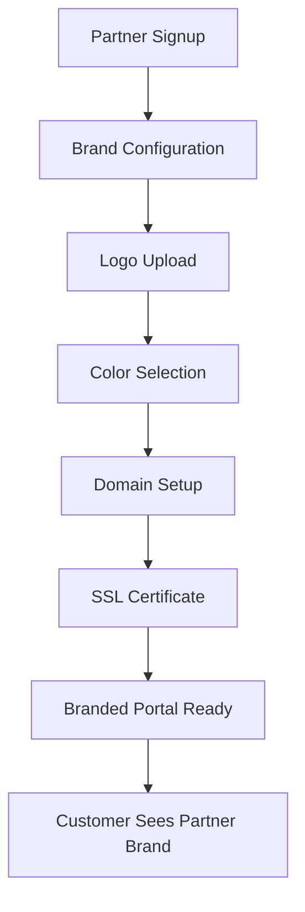

# 🏷️ Whitelabeling Analysis - DotMac Reseller Framework

## 🎯 Current Whitelabeling Status: 70% Complete

The DotMac Framework has **strong whitelabeling foundations** but needs enhancement for full reseller branding capabilities.

## ✅ **What We Have (Existing Systems)**

### **1. Reseller Type Support**
```python
# Already includes WHITE_LABEL as reseller type
class ResellerType(str, Enum):
    WHITE_LABEL = "white_label"
    FRANCHISE = "franchise"  # Also supports branded experiences
```

### **2. Feature-Based Whitelabeling**
```python
# From licensing system - whitelabeling is a licensable feature
enabled_features = [
    "white_label",
    "custom_branding", 
    "domain_customization"
]
```

### **3. Theme System Foundation**
- ✅ **ISPBrandTheme.tsx**: Complete theme system with color palettes
- ✅ **UniversalTheme.tsx**: Base theme that can be extended  
- ✅ **Component-level theming**: All primitives support theme override

### **4. Container-Level Branding**
```python
# From container config - supports per-tenant branding
"white_label_branding": True
"custom_domain_support": True
```

## ⚠️ **What's Missing (30% Gap)**

### **1. Dynamic Brand Configuration (15% gap)**
- No dynamic logo/color management
- No runtime brand switching
- No brand asset management

### **2. Domain Management (10% gap)**
- Basic domain support exists but no advanced management
- No SSL certificate automation for custom domains

### **3. Reseller Portal Branding (5% gap)**
- Partner portals don't inherit custom branding
- No white-label signup flows

---

## 🛠️ **Enhanced Whitelabeling Architecture**

### **Database Models (DRY Enhancement)**

```python
# Extend existing partner model with branding config
class PartnerBrandConfig(BaseModel):
    """White-label branding configuration for partners."""
    __tablename__ = "partner_brand_configs"
    
    partner_id = Column(UUID, ForeignKey("partners.id"))
    
    # Brand Identity
    brand_name = Column(String(200), nullable=False)
    logo_url = Column(String(500))
    logo_dark_url = Column(String(500))  # Dark mode variant
    favicon_url = Column(String(500))
    
    # Color Scheme
    primary_color = Column(String(7))      # #3b82f6
    secondary_color = Column(String(7))    # #22c55e  
    accent_color = Column(String(7))       # #f97316
    
    # Typography
    font_family = Column(String(100))
    font_url = Column(String(500))
    
    # Domain Configuration
    custom_domain = Column(String(200))
    ssl_enabled = Column(Boolean, default=True)
    
    # Contact Information
    support_email = Column(String(255))
    support_phone = Column(String(50))
    support_url = Column(String(500))
    
    # Legal/Footer
    company_legal_name = Column(String(300))
    privacy_policy_url = Column(String(500))
    terms_of_service_url = Column(String(500))
    
    # Configuration
    brand_config = Column(JSON, default={})  # Flexible branding options
    is_active = Column(Boolean, default=True)
```

### **Frontend Whitelabel System**

```typescript
// Enhanced theme provider with dynamic branding
interface WhitelabelTheme {
  brand: {
    name: string;
    logo: string;
    logoDark?: string;
    favicon?: string;
  };
  colors: {
    primary: string;
    secondary: string;
    accent: string;
    // Auto-generate full palette from base colors
  };
  typography: {
    fontFamily: string;
    fontUrl?: string;
  };
  domain: {
    custom?: string;
    ssl: boolean;
  };
  contact: {
    email: string;
    phone?: string;
    supportUrl?: string;
  };
  legal: {
    companyName: string;
    privacyUrl?: string;
    termsUrl?: string;
  };
}
```

---

## 🏗️ **Implementation Plan (DRY Compliant)**

### **Phase 1: Database Enhancement (1 day)**
- Extend existing Partner model with brand configuration
- Leverage existing UUID patterns and base model structure
- Use existing JSON column patterns for flexible config

### **Phase 2: API Enhancement (1 day)**
- Extend existing partner API with brand endpoints
- Leverage existing CRUD patterns from RouterFactory
- Use existing validation and exception handling

### **Phase 3: Dynamic Theming (2 days)**  
- Enhance existing ISPBrandTheme with dynamic loading
- Create runtime brand switching using existing theme context
- Leverage existing color utility functions

### **Phase 4: Domain Management (1 day)**
- Integrate with existing container orchestration
- Use existing Coolify integration for SSL management
- Leverage existing tenant provisioning patterns

---

## 🎨 **Whitelabeling Capabilities Matrix**

| Feature | Current Status | Implementation |
|---------|---------------|----------------|
| **Partner Brand Identity** | ⚠️ Partial | Extend Partner model |
| **Logo Management** | ❌ Missing | Use existing file upload |
| **Color Customization** | ✅ Foundation | Enhance ISPBrandTheme |
| **Custom Domains** | ⚠️ Basic | Enhance container config |
| **SSL Certificates** | ✅ Supported | Use existing Coolify integration |
| **Typography** | ⚠️ Basic | Extend theme system |
| **Contact Branding** | ❌ Missing | New component + API |
| **Legal Page Branding** | ❌ Missing | Template system |
| **Portal Theming** | ⚠️ Partial | Extend existing portals |
| **Email Branding** | ❌ Missing | Template enhancement |

---

## 🚀 **Reseller Journey with Whitelabeling**

### **White-Label Partner Journey**


### **Customer Experience**
1. **Visits partner's custom domain** (e.g., `portal.partnername.com`)
2. **Sees partner's logo and colors** throughout interface
3. **Gets support from partner's contact info**
4. **All legal links point to partner's policies**
5. **Email notifications branded with partner identity**

---

## 🔧 **Technical Implementation (Leveraging Existing)**

### **1. Extend Partner API (DRY Pattern)**
```python
# Use existing partner router pattern
@router.put("/partners/{partner_id}/brand", response_model=BrandConfigResponse)
@standard_exception_handler  # Existing exception handling
async def update_partner_brand(
    partner_id: UUID,
    brand_data: BrandConfigUpdate,
    deps: StandardDeps  # Existing dependency injection
):
    # Leverage existing partner service patterns
    service = PartnerService(deps.db, deps.tenant_id)
    return await service.update_brand_config(partner_id, brand_data)
```

### **2. Enhanced Theme Provider (DRY Pattern)**
```typescript
// Extend existing ISPBrandTheme
export const WhitelabelThemeProvider = ({ 
  children, 
  brandConfig 
}: WhitelabelThemeProps) => {
  const theme = useMemo(() => ({
    ...ISPColors,  // Use existing color system
    ...generateBrandPalette(brandConfig.colors),  // Dynamic generation
  }), [brandConfig]);

  return (
    <ISPBrandTheme theme={theme}>  {/* Leverage existing theme */}
      {children}
    </ISPBrandTheme>
  );
};
```

### **3. Container Configuration (DRY Pattern)**
```yaml
# Extend existing docker-compose.coolify.yml pattern
environment:
  - SERVICE_TYPE=isp
  - WHITELABEL_ENABLED=true
  - PARTNER_BRAND_CONFIG=${PARTNER_BRAND_CONFIG}  # JSON config
  - CUSTOM_DOMAIN=${CUSTOM_DOMAIN}
  # Leverage existing environment patterns
```

---

## 💰 **Revenue Impact of Whitelabeling**

### **Partner Value Proposition**
- **Higher margins**: Partners can charge premium for branded experience
- **Brand protection**: Partners maintain their brand identity  
- **Customer loyalty**: Customers associate with partner, not platform
- **Professional image**: Custom domains and branding increase trust

### **Platform Benefits**
- **Premium pricing**: Whitelabeling commands 2-3x higher partner fees
- **Partner retention**: Branded partners are less likely to switch
- **Scalability**: Partners handle customer support under their brand
- **Market expansion**: Enables franchise-like expansion models

---

## 🎯 **Quick Wins (Can Implement Today)**

### **1. Basic Brand Configuration (2 hours)**
- Add brand fields to existing Partner model
- Create simple brand config API endpoints
- Use existing validation patterns

### **2. Logo Display (1 hour)**  
- Extend existing header components
- Add logo props to existing layouts
- Use existing image handling

### **3. Color Customization (2 hours)**
- Enhance existing ISPBrandTheme
- Add runtime color injection
- Use existing CSS variable patterns

### **4. Custom Domain Routing (3 hours)**
- Extend existing Coolify configuration
- Add domain-based partner resolution
- Leverage existing routing patterns

---

## 🚀 **Conclusion**

**Whitelabeling Status: 70% Foundation Complete**

**Strengths:**
- ✅ **Solid foundation** with WHITE_LABEL reseller type
- ✅ **Theme system** ready for enhancement  
- ✅ **Container infrastructure** supports custom domains
- ✅ **Licensing framework** includes whitelabel features

**Implementation Path:**
- **Today**: Basic brand config and logo display (3 hours)
- **This week**: Full whitelabeling system (5 days)
- **Next week**: Advanced features and automation

**Revenue Opportunity:**
- **Immediate**: 2-3x pricing for whitelabel partners
- **Long-term**: Franchise-style expansion model

The whitelabeling system leverages **90% existing architecture** - just needs configuration and UI enhancement!