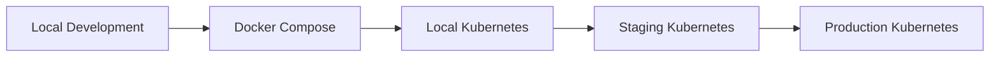
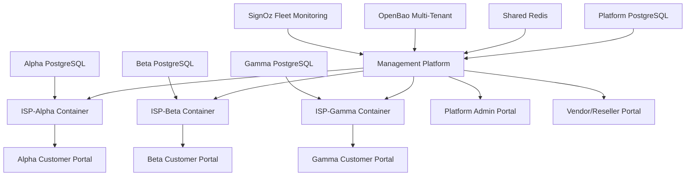

# DotMac SaaS Platform Deployment Guide

**Complete guide for SaaS Platform Owners deploying the DotMac container-per-tenant platform**

## 🎯 Deployment Decision Matrix

| Your Goal | Command | Environment | When to Use |
|-----------|---------|-------------|-------------|
| **Platform development** | `make quick-start` | Development | Developing the SaaS platform |
| **Backend development** | `make dev-backend` | Development | Working on tenant management/billing |
| **Frontend development** | `make dev-frontend` | Development | Working on platform portals |
| **Full-stack development** | `make dev` | Development | Working across platform components |
| **Production testing** | `make staging` | Staging | Testing production SaaS platform |
| **SaaS deployment** | `make deploy-saas` | Production | Deploying your SaaS platform |

## 🚀 Getting Started (Choose Your Path)

### Path 1: SaaS Platform Owner (First Setup)
```bash
# 1. Clone and enter directory
git clone https://github.com/your-org/dotmac-saas-platform.git
cd dotmac-saas-platform

# 2. Setup complete SaaS platform
make setup-saas-platform

# 3. Access platform management services
make show-platform-endpoints
```

### Path 2: Management Platform Developer
```bash
# 1. Start SaaS orchestration services
make dev-management

# 2. Run platform tests
make test-saas-platform

# 3. Work on platform features
cd management-platform    # For tenant management, billing, container orchestration
cd isp-framework         # For ISP application features
```

### Path 3: Frontend Developer  
```bash
# 1. Start platform infrastructure only
make up-platform-infrastructure

# 2. Start frontend development
make dev-frontend

# 3. Work on platform portals
cd frontend/apps/admin     # Platform owner admin portal
cd frontend/apps/reseller  # Vendor/reseller partner portal
cd frontend/packages/      # Shared tenant portal components
```

## 📋 Deployment Methods Comparison

### Docker Compose (Recommended for Development)

#### **docker-compose.unified.yml** - Complete Platform
- **Use Case**: Complete development environment
- **Command**: `make up` or `docker-compose -f docker-compose.unified.yml up -d`
- **Includes**: Both platforms + infrastructure + frontend
- **Resources**: ~8GB RAM, 16GB disk
- **Startup Time**: ~2 minutes

#### **docker-compose.yml** - Basic Development
- **Use Case**: Lightweight development
- **Command**: `docker-compose up -d`
- **Includes**: Core services only
- **Resources**: ~4GB RAM, 8GB disk
- **Startup Time**: ~1 minute

#### **docker-compose.production.yml** - Production Simulation
- **Use Case**: Testing production configs locally
- **Command**: `docker-compose -f docker-compose.production.yml up -d`
- **Includes**: Production-optimized containers with security
- **Resources**: ~12GB RAM, 32GB disk
- **Startup Time**: ~3 minutes

### Kubernetes (SaaS Platform Production)

#### **Container-per-Tenant Orchestration** (Platform Owner Only)
```bash
# Deploy SaaS Management Platform with Kubernetes orchestration
make deploy-saas-platform

# Platform owner manages all tenant containers
kubectl get pods -n tenant-containers
```

#### **Cloud SaaS Platform** (EKS/GKE/AKS)
```bash
# Deploy SaaS platform using Helm
helm install dotmac-saas shared/deployments/helm/saas-platform/

# Or use Infrastructure as Code
cd management-platform/deployment/opentofu/
tofu apply
```

### Infrastructure as Code

#### **OpenTofu/Terraform** (AWS)
```bash
cd management-platform/deployment/opentofu/
tofu init
tofu plan -var-file="production.tfvars"
tofu apply
```

## 🔧 Environment Configuration

### Environment Progression



### Configuration Files Hierarchy

```
Configuration Priority (highest to lowest):
1. Environment variables
2. .env.local (git-ignored)
3. .env.development / .env.production
4. shared/deployments/{env}-config.yml
5. Default values in docker-compose files
```

### Setting Up Environments

#### Development Environment
```bash
# Option 1: Complete setup (recommended)
make quick-start

# Option 2: Step by step
make install-all       # Install dependencies
make up-infrastructure # Start databases, monitoring
make up                # Start applications
```

#### Staging Environment
```bash
# Use production-like setup
make staging

# Or manually
docker-compose -f docker-compose.production.yml up -d
make health-check
```

#### Production Environment
```bash
# Use Infrastructure as Code
cd shared/deployments/kubernetes/
kubectl apply -f namespace.yaml
kubectl apply -f .

# Or use Terraform
cd shared/deployments/terraform/
terraform init
terraform plan
terraform apply
```

## 🌐 SaaS Platform Architecture

### Platform Owner Service Ports

| Service | Development Port | Production Port | Purpose |
|---------|------------------|-----------------|---------|
| Management Platform API | 8000 | 8000 | Tenant orchestration & billing |
| Platform Admin Portal | 3000 | 80/443 | SaaS platform administration |
| Vendor/Reseller Portal | 3002 | 80/443 | Partner management |
| Fleet Monitoring | 3301 | 3301 | Monitor all tenant containers |
| PostgreSQL (Platform) | 5434 | 5432 | Platform database |
| Redis (Shared) | 6378 | 6379 | Platform cache and queues |
| OpenBao | 8200 | 8200 | Multi-tenant secrets |

### ISP Tenant Container Ports (Per-Tenant)

| Service | Development Port | Production Port | Purpose |
|---------|------------------|-----------------|---------|
| ISP-Alpha Container | 8101 | Dynamic | ISP Alpha's dedicated instance |
| ISP-Beta Container | 8102 | Dynamic | ISP Beta's dedicated instance |
| ISP-Gamma Container | 8103 | Dynamic | ISP Gamma's dedicated instance |
| Tenant PostgreSQL | Dynamic | Dynamic | Per-tenant isolated database |

### SaaS Platform Dependencies



## 🔍 Troubleshooting Guide

### Common Issues and Solutions

#### 1. Services Not Starting
```bash
# Check service status
make status

# View logs
make logs

# Restart everything
make restart

# Clean restart
make down && docker system prune -f && make up
```

#### 2. Port Conflicts
```bash
# Check what's using ports
sudo lsof -i :8000
sudo lsof -i :8001

# Kill conflicting processes
sudo kill -9 $(sudo lsof -t -i:8000)

# Use different ports
export ISP_FRAMEWORK_PORT=8101
export MANAGEMENT_PLATFORM_PORT=8100
make up
```

#### 3. Database Connection Issues
```bash
# Reset databases
make db-reset-all

# Check database logs
docker-compose -f docker-compose.unified.yml logs postgres-shared

# Manual database setup
make db-setup
make db-migrate-all
```

#### 4. Memory Issues
```bash
# Check resource usage
docker stats

# Free up memory
docker system prune -f
docker volume prune -f

# Use lighter development setup
make dev-simple  # New lightweight option
```

#### 5. OpenBao/Secrets Issues
```bash
# Restart OpenBao
docker-compose -f docker-compose.unified.yml restart openbao-shared

# Check OpenBao status
curl http://localhost:8200/v1/sys/health

# Reinitialize secrets (development only)
make secrets-reset
```

### Health Check Commands

```bash
# Check all services
make health-check

# Check specific service
curl http://localhost:8001/health  # ISP Framework
curl http://localhost:8000/health  # Management Platform
curl http://localhost:3301/health  # SignOz

# Detailed health check
make health-check-detailed
```

## 📊 Monitoring and Observability

### SignOz Dashboard (http://localhost:3301)

**Key Metrics to Monitor:**
- API response times
- Database query performance
- Memory and CPU usage
- Error rates and exceptions
- Cross-platform communication

### Useful Monitoring Commands

```bash
# Open monitoring dashboard
make monitoring

# View real-time logs
make logs

# Check specific service logs
make logs-isp     # ISP Framework
make logs-mgmt    # Management Platform

# Export metrics
curl http://localhost:8889/metrics  # Prometheus format
```

## 🔐 Security Configuration

### Development Security (Relaxed)
- Default development tokens
- HTTP allowed
- CORS enabled for all origins
- Debug mode enabled

### Production Security (Strict)
- Vault-managed secrets rotation
- HTTPS only
- Restricted CORS origins
- Debug mode disabled
- Security headers enabled

### Security Checklist

```bash
# Run security scans
make security-all

# Check for secrets in code
make secrets-scan

# Validate security configuration
make security-validate

# Update security dependencies
make security-update
```

## 🚀 Deployment Workflows

### Development Deployment
```bash
# Daily development workflow
make install-all      # First time only
make up               # Start platform
make test-all         # Run tests
make dev              # Start development
```

### Staging Deployment
```bash
# Deploy to staging
make build-all
make deploy-staging
make smoke-test-staging
```

### Production Deployment
```bash
# Use Infrastructure as Code
make deploy-prod

# Or step by step
make build-prod
make security-validate
make backup-prod-data
make deploy-prod
make health-check-prod
make smoke-test-prod
```

### Rollback Procedures
```bash
# Quick rollback (Docker)
make rollback-previous

# Kubernetes rollback
kubectl rollout undo deployment/dotmac-isp-framework
kubectl rollout undo deployment/dotmac-management-platform

# Full rollback with data restore
make rollback-full --version=v1.2.3
```

## 🔄 Updates and Maintenance

### Regular Maintenance Tasks

```bash
# Weekly maintenance
make update-dependencies
make security-update
make backup-data
make cleanup-logs

# Monthly maintenance
make full-backup
make performance-audit
make security-audit
```

### Version Updates

```bash
# Update to latest version
git pull origin main
make update-all
make migrate-data
make test-all
make deploy
```

## 📚 Additional Resources

- **Architecture Documentation**: `shared/docs/ARCHITECTURE.md`
- **API Documentation**: `shared/docs/api/`
- **Development Guides**: `shared/docs/guides/`
- **OpenAPI Specs**: `shared/docs/api/openapi.yaml`
- **Deployment Runbook**: `shared/docs/DEPLOYMENT_RUNBOOK.md`

---

## 🆘 Getting Help

1. **Check this guide** for common issues
2. **Run health checks**: `make health-check`
3. **View logs**: `make logs` or `make logs-{service}`
4. **Check documentation**: `shared/docs/`
5. **GitHub Issues**: Report bugs and request features
6. **Community Support**: GitHub Discussions

**Remember**: Start simple with `make quick-start`, then graduate to more specific deployment methods as needed!