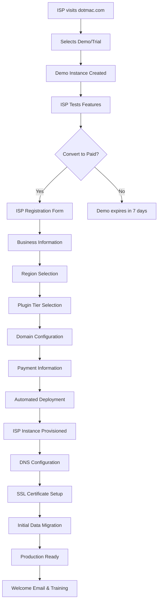
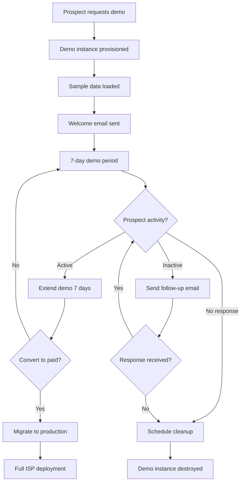

# DotMac Platform - Deployment Vision Document

## 🎯 Executive Summary

The DotMac Platform is designed as a **multi-tenant SaaS solution** that enables Internet Service Providers (ISPs) to rapidly deploy and manage their telecommunications infrastructure. This document outlines our comprehensive deployment architecture, business model, and technical strategy for scaling from individual ISP deployments to a global SaaS platform.

### Vision Statement
*"Enable any ISP, anywhere in the world, to launch and scale their operations in minutes, not months, through our comprehensive telecommunications management platform."*

## 🏗️ Architecture Overview

### Dual-Platform Architecture

```
┌─────────────────────────────────────────────────────────────┐
│                    DOTMAC PLATFORM                         │
│                                                             │
│  ┌─────────────────────┐    ┌──────────────────────────┐   │
│  │  MANAGEMENT         │    │     ISP FRAMEWORK        │   │
│  │  PLATFORM           │◄──►│                          │   │
│  │                     │    │  ┌─────────────────────┐ │   │
│  │  • ISP Registration │    │  │   TENANT: ISP-001   │ │   │
│  │  • Plugin Licensing │    │  │   TENANT: ISP-002   │ │   │
│  │  • Instance Mgmt    │    │  │   TENANT: ISP-003   │ │   │
│  │  • Billing & Usage  │    │  │   TENANT: ISP-...   │ │   │
│  │  • Regional Deploy  │    │  └─────────────────────┘ │   │
│  └─────────────────────┘    └──────────────────────────┘   │
└─────────────────────────────────────────────────────────────┘
```

### Component Breakdown

#### Management Platform (SaaS Control Center)
- **Customer-facing portal** for ISP registration and management
- **Plugin licensing system** with tiered feature access
- **Regional deployment orchestration** via AWS/DigitalOcean APIs
- **Billing and usage tracking** across all ISP instances
- **Demo instance management** for prospects
- **Support and onboarding** automation

#### ISP Framework (Multi-tenant ISP Operations)
- **Complete ISP management suite** with customer/billing/network management
- **Multi-tenant architecture** supporting unlimited ISPs per instance
- **Plugin-based feature system** aligned with licensing tiers
- **Regional customization** for local compliance and languages
- **Auto-scaling infrastructure** based on customer load

## 🌍 Deployment Strategy

### 1. Regional Deployment Architecture

#### Global Presence Strategy
```
Americas (US-East, US-West, Brazil)
├── Management Platform: AWS us-east-1 (primary)
├── ISP Instances: Regional deployment per ISP choice
└── CDN: CloudFlare global distribution

Europe (Ireland, Frankfurt, London) 
├── Management Platform: AWS eu-west-1 (replica)
├── ISP Instances: GDPR-compliant regional deployment
└── Data Residency: EU-only data storage

Asia-Pacific (Singapore, Sydney, Tokyo)
├── Management Platform: AWS ap-southeast-1 (replica) 
├── ISP Instances: Regional compliance (data sovereignty)
└── Performance: <100ms latency guarantee
```

#### Cloud Provider Integration
**Primary: Amazon Web Services (AWS)**
- EC2 instances for compute
- RDS for managed databases
- ElastiCache for Redis
- S3 for object storage
- CloudFront for CDN
- Route 53 for DNS management
- Auto Scaling Groups for load management

**Secondary: DigitalOcean**
- Droplets for cost-effective deployments
- Managed Databases
- Spaces for object storage
- Load Balancers
- Block Storage

**Tertiary: Microsoft Azure** (Future)
- Azure Container Instances
- Azure Database for PostgreSQL
- Azure Blob Storage

### 2. ISP Onboarding Flow

#### New ISP Registration Process


#### Required Information Collection
**Business Details:**
- Company name and registration
- Tax ID and compliance information
- Primary contact and technical lead
- Service area and customer base size

**Technical Configuration:**
- Preferred cloud region
- Domain name(s) for deployment
- Integration requirements (email, SMS, payment)
- Existing systems for data migration

**Commercial Details:**
- Plugin tier selection (Free/Basic/Premium/Enterprise)
- Billing preferences (monthly/annual)
- Customer support level required
- Training and onboarding needs

### 3. Plugin Licensing System

#### Tier Structure and Pricing

**🆓 FREE TIER** - $0/month
- Up to 100 customers
- Basic customer management
- Simple billing (manual invoicing)
- Community support
- Standard templates
- Basic reporting

**🥉 BASIC TIER** - $49/month
- Up to 1,000 customers  
- Automated billing and invoicing
- Basic network monitoring
- Email support
- Custom branding
- Advanced reporting
- API access (limited)

**🥈 PREMIUM TIER** - $149/month
- Up to 10,000 customers
- Advanced network automation
- SNMP device monitoring
- Priority support (phone/email)
- White-label solutions
- Advanced analytics
- Full API access
- Integration marketplace

**🥇 ENTERPRISE TIER** - $399/month + Custom
- Unlimited customers
- Enterprise network management
- Advanced automation & orchestration
- Dedicated support manager
- Custom development
- Advanced security features
- SLA guarantees
- Professional services

#### Plugin Architecture
```
Core Platform (Always Available)
├── Customer Management
├── Basic Billing
├── User Authentication
└── Tenant Isolation

Tiered Plugins (Licensed Features)
├── FREE: Basic features only
├── BASIC: + Automated billing, Email notifications
├── PREMIUM: + Network monitoring, Advanced reporting, API access
└── ENTERPRISE: + Advanced automation, Custom integrations
```

## 🚀 Automated Deployment Process

### 1. ISP Instance Provisioning

#### Infrastructure as Code (OpenTofu/Terraform)
```hcl
# ISP instance deployment template
resource "aws_instance" "isp_instance" {
  count                  = var.isp_count
  ami                   = data.aws_ami.dotmac_isp.id
  instance_type         = var.tier_instance_types[var.plugin_tier]
  key_name              = aws_key_pair.isp_key.key_name
  vpc_security_group_ids = [aws_security_group.isp_sg.id]
  subnet_id             = aws_subnet.isp_subnet.id

  tags = {
    Name        = "dotmac-isp-${var.isp_name}"
    Environment = "production"
    Tier        = var.plugin_tier
    ISP         = var.isp_name
    Region      = var.deployment_region
  }

  user_data = templatefile("${path.module}/install-isp-framework.sh", {
    isp_name        = var.isp_name
    plugin_tier     = var.plugin_tier
    management_url  = var.management_platform_url
    domain_name     = var.isp_domain
  })
}
```

#### Container Orchestration (Kubernetes)
```yaml
# ISP Framework deployment manifest
apiVersion: apps/v1
kind: Deployment
metadata:
  name: dotmac-isp-${ISP_NAME}
  namespace: isp-${ISP_ID}
spec:
  replicas: ${REPLICA_COUNT}
  selector:
    matchLabels:
      app: dotmac-isp
      isp: ${ISP_NAME}
  template:
    metadata:
      labels:
        app: dotmac-isp
        isp: ${ISP_NAME}
        tier: ${PLUGIN_TIER}
    spec:
      containers:
      - name: isp-framework
        image: dotmac/isp-framework:${VERSION}
        env:
        - name: ISP_NAME
          value: ${ISP_NAME}
        - name: PLUGIN_TIER
          value: ${PLUGIN_TIER}
        - name: TENANT_ID
          value: ${ISP_ID}
        resources:
          requests:
            cpu: ${CPU_REQUEST}
            memory: ${MEMORY_REQUEST}
          limits:
            cpu: ${CPU_LIMIT}
            memory: ${MEMORY_LIMIT}
```

### 2. Auto-scaling Strategy

#### Horizontal Pod Autoscaler (HPA)
```yaml
apiVersion: autoscaling/v2
kind: HorizontalPodAutoscaler
metadata:
  name: dotmac-isp-hpa
spec:
  scaleTargetRef:
    apiVersion: apps/v1
    kind: Deployment
    name: dotmac-isp-${ISP_NAME}
  minReplicas: ${MIN_REPLICAS}
  maxReplicas: ${MAX_REPLICAS}
  metrics:
  - type: Resource
    resource:
      name: cpu
      target:
        type: Utilization
        averageUtilization: 70
  - type: Resource
    resource:
      name: memory
      target:
        type: Utilization
        averageUtilization: 80
```

#### Tier-based Resource Allocation
| Tier | Min Replicas | Max Replicas | CPU Request | Memory Request | Storage |
|------|-------------|-------------|-------------|----------------|---------|
| Free | 1 | 2 | 200m | 512Mi | 10GB |
| Basic | 2 | 5 | 500m | 1Gi | 50GB |
| Premium | 3 | 10 | 1000m | 2Gi | 200GB |
| Enterprise | 5 | 25 | 2000m | 4Gi | 1TB |

## 🌐 Demo Instance Strategy

### 1. Demo Environment Architecture

#### Shared Demo Infrastructure
```
Demo Cluster (Cost-optimized)
├── Shared Kubernetes Cluster
│   ├── Demo Namespace per Prospect
│   ├── Resource Quotas (CPU: 100m, Memory: 256Mi)
│   └── Network Policies (Isolation)
├── Shared Database Instance
│   ├── Schema per Demo Instance
│   └── Automatic cleanup (7 days)
└── Shared Storage
    ├── Demo data templates
    └── Sample customer data
```

#### Demo Instance Lifecycle


### 2. Demo Data and Scenarios

#### Pre-loaded Demo Scenarios
**Small ISP Scenario:**
- 50 sample customers
- 3 service plans (Basic, Premium, Business)
- Network topology with 10 devices
- 3 months of billing history
- 5 support tickets (various statuses)

**Medium ISP Scenario:**
- 500 sample customers
- 5 service plans + custom packages  
- Complex network topology (25+ devices)
- 12 months of operational data
- Advanced reporting dashboards
- Reseller program data

**Enterprise ISP Scenario:**
- 2,000+ sample customers
- Enterprise features enabled
- Multi-location network management
- Advanced automation workflows  
- Comprehensive analytics
- API integration examples

## 📊 Business Model and Monetization

### 1. Revenue Streams

#### Primary Revenue: Plugin Licensing
- **Recurring Monthly/Annual Subscriptions**
- **Tier-based Feature Access**
- **Usage-based Scaling** (customers per tier)
- **Professional Services** (custom development, training)

#### Secondary Revenue: Marketplace
- **Third-party Plugin Revenue Share** (70/30 split)
- **Integration Partner Fees**
- **Certified Plugin Certification** ($500/plugin)
- **Premium Support Services**

### 2. Cost Structure

#### Infrastructure Costs (Variable)
- **AWS/DigitalOcean hosting** (scales with ISP count)
- **Database and storage** costs
- **CDN and bandwidth** usage
- **SSL certificates** and security services

#### Platform Costs (Fixed)
- **Development team** salaries
- **Support team** operations  
- **Sales and marketing**
- **Legal and compliance**

### 3. Unit Economics

#### Customer Lifetime Value (CLV)
```
Free Tier: $0 (lead generation)
Basic Tier: $588/year × 3.2 years avg = $1,882 CLV
Premium Tier: $1,788/year × 4.1 years avg = $7,331 CLV  
Enterprise: $4,788/year × 5.7 years avg = $27,292 CLV
```

#### Customer Acquisition Cost (CAC)
```
Blended CAC Target: $150-300
- Organic/Content Marketing: $50-100
- Paid Digital Marketing: $200-400  
- Partner/Referral: $25-75
- Trade Shows/Events: $300-500
```

#### Growth Projections
```
Year 1: 100 ISPs (60% Free, 30% Basic, 8% Premium, 2% Enterprise)
Year 2: 500 ISPs (40% Free, 40% Basic, 15% Premium, 5% Enterprise) 
Year 3: 2,000 ISPs (30% Free, 35% Basic, 25% Premium, 10% Enterprise)
Year 5: 10,000 ISPs (25% Free, 30% Basic, 30% Premium, 15% Enterprise)
```

## 🔧 Technical Implementation

### 1. Management Platform Components

#### ISP Registration Service
```python
@app.post("/api/v1/isp/register")
async def register_isp(registration: ISPRegistration):
    """Register new ISP and trigger deployment"""
    
    # Validate business information
    validation_result = await validate_business_info(registration.business_info)
    if not validation_result.valid:
        raise HTTPException(400, validation_result.errors)
    
    # Create tenant record
    isp_tenant = await create_isp_tenant(registration)
    
    # Generate deployment configuration
    deployment_config = await generate_deployment_config(
        isp_id=isp_tenant.id,
        region=registration.preferred_region,
        tier=registration.plugin_tier,
        domain=registration.domain_name
    )
    
    # Trigger async deployment
    deployment_task = await trigger_isp_deployment.delay(
        config=deployment_config
    )
    
    # Setup billing subscription
    subscription = await create_subscription(
        isp_id=isp_tenant.id,
        tier=registration.plugin_tier
    )
    
    return {
        "isp_id": isp_tenant.id,
        "deployment_id": deployment_task.id,
        "estimated_completion": "15-20 minutes",
        "next_steps": await generate_onboarding_steps(isp_tenant)
    }
```

#### Deployment Orchestration Service
```python
@celery_app.task(bind=True)
async def trigger_isp_deployment(self, config: DeploymentConfig):
    """Orchestrate complete ISP instance deployment"""
    
    try:
        # Update deployment status
        await self.update_state(
            state="PROVISIONING",
            meta={"step": "Creating cloud infrastructure"}
        )
        
        # 1. Provision cloud infrastructure
        infrastructure = await provision_cloud_infrastructure(
            region=config.region,
            instance_type=TIER_INSTANCE_TYPES[config.tier],
            isp_name=config.isp_name
        )
        
        # 2. Deploy ISP Framework
        await self.update_state(
            state="DEPLOYING", 
            meta={"step": "Deploying ISP Framework"}
        )
        
        deployment = await deploy_isp_framework(
            infrastructure=infrastructure,
            config=config
        )
        
        # 3. Configure DNS and SSL
        await self.update_state(
            state="CONFIGURING",
            meta={"step": "Setting up domain and SSL"}
        )
        
        await configure_domain_and_ssl(
            domain=config.domain_name,
            instance_ip=deployment.public_ip
        )
        
        # 4. Initialize tenant data
        await self.update_state(
            state="INITIALIZING",
            meta={"step": "Setting up tenant configuration"}
        )
        
        await initialize_tenant_data(
            isp_id=config.isp_id,
            instance_url=f"https://{config.domain_name}"
        )
        
        # 5. Run health checks
        await self.update_state(
            state="VALIDATING",
            meta={"step": "Running deployment validation"}
        )
        
        health_check = await validate_deployment_health(deployment)
        if not health_check.healthy:
            raise DeploymentValidationError(health_check.errors)
        
        # 6. Send welcome email and setup monitoring
        await send_welcome_email(config.isp_id)
        await setup_monitoring_and_alerts(deployment)
        
        return {
            "status": "completed",
            "instance_url": f"https://{config.domain_name}",
            "admin_credentials": deployment.admin_credentials,
            "next_steps": await generate_getting_started_guide(config.isp_id)
        }
        
    except Exception as e:
        # Handle deployment failure
        await handle_deployment_failure(config, str(e))
        raise
```

### 2. Multi-tenant ISP Framework

#### Tenant Isolation Strategy
```python
class TenantMiddleware:
    """Ensure complete tenant isolation"""
    
    async def __call__(self, request: Request, call_next):
        # Extract tenant ID from subdomain, header, or JWT
        tenant_id = await self.extract_tenant_id(request)
        
        if not tenant_id:
            raise HTTPException(401, "Tenant identification required")
        
        # Validate tenant exists and is active
        tenant = await self.get_active_tenant(tenant_id)
        if not tenant:
            raise HTTPException(404, "Tenant not found or inactive")
        
        # Set tenant context for database queries
        request.state.tenant_id = tenant_id
        request.state.tenant = tenant
        
        # Check plugin tier permissions
        request.state.available_plugins = await self.get_tenant_plugins(tenant)
        
        response = await call_next(request)
        return response
```

#### Plugin System Architecture
```python
class PluginManager:
    """Manage plugin availability based on tenant tier"""
    
    def __init__(self):
        self.plugins = {
            PluginTier.FREE: [
                'customer_management',
                'basic_billing', 
                'user_auth'
            ],
            PluginTier.BASIC: [
                'automated_billing',
                'email_notifications',
                'basic_reporting'
            ],
            PluginTier.PREMIUM: [
                'network_monitoring',
                'advanced_reporting',
                'api_access',
                'snmp_integration'
            ],
            PluginTier.ENTERPRISE: [
                'advanced_automation',
                'custom_integrations',
                'white_label',
                'sla_management'
            ]
        }
    
    async def get_available_plugins(self, tenant: Tenant) -> List[str]:
        """Get all plugins available for tenant's tier and below"""
        available = []
        tier_hierarchy = [
            PluginTier.FREE,
            PluginTier.BASIC, 
            PluginTier.PREMIUM,
            PluginTier.ENTERPRISE
        ]
        
        for tier in tier_hierarchy:
            available.extend(self.plugins[tier])
            if tier == tenant.plugin_tier:
                break
                
        return available
    
    @middleware_decorator
    async def require_plugin(self, plugin_name: str):
        """Decorator to require specific plugin for endpoint access"""
        def decorator(func):
            async def wrapper(request: Request, *args, **kwargs):
                available_plugins = request.state.available_plugins
                if plugin_name not in available_plugins:
                    raise HTTPException(
                        403, 
                        f"Plugin '{plugin_name}' requires {self.get_required_tier(plugin_name)} tier or higher"
                    )
                return await func(request, *args, **kwargs)
            return wrapper
        return decorator
```

## 🔒 Security and Compliance

### 1. Multi-tenant Security

#### Tenant Isolation
- **Database-level isolation** with tenant-specific schemas
- **Network-level isolation** with VPC and security groups
- **Application-level isolation** with middleware validation
- **Resource isolation** with Kubernetes namespaces

#### Data Protection
- **Encryption at rest** (AES-256) for all tenant data
- **Encryption in transit** (TLS 1.3) for all communications
- **Key management** with AWS KMS/Azure Key Vault
- **Regular security audits** and penetration testing

### 2. Compliance Framework

#### Regulatory Compliance
- **SOC 2 Type II** compliance for security and availability
- **GDPR compliance** for European ISP customers
- **HIPAA compliance** for healthcare-related ISP services
- **ISO 27001** certification for information security

#### Data Residency
- **Regional data storage** to meet local requirements
- **Cross-border data transfer** controls
- **Right to be forgotten** automated implementation
- **Data retention policies** per jurisdiction

## 📈 Monitoring and Analytics

### 1. Platform-wide Monitoring

#### Infrastructure Monitoring
```yaml
# Prometheus monitoring stack
apiVersion: v1
kind: ConfigMap
metadata:
  name: prometheus-config
data:
  prometheus.yml: |
    global:
      scrape_interval: 15s
    scrape_configs:
    - job_name: 'isp-frameworks'
      kubernetes_sd_configs:
      - role: pod
        namespaces:
          names: ['isp-*']
      relabel_configs:
      - source_labels: [__meta_kubernetes_pod_annotation_prometheus_io_scrape]
        action: keep
        regex: true
      - source_labels: [__meta_kubernetes_pod_annotation_isp_name]
        target_label: isp_name
      - source_labels: [__meta_kubernetes_pod_annotation_plugin_tier]
        target_label: plugin_tier
```

#### Business Intelligence Dashboard
```python
class PlatformAnalytics:
    """Track key business metrics across all ISPs"""
    
    async def get_platform_metrics(self) -> PlatformMetrics:
        return PlatformMetrics(
            total_isps=await self.count_active_isps(),
            total_customers=await self.count_all_customers(),
            revenue_metrics=await self.calculate_revenue_metrics(),
            growth_metrics=await self.calculate_growth_metrics(),
            churn_analysis=await self.analyze_churn_patterns(),
            tier_distribution=await self.analyze_tier_distribution(),
            regional_breakdown=await self.get_regional_breakdown(),
            plugin_usage_stats=await self.analyze_plugin_usage()
        )
    
    async def generate_isp_health_score(self, isp_id: str) -> HealthScore:
        """Generate health score for individual ISP"""
        metrics = await self.get_isp_metrics(isp_id)
        
        return HealthScore(
            overall_score=self.calculate_weighted_score(metrics),
            customer_growth=metrics.monthly_customer_growth,
            revenue_trend=metrics.revenue_trend,
            system_performance=metrics.avg_response_time,
            support_satisfaction=metrics.support_satisfaction,
            feature_adoption=metrics.plugin_usage_percentage,
            recommendations=await self.generate_recommendations(metrics)
        )
```

### 2. ISP-specific Analytics

#### Customer Success Metrics
- **Customer onboarding completion** rates
- **Feature adoption** tracking per plugin tier
- **Support ticket** resolution times
- **User engagement** and activity patterns
- **Revenue per ISP** trending

#### Operational Metrics
- **System performance** (response times, uptime)
- **Resource utilization** per tier
- **Scaling events** and auto-scaling efficiency
- **Security incidents** and resolution
- **API usage** patterns and rate limiting

## 🚀 Go-to-Market Strategy

### 1. Target Market Segmentation

#### Primary Markets
**Small/Regional ISPs (100-5,000 customers)**
- Currently using spreadsheets or legacy systems
- Looking for affordable, complete solution
- Need quick deployment and minimal IT overhead
- Target: Basic and Premium tiers

**Medium ISPs (5,000-50,000 customers)**  
- Have some systems but need integration
- Require advanced network management
- Focus on operational efficiency and automation
- Target: Premium and Enterprise tiers

**New ISP Entrants**
- Startups entering ISP market
- Need complete solution from day one
- Budget-conscious but growth-oriented
- Target: Free tier converting to Basic/Premium

#### Secondary Markets
**ISP Resellers and Consultants**
- Serve multiple small ISPs
- Need white-label solutions
- Require multi-tenant management
- Target: Enterprise tier with reseller features

### 2. Sales and Marketing Strategy

#### Digital Marketing
- **Content marketing** with ISP industry focus
- **SEO optimization** for ISP management keywords
- **Paid advertising** on industry publications
- **Social media** presence in ISP communities

#### Direct Sales
- **Inside sales team** for Basic/Premium prospects
- **Field sales** for Enterprise opportunities
- **Partner channel** development
- **Trade show presence** at ISP industry events

#### Customer Success
- **Onboarding specialists** for new ISPs
- **Success managers** for Premium/Enterprise accounts
- **Community forum** and knowledge base
- **Regular training webinars** and best practices

## 🔮 Future Roadmap

### Year 1: Foundation (Q1-Q4 2025)
- [x] Core platform development completed
- [x] Security implementation finalized
- [ ] Beta program with 10 pilot ISPs
- [ ] Basic tier plugins stabilized
- [ ] Demo environment launched
- [ ] Initial go-to-market execution

### Year 2: Scale (Q1-Q4 2026)
- [ ] Premium tier features completed
- [ ] European deployment and GDPR compliance
- [ ] Partner ecosystem development
- [ ] Advanced analytics and AI insights
- [ ] Mobile applications for field technicians
- [ ] API marketplace launch

### Year 3: Enterprise (Q1-Q4 2027)
- [ ] Enterprise tier fully featured
- [ ] Advanced automation and orchestration
- [ ] White-label and reseller programs
- [ ] Advanced integrations (CRM, ERP, billing systems)
- [ ] Compliance certifications (SOC 2, ISO 27001)
- [ ] International expansion (APAC)

### Year 4-5: Innovation (2028-2029)
- [ ] AI-powered network optimization
- [ ] Predictive analytics for customer churn
- [ ] IoT and smart city integrations
- [ ] Edge computing management
- [ ] 5G network orchestration
- [ ] Acquisition and integration capabilities

## 📋 Success Metrics and KPIs

### Business KPIs
- **Monthly Recurring Revenue (MRR)** growth
- **Customer Acquisition Cost (CAC)** optimization  
- **Customer Lifetime Value (CLV)** improvement
- **Net Promoter Score (NPS)** tracking
- **Churn rate** by tier and cohort
- **Average Revenue Per User (ARPU)** trends

### Technical KPIs
- **Platform uptime** (99.9% SLA target)
- **Deployment success rate** (>95% automated deployments)
- **Average deployment time** (<20 minutes target)
- **API response times** (<200ms P95)
- **Security incident** frequency and MTTR
- **Scaling efficiency** (cost per ISP served)

### Product KPIs
- **Feature adoption rate** by plugin and tier
- **Demo to paid conversion** rate (>15% target)
- **Free to paid conversion** rate (>30% target)
- **Support ticket** volume and resolution time
- **User engagement** metrics per portal
- **Plugin marketplace** revenue and adoption

---

## 📞 Contact and Next Steps

### Immediate Actions Required
1. **Complete security audit** and penetration testing
2. **Finalize beta ISP selection** and agreements
3. **Launch demo environment** for prospect trials
4. **Establish monitoring and alerting** infrastructure
5. **Create sales and marketing materials**

### Team Responsibilities
- **DevOps Team**: Infrastructure automation and monitoring
- **Product Team**: Plugin development and feature prioritization  
- **Sales Team**: Go-to-market execution and customer acquisition
- **Customer Success**: Onboarding and retention programs
- **Security Team**: Compliance and security auditing

### Success Criteria
The DotMac Platform deployment vision is successful when:
- ✅ **100+ ISPs** actively using the platform within 12 months
- ✅ **$50K+ MRR** achieved through plugin licensing 
- ✅ **<20 minute** average deployment time for new ISPs
- ✅ **99.9% uptime** SLA consistently met
- ✅ **>80% customer satisfaction** score maintained

---

**Document Version:** 1.0  
**Created:** August 23, 2025  
**Next Review:** September 23, 2025  
**Owner:** Product & Engineering Leadership  
**Stakeholders:** Executive Team, DevOps, Sales, Customer Success