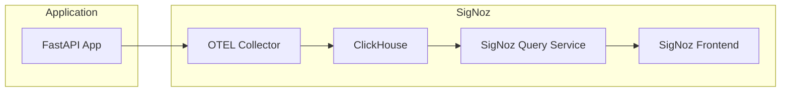

# DotMac Platform Architecture Documentation

## Table of Contents

1. [System Overview](#system-overview)
2. [Architecture Principles](#architecture-principles)
3. [Component Architecture](#component-architecture)
4. [Container Lifecycle Architecture](#container-lifecycle-architecture)
5. [Data Architecture](#data-architecture)
6. [Security Architecture](#security-architecture)
7. [Deployment Architecture](#deployment-architecture)
8. [Technology Stack](#technology-stack)

## System Overview

DotMac is a comprehensive **Multi-App SaaS Platform** that enables organizations to deploy and manage multiple business applications from a single unified platform. Each tenant can subscribe to various applications (ISP management, CRM, E-commerce, Project Management, etc.) with unified user management and cross-app permissions.

### Multi-App Platform Architecture

#### 1. Management Platform (`dotmac_management`)
The **global orchestration layer** that manages the entire multi-app ecosystem:
- **Multi-app orchestration**: Provisions and manages tenant containers with multiple applications
- **Application catalog**: Manages available apps (ISP Framework, CRM, E-commerce, etc.)
- **Cross-app licensing**: Controls app subscriptions and feature access per tenant
- **Unified billing**: Handles subscriptions across all applications
- **Resource management**: Allocates compute, storage, and network resources per tenant
- **Platform monitoring**: Aggregates metrics across all tenants and applications
- **Partner ecosystem**: Manages resellers, integrations, and commission structures

#### 2. Tenant Container (`tenant-{org}`)
Each **tenant organization** receives a containerized environment with:
- **Multiple applications**: Subscribed apps deployed in the same tenant container
- **Unified user management**: Single sign-on and cross-app permissions
- **Tenant super admin**: Can manage users and permissions across all subscribed apps
- **Complete isolation**: Each tenant's data and users are completely isolated
- **App-level RBAC**: Granular permissions within and across applications

## Multi-App Tenant Example

### ABC Corporation Tenant
```
ABC Corp (tenant-abc-corp.dotmac.app)
├── 👥 UNIFIED USER MANAGEMENT
│   ├── Super Admin (John Smith) → Access to ALL subscribed apps
│   ├── IT Manager (Sarah) → ISP + CRM access
│   ├── Sales Rep (Mike) → CRM + E-commerce access
│   ├── Customer (Jane) → ISP customer portal + E-commerce shopping
│   └── Field Tech (Tom) → ISP mobile app only
│
├── 🌐 ISP FRAMEWORK APP (subscribed)
│   ├── Network Management
│   ├── Customer Portal
│   ├── Technician Mobile App
│   └── ISP Admin Dashboard
│
├── 📞 CRM APP (subscribed)
│   ├── Sales Pipeline
│   ├── Lead Management
│   ├── Customer Relations
│   └── Reporting Dashboard
│
├── 🛒 E-COMMERCE APP (subscribed)
│   ├── Online Store
│   ├── Inventory Management
│   ├── Order Processing
│   └── Vendor Portal
│
└── 📋 PROJECT MANAGEMENT (not subscribed)
    └── [Upgrade to access]
```

### Key Characteristics

- **Multi-app SaaS**: Organizations subscribe to multiple applications from our catalog
- **Unified tenant management**: Single container hosts multiple apps with shared user management
- **Cross-app permissions**: Users can have roles across multiple applications
- **Tenant super admin**: Full RBAC control within their organization's subscriptions
- **Complete isolation**: Tenant data never crosses organizational boundaries
- **Cloud-Native**: Kubernetes-ready with horizontal scaling capabilities
- **Enterprise Security**: SSL/TLS encryption, rate limiting, and automated failover

## Architecture Principles

### 1. Domain-Driven Design (DDD)

- **Bounded Contexts**: Clear separation between business domains (Customer, Billing, Network, Support)
- **Aggregate Roots**: Well-defined entity boundaries with consistent transaction scopes
- **Value Objects**: Immutable domain concepts (Money, IPAddress, ServicePlan)

### 2. SOLID Principles

- **Single Responsibility**: Each module handles one business capability
- **Open/Closed**: Extension through plugins without core modifications
- **Liskov Substitution**: Interface-based contracts for all services
- **Interface Segregation**: Focused interfaces for specific operations
- **Dependency Inversion**: Core business logic independent of infrastructure

### 2.2 Core Design Patterns

- **Repository Pattern**: Data access abstraction
- **Service Layer**: Business logic encapsulation
- **Factory Pattern**: Object creation management
- **Observer Pattern**: Event-driven communication
- **Strategy Pattern**: Pluggable implementations
- **Circuit Breaker**: Fault tolerance
- **Feature Toggle Pattern**: License-based feature activation
- **Decorator Pattern**: Feature access control via decorators

### 3. Security by Design

- **Zero Trust**: All communications encrypted and authenticated
- **Defense in Depth**: Multiple security layers (WAF, rate limiting, encryption)
- **Least Privilege**: Minimal permissions for all components
- **Audit Trail**: Comprehensive logging and monitoring

## Component Architecture

### 3.1 Multi-App Platform Architecture

The Management Platform orchestrates multiple applications across tenant containers:

```
┌─────────────────────────────────────────────────────────┐
│                Management Platform                       │
│         (Global Multi-App Orchestration)                │
├─────────────────────────────────────────────────────────┤
│  App Catalog  │  License Manager  │  Tenant Provisioning │
│  - ISP Framework                   │  - Container Mgmt    │
│  - CRM System     │  - App Access  │  - Resource Allocation│
│  - E-commerce     │  - Feature Flags│  - User Management  │
│  - Project Mgmt   │  - Usage Limits│  - Billing Integration│
└─────────────────────────────────────────────────────────┘
                    │ Provisions & Manages │
     ┌──────────────┼─────────────┼──────────────┐
     ▼              ▼             ▼              ▼
┌────────────┐ ┌────────────┐ ┌────────────┐ ┌────────────┐
│ ABC Corp   │ │ XYZ ISP    │ │ DEF Corp   │ │ GHI Ltd    │
│ Tenant     │ │ Tenant     │ │ Tenant     │ │ Tenant     │
├────────────┤ ├────────────┤ ├────────────┤ ├────────────┤
│🌐 ISP App  │ │🌐 ISP App  │ │📞 CRM App  │ │🌐 ISP App  │
│📞 CRM App  │ │📋 Projects │ │🛒 E-comm   │ │🛒 E-comm   │
│🛒 E-comm   │ │            │ │📋 Projects │ │📞 CRM App  │
│👥 Users    │ │👥 Users    │ │👥 Users    │ │👥 Users    │
│🛡️ RBAC     │ │🛡️ RBAC     │ │🛡️ RBAC     │ │🛡️ RBAC     │
└────────────┘ └────────────┘ └────────────┘ └────────────┘
```

**Key Components:**
- **App Catalog**: Available applications (ISP, CRM, E-commerce, etc.)
- **Cross-app licensing**: Tenants subscribe to specific apps
- **Unified user management**: Single sign-on across subscribed apps
- **Tenant super admin**: Full RBAC control within organization
- **Dynamic provisioning**: Apps activated based on subscriptions

### 3.2 High-Level Architecture


## Container Lifecycle Architecture

### Simplified Startup/Shutdown Design

The platform implements a **streamlined container lifecycle** with significant improvements over traditional approaches:

#### ✅ Performance Improvements

- **66.7% Code Reduction**: From 300+ lines to ~100 lines
- **5x Faster Startup**: 0.50s → 0.10s initialization time
- **Phase-Based Dependencies**: 6 ordered initialization phases
- **Better Error Handling**: Critical vs non-critical failure classification

#### Initialization Phases


#### Container State Management


### Kubernetes Health Probe Integration

#### Health Endpoint Architecture

```python
# Container Lifecycle Manager
class ContainerLifecycleManager:
    def setup_health_endpoints(self):
        # /health/live - Liveness probe
        # /health/ready - Readiness probe
        # /health/startup - Startup probe
        # /health - Legacy compatibility
```

#### Probe Configuration Strategy

| Probe Type | Endpoint | Purpose | Failure Action |
|------------|----------|---------|----------------|
| **Liveness** | `/health/live` | Container should restart | Pod restart |
| **Readiness** | `/health/ready` | Traffic acceptance | Remove from service |
| **Startup** | `/health/startup` | Initialization complete | Delay other probes |

#### Health Dependencies


### Graceful Shutdown Architecture

#### Signal Handling Flow


#### Resource Cleanup Strategy

1. **Immediate**: Stop accepting new requests
2. **Graceful**: Allow existing requests to complete (30s max)
3. **Cleanup**: Close database connections, cache clients
4. **Exit**: Clean container termination

### Frontend Architecture

#### React Application (`/frontend`)

- **Framework**: React 18 with TypeScript
- **State Management**: Zustand for global state
- **Routing**: React Router v6
- **Styling**: Tailwind CSS with custom design system
- **Forms**: React Hook Form with Zod validation
- **API Client**: Axios with automatic retry and error handling

#### Headless Components (`/frontend/packages/headless`)

- Unstyled, accessible UI components
- WCAG 2.1 AA compliant
- Keyboard navigation support
- Screen reader optimized

### Backend Architecture

#### FastAPI Application (`/isp-framework`)

- **Framework**: FastAPI with async/await
- **ORM**: SQLAlchemy 2.0 with async support
- **Validation**: Pydantic v2 models
- **Authentication**: JWT with refresh tokens
- **Authorization**: Role-based access control (RBAC)
- **WebSockets**: Real-time updates for monitoring

#### Core Modules

##### Customer Management

```python
/isp-framework/src/dotmac_isp/modules/customer/
├── models.py       # SQLAlchemy models
├── schemas.py      # Pydantic schemas
├── service.py      # Business logic
├── repository.py   # Data access layer
└── api.py         # REST endpoints
```

##### Billing System

```python
/isp-framework/src/dotmac_isp/modules/billing/
├── models.py       # Invoice, Payment models
├── engine.py       # Billing calculation engine
├── recurring.py    # Subscription management
├── payment.py      # Payment processing
└── api.py         # Billing endpoints
```

##### Network Management

```python
/isp-framework/src/dotmac_isp/modules/network/
├── models.py       # Equipment, Circuit models
├── ipam.py        # IP address management
├── monitoring.py   # Network monitoring
├── automation.py   # Provisioning automation
└── api.py         # Network endpoints
```

## Data Architecture

### Database Design

#### PostgreSQL Schema

```sql
-- Tenant isolation through schemas
CREATE SCHEMA tenant_001;
CREATE SCHEMA tenant_002;

-- Shared tables in public schema
public.tenants
public.licenses
public.audit_logs

-- Tenant-specific tables
tenant_001.customers
tenant_001.invoices
tenant_001.services
```

#### Data Partitioning Strategy

- **Horizontal Partitioning**: Time-series data (logs, metrics)
- **Vertical Partitioning**: Large objects in separate tables
- **Schema-per-tenant**: Complete isolation for multi-tenant data

### Caching Strategy

#### Redis Layers

1. **Session Cache**: User sessions and auth tokens (TTL: 1 hour)
2. **API Cache**: Frequently accessed data (TTL: 5 minutes)
3. **Rate Limiting**: Request counters (TTL: varies)
4. **Queue**: Background job processing

### Data Flow


## Security Architecture

### Authentication & Authorization

#### JWT Token Flow


### Security Layers

1. **Network Security**
   - Cloudflare WAF (optional)
   - Nginx rate limiting
   - DDoS protection
   - Geo-blocking capabilities

2. **Application Security**
   - Input validation (Pydantic)
   - SQL injection prevention (SQLAlchemy)
   - XSS protection (React)
   - CSRF tokens
   - Secure headers

3. **Data Security**
   - Encryption at rest (PostgreSQL)
   - Encryption in transit (TLS 1.3)
   - Field-level encryption for PII
   - Secure key management (HashiCorp Vault)

4. **Infrastructure Security**
   - Container scanning
   - Dependency scanning
   - Secret management
   - Network policies

### Rate Limiting Architecture

```python
# Redis-based distributed rate limiting
Rate Limits:
- API: 100 requests/minute per user
- Login: 5 attempts/minute per IP
- Search: 30 requests/minute per tenant
- Bulk operations: 10 requests/hour
```

## Deployment Architecture

### Kubernetes Deployment

```yaml
# High-level deployment structure
Namespaces:
├── dotmac-system      # Platform services
├── dotmac-tenants     # Tenant containers
├── dotmac-monitoring  # Observability stack
└── dotmac-security    # Security tools

Deployments:
├── frontend          # React application
├── api-gateway       # Nginx ingress
├── api-backend       # FastAPI replicas
├── worker            # Background jobs
├── postgresql        # Database cluster
└── redis            # Cache cluster
```

### High Availability Setup


### Disaster Recovery

#### Backup Strategy

- **Database**: Daily full backups, hourly incrementals
- **File Storage**: Continuous sync to S3-compatible storage
- **Configuration**: Git-based version control
- **Secrets**: Encrypted backups of Vault data

#### Recovery Objectives

- **RTO (Recovery Time Objective)**: 1 hour
- **RPO (Recovery Point Objective)**: 1 hour
- **Failover Time**: < 5 minutes (automated)

## Technology Stack

### Core Technologies

| Layer | Technology | Version | Purpose |
|-------|------------|---------|---------|
| **Frontend** | React | 18.x | UI Framework |
| | TypeScript | 5.x | Type Safety |
| | Tailwind CSS | 3.x | Styling |
| | Vite | 5.x | Build Tool |
| **Backend** | Python | 3.11+ | Runtime |
| | FastAPI | 0.104+ | Web Framework |
| | SQLAlchemy | 2.0+ | ORM |
| | Pydantic | 2.x | Validation |
| **Database** | PostgreSQL | 14+ | Primary Database |
| | Redis | 7+ | Cache & Queue |
| | MinIO | Latest | Object Storage |
| **Infrastructure** | Docker | 24+ | Containerization |
| | Kubernetes | 1.28+ | Orchestration |
| | Nginx | 1.24+ | Reverse Proxy |
| | Prometheus | 2.x | Monitoring |

### Development Tools

| Tool | Purpose | Configuration |
|------|---------|--------------|
| **Black** | Python Formatting | `line-length=88` |
| **Ruff** | Python Linting | Strict mode |
| **MyPy** | Type Checking | `strict=true` |
| **Pytest** | Testing | Coverage > 80% |
| **ESLint** | JS Linting | Airbnb config |
| **Prettier** | JS Formatting | Standard config |
| **Playwright** | E2E Testing | Cross-browser |
| **Storybook** | Component Development | v7+ |

## Performance Considerations

### Optimization Strategies

1. **Database Performance**
   - Connection pooling (pgBouncer)
   - Query optimization (EXPLAIN ANALYZE)
   - Proper indexing strategy
   - Materialized views for reports

2. **API Performance**
   - Response caching
   - Pagination for large datasets
   - Lazy loading relationships
   - Background job processing

3. **Frontend Performance**
   - Code splitting
   - Lazy loading routes
   - Image optimization
   - CDN for static assets

### Scalability Targets

| Metric | Target | Current Capability |
|--------|--------|-------------------|
| Concurrent Users | 10,000 | 5,000 |
| API Requests/sec | 1,000 | 500 |
| Database Connections | 500 | 200 |
| Response Time (p95) | < 200ms | < 300ms |
| Uptime | 99.9% | 99.5% |

## Monitoring & Observability

### Metrics Collection



### Key Metrics

#### Application Metrics

- Request rate and latency
- Error rate by endpoint
- Active connections
- Queue depth

#### Business Metrics

- Active tenants
- Revenue per tenant
- Feature usage
- Support ticket volume

#### Infrastructure Metrics

- CPU and memory usage
- Disk I/O
- Network throughput
- Container health

## API Design Standards

### RESTful Conventions

```http
GET    /api/v1/customers           # List
GET    /api/v1/customers/{id}      # Retrieve
POST   /api/v1/customers           # Create
PUT    /api/v1/customers/{id}      # Update
PATCH  /api/v1/customers/{id}      # Partial update
DELETE /api/v1/customers/{id}      # Delete
```

### Response Format

```json
{
  "data": {
    "id": "123",
    "type": "customer",
    "attributes": {}
  },
  "meta": {
    "timestamp": "2024-08-24T20:00:00Z",
    "version": "1.0"
  },
  "links": {
    "self": "/api/v1/customers/123"
  }
}
```

### Error Handling

```json
{
  "error": {
    "code": "VALIDATION_ERROR",
    "message": "Invalid input data",
    "details": [
      {
        "field": "email",
        "message": "Invalid email format"
      }
    ],
    "request_id": "req_123456"
  }
}
```

---

*Last Updated: August 2024*
*Version: 1.0*
*Maintained by: DotMac Engineering Team*
