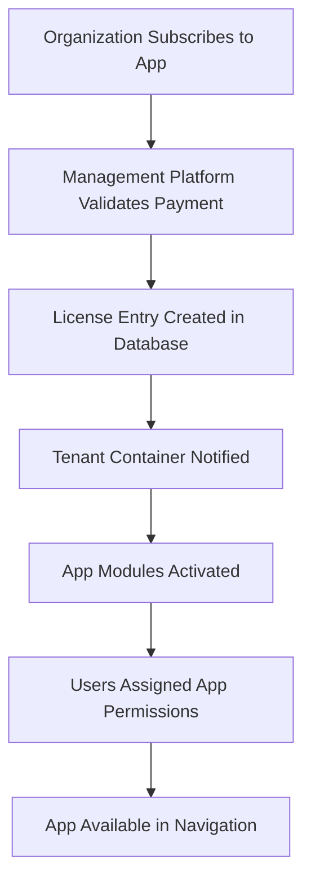

# DotMac Multi-App SaaS Platform Architecture

## Overview

DotMac is a comprehensive **Multi-Application SaaS Platform** that enables organizations to subscribe to and manage multiple business applications from a unified platform. Each tenant organization receives their own containerized environment with unified user management, cross-app permissions, and tenant-level administration.

## Platform Vision

### Traditional SaaS Model
```
Separate platforms for each need:
├── ISP Management System (Vendor A)
├── CRM System (Vendor B) 
├── E-commerce Platform (Vendor C)
├── Project Management (Vendor D)
└── Different users, billing, support for each
```

### DotMac Multi-App Model
```
Single unified platform:
├── 🏢 One Organization Account
├── 👥 Unified User Management
├── 🛡️ Cross-App Permissions
├── 💳 Single Billing & Support
└── 📱 Multiple Apps from Our Catalog
```

## Application Catalog

### Current Applications

#### 🌐 ISP Framework
**Target Audience**: Internet Service Providers
- Network infrastructure management
- Customer portal and billing
- Technician mobile applications
- Service provisioning automation
- Network monitoring and analytics

#### 📞 CRM System
**Target Audience**: Sales organizations
- Lead management and tracking
- Sales pipeline automation
- Customer relationship management
- Sales analytics and reporting
- Email and marketing automation

#### 🛒 E-commerce Platform
**Target Audience**: Online retailers
- Multi-vendor marketplace
- Inventory management
- Order processing and fulfillment
- Customer support portal
- Payment processing integration

#### 📋 Project Management
**Target Audience**: Service companies
- Task and project tracking
- Resource planning and allocation
- Time tracking and billing
- Gantt charts and reporting
- Team collaboration tools

### Planned Applications

#### 📊 Business Intelligence
- Advanced analytics across all apps
- Custom dashboards and reports
- Data warehouse integration
- Predictive analytics and ML

#### 🎓 Learning Management System (LMS)
- Training and certification management
- Course creation and delivery
- Progress tracking and assessment
- Compliance training

#### 📱 Mobile App Builder
- White-label mobile applications
- Push notification management
- Mobile-first customer experiences
- App store deployment assistance

## Tenant Architecture

### Multi-App Tenant Container

Each tenant organization receives a dedicated container with:

```
┌─────────────────────────────────────────────────────────┐
│              ABC Corp Tenant Container                   │
│           (tenant-abc-corp.dotmac.app)                  │
├─────────────────────────────────────────────────────────┤
│                                                         │
│  👥 UNIFIED USER MANAGEMENT SYSTEM                      │
│  ├── Authentication & Authorization                     │
│  ├── Cross-App Single Sign-On (SSO)                    │
│  ├── Role-Based Access Control (RBAC)                  │
│  ├── Tenant Super Admin Interface                       │
│  └── User Lifecycle Management                          │
│                                                         │
│  🌐 ISP FRAMEWORK APP (if subscribed)                   │
│  ├── Network Management Dashboard                       │
│  ├── Customer Portal                                    │
│  ├── Technician Mobile API                             │
│  ├── Service Provisioning                              │
│  └── Network Monitoring                                 │
│                                                         │
│  📞 CRM SYSTEM APP (if subscribed)                      │
│  ├── Sales Dashboard                                    │
│  ├── Lead Management                                    │
│  ├── Customer Relations                                 │
│  ├── Sales Pipeline                                     │
│  └── Reporting Engine                                   │
│                                                         │
│  🛒 E-COMMERCE APP (if subscribed)                      │
│  ├── Storefront Interface                              │
│  ├── Admin Panel                                        │
│  ├── Vendor Portal                                      │
│  ├── Inventory Management                               │
│  └── Order Processing                                   │
│                                                         │
│  📋 PROJECT MANAGEMENT (if subscribed)                  │
│  ├── Project Dashboard                                  │
│  ├── Task Management                                    │
│  ├── Resource Planning                                  │
│  ├── Time Tracking                                      │
│  └── Collaboration Tools                                │
│                                                         │
│  🗄️ TENANT DATABASE                                     │
│  ├── Shared user management tables                      │
│  ├── App-specific data (isolated)                      │
│  ├── Cross-app audit logs                              │
│  └── Unified reporting data                             │
│                                                         │
└─────────────────────────────────────────────────────────┘
```

## User Management & RBAC

### Unified User System

Each tenant has a comprehensive user management system supporting:

#### User Types
```
👤 TENANT SUPER ADMIN
├── Full administrative control over tenant
├── Can manage users across ALL subscribed apps
├── Access to billing and subscription management
├── Tenant-wide configuration and security settings

👤 APP ADMINISTRATORS  
├── Administrative control within specific apps
├── Can manage users for their assigned applications
├── App-specific configuration and settings

👤 CROSS-APP USERS
├── Access to multiple applications with different roles
├── Single profile across all accessible apps
├── Unified login experience

👤 APP-SPECIFIC USERS
├── Access limited to specific applications
├── Role-based permissions within assigned apps
├── Can be customers, employees, vendors, etc.
```

#### Permission Matrix Example

| User | ISP Framework | CRM System | E-commerce | Project Mgmt |
|------|---------------|------------|------------|--------------|
| **Super Admin** | ✅ Full Admin | ✅ Full Admin | ✅ Full Admin | ✅ Full Admin |
| **IT Manager** | ✅ Network Admin | ✅ Account Manager | ❌ No Access | ✅ Project View |
| **Sales Rep** | ✅ Customer View | ✅ Sales Rep | ✅ Customer Service | ❌ No Access |
| **Customer** | ✅ Customer Portal | ❌ No Access | ✅ Shopping Portal | ❌ No Access |
| **Technician** | ✅ Mobile App | ❌ No Access | ❌ No Access | ❌ No Access |

### Tenant Super Admin Capabilities

#### User & Role Management
```typescript
// Super admin can create roles that span multiple apps
const customerSuccessRole = {
  name: "Customer Success Manager",
  description: "Manages customer relationships across ISP and CRM",
  appPermissions: {
    isp_framework: [
      "customers:read",
      "services:read", 
      "support_tickets:write",
      "billing:read"
    ],
    crm: [
      "accounts:write",
      "opportunities:read",
      "reports:read",
      "activities:write"
    ],
    ecommerce: [
      "customer_orders:read",
      "customer_support:write"
    ]
  }
};
```

#### Security & Compliance
- Password policies and MFA requirements
- Session management and timeout settings
- Audit log access for their tenant
- Data export and compliance reporting

#### Integration Management
- API key management for their tenant
- Webhook configuration for cross-app data flow
- Third-party integration settings

## Subscription & Licensing Model

### Flexible Subscription Options

#### Per-App Subscriptions
```
ABC Corp Subscriptions:
├── ISP Framework: $299/month (Professional)
├── CRM System: $149/month (Standard) 
├── E-commerce: $199/month (Professional)
└── Project Management: $99/month (Basic)
Total: $746/month
```

#### Bundle Pricing
```
Business Suite Bundle: $599/month (Save $147)
├── ISP Framework (Professional)
├── CRM System (Standard)
├── E-commerce (Basic)
└── 20% discount applied
```

#### Usage-Based Add-ons
```
Additional Services:
├── Extra storage: $0.10/GB/month
├── Additional API calls: $0.001/call
├── Advanced analytics: $49/month
├── Premium support: $199/month
└── Custom integrations: Quote-based
```

### License Management

#### App Activation Flow


#### Feature Flags per App
```typescript
interface AppLicense {
  appName: string;
  plan: 'basic' | 'standard' | 'professional' | 'enterprise';
  features: {
    // ISP Framework features
    network_monitoring?: boolean;
    advanced_analytics?: boolean;
    api_access?: boolean;
    
    // CRM features
    sales_pipeline?: boolean;
    email_automation?: boolean;
    custom_fields?: boolean;
    
    // E-commerce features
    multi_vendor?: boolean;
    advanced_inventory?: boolean;
    marketplace_features?: boolean;
  };
  usageLimits: {
    users?: number;
    apiCalls?: number;
    storage?: number; // in GB
    transactions?: number;
  };
}
```

## Technical Implementation

### Container Orchestration

#### Kubernetes Deployment
```yaml
apiVersion: apps/v1
kind: Deployment
metadata:
  name: tenant-abc-corp
  namespace: tenants
spec:
  replicas: 2
  selector:
    matchLabels:
      app: dotmac-tenant
      tenant: abc-corp
  template:
    spec:
      containers:
      - name: multi-app-platform
        image: dotmac/platform:latest
        env:
        - name: TENANT_ID
          value: "abc-corp"
        - name: SUBSCRIBED_APPS
          value: "isp,crm,ecommerce"
        - name: LICENSE_CHECK_INTERVAL
          value: "300"
        resources:
          requests:
            memory: "2Gi"
            cpu: "1000m"
          limits:
            memory: "4Gi" 
            cpu: "2000m"
```

### Database Architecture

#### Tenant Schema Structure
```sql
-- Unified user management (shared across all apps)
CREATE SCHEMA tenant_abc_corp;

-- User management tables
tenant_abc_corp.users
tenant_abc_corp.roles
tenant_abc_corp.permissions  
tenant_abc_corp.user_roles
tenant_abc_corp.role_permissions

-- Cross-app audit and activity
tenant_abc_corp.audit_logs
tenant_abc_corp.user_activity
tenant_abc_corp.app_usage_stats

-- App-specific data (isolated)
-- ISP Framework
tenant_abc_corp.isp_customers
tenant_abc_corp.isp_services
tenant_abc_corp.isp_network_devices

-- CRM System  
tenant_abc_corp.crm_leads
tenant_abc_corp.crm_opportunities
tenant_abc_corp.crm_accounts

-- E-commerce
tenant_abc_corp.ecommerce_products
tenant_abc_corp.ecommerce_orders
tenant_abc_corp.ecommerce_customers
```

### API Architecture

#### Unified Authentication
```typescript
// Single authentication endpoint for all apps
POST /api/auth/login
{
  "email": "user@abccorp.com",
  "password": "password",
  "tenant": "abc-corp"
}

Response:
{
  "accessToken": "jwt_token",
  "user": {
    "id": "user_123",
    "name": "John Smith",
    "email": "john@abccorp.com",
    "permissions": {
      "isp_framework": ["network:read", "customers:write"],
      "crm": ["leads:read", "accounts:write"],
      "ecommerce": ["orders:read"]
    }
  },
  "availableApps": [
    {
      "name": "isp_framework",
      "displayName": "ISP Management",
      "url": "/isp",
      "icon": "network"
    },
    {
      "name": "crm",
      "displayName": "CRM System", 
      "url": "/crm",
      "icon": "users"
    }
  ]
}
```

#### Cross-App Data Sharing
```typescript
// Internal API for cross-app data access
// CRM can access ISP customer data for the same tenant
GET /api/internal/cross-app/isp/customers?crm_account_id=123

// E-commerce can access CRM customer data
GET /api/internal/cross-app/crm/customer-profile?ecommerce_customer_id=456
```

## User Experience

### Unified Navigation

#### App Switcher Interface
```
┌─────────────────────────────────────────────┐
│ 🏢 ABC Corp                    👤 John Smith │
├─────────────────────────────────────────────┤
│                                             │
│  🌐 ISP Management        📞 CRM System      │
│     Network Dashboard        Sales Pipeline │
│     Customer Portal          Lead Management│
│                                             │
│  🛒 E-commerce           📋 Projects         │
│     Online Store             [Subscribe]    │
│     Inventory Mgmt                          │
│                                             │
│  ⚙️ Administration      📊 Analytics        │
│     User Management          Cross-App      │
│     Security Settings        Reports        │
│                                             │
└─────────────────────────────────────────────┘
```

#### Cross-App Search
```typescript
// Global search across all subscribed apps
POST /api/search/global
{
  "query": "john smith",
  "apps": ["isp", "crm", "ecommerce"],
  "limit": 20
}

Response:
{
  "results": [
    {
      "app": "isp",
      "type": "customer", 
      "title": "John Smith - Customer #12345",
      "url": "/isp/customers/12345",
      "context": "Network service since 2022"
    },
    {
      "app": "crm",
      "type": "contact",
      "title": "John Smith - ABC Industries", 
      "url": "/crm/contacts/789",
      "context": "Sales opportunity $50K"
    }
  ]
}
```

### Mobile Experience

#### Unified Mobile App
```
DotMac Mobile App Features:
├── Single login for all subscribed apps
├── Push notifications across applications
├── Offline capability with sync
├── App-specific mobile interfaces
├── Cross-app customer lookup
└── Unified settings and profile
```

## Benefits of Multi-App Platform

### For Organizations (Tenants)

#### Operational Benefits
- **Single Vendor Relationship**: One contact for all business applications
- **Unified User Management**: Manage all users from one interface  
- **Cost Savings**: Bundle pricing and shared infrastructure costs
- **Faster Onboarding**: New employees get access to all needed apps instantly
- **Consistent Experience**: Same UI patterns across all applications

#### Technical Benefits  
- **Single Sign-On**: One login for all applications
- **Integrated Data**: Cross-app reporting and analytics
- **Simplified IT**: One platform to secure, backup, and maintain
- **API Integration**: Built-in connections between applications
- **Unified Support**: Single help desk for all issues

### For DotMac (Platform Provider)

#### Business Benefits
- **Higher Customer Value**: Increased revenue per customer
- **Lower Churn**: Harder to leave when using multiple apps
- **Cross-Selling**: Easy to add new applications to existing tenants
- **Competitive Differentiation**: Unique multi-app offering
- **Predictable Revenue**: Subscription-based model across all apps

#### Technical Benefits
- **Shared Infrastructure**: Efficient resource utilization
- **Unified Development**: Shared libraries and components
- **Faster Feature Development**: Features can span multiple apps
- **Simplified Deployment**: Single platform to maintain
- **Better Analytics**: Complete view of customer usage

### For End Users

#### Productivity Benefits
- **Seamless Navigation**: Easy switching between applications
- **Unified Search**: Find information across all apps
- **Single Profile**: Consistent user experience
- **Cross-App Workflows**: Processes that span multiple applications
- **Mobile Optimization**: Consistent mobile experience

## Migration Strategy

### Phase 1: Foundation (Months 1-2)
- ✅ Update architecture documentation
- ✅ Enhance user management system for cross-app support
- ✅ Implement app catalog and subscription management
- ✅ Create tenant super admin interfaces

### Phase 2: Multi-App Support (Months 3-4)
- 🔄 Refactor existing ISP Framework for multi-app deployment
- 🔄 Implement cross-app authentication and authorization
- 🔄 Create unified navigation and app switcher
- 🔄 Develop subscription and licensing management

### Phase 3: Additional Apps (Months 5-8)
- 🔄 Develop CRM application
- 🔄 Build E-commerce platform
- 🔄 Create Project Management application
- 🔄 Implement cross-app data sharing

### Phase 4: Advanced Features (Months 9-12)
- 🔄 Cross-app analytics and reporting
- 🔄 Advanced integration capabilities
- 🔄 Mobile application development
- 🔄 Enterprise features (SSO, compliance, etc.)

## Security Considerations

### Tenant Isolation
- **Container-level isolation**: Each tenant runs in separate containers
- **Database isolation**: Schema-per-tenant approach
- **Network isolation**: Kubernetes network policies
- **Data encryption**: At rest and in transit

### Cross-App Security
- **Permission inheritance**: Roles can span multiple apps safely
- **Audit logging**: All cross-app access logged
- **API rate limiting**: Per-tenant and per-app limits
- **Data access controls**: Fine-grained permissions for cross-app data

### Compliance & Privacy
- **GDPR compliance**: Data portability and deletion across all apps
- **SOC2 certification**: Enterprise security standards
- **Role-based auditing**: Complete audit trail per user per app
- **Data residency**: Tenant data stays within designated regions

## Monitoring & Analytics

### Platform Metrics
- **Tenant health**: Resource usage across all apps
- **App adoption**: Which applications are most popular
- **User engagement**: Cross-app usage patterns
- **Performance monitoring**: Response times per app per tenant

### Business Intelligence
- **Revenue analytics**: Per-app and per-tenant revenue
- **Churn prediction**: Early warning based on usage patterns
- **Feature utilization**: Which features drive the most value
- **Cross-selling opportunities**: Apps commonly bought together

---

*This document outlines the vision and implementation strategy for DotMac's Multi-App SaaS Platform. It serves as the foundation for architectural decisions and development priorities as we expand beyond ISP-specific applications.*