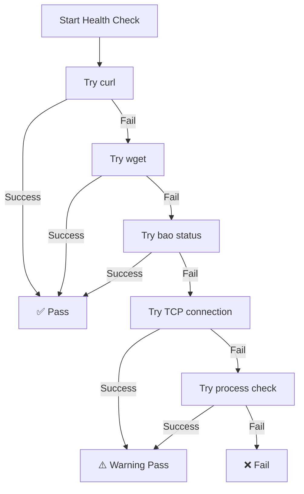

# OpenBao Health Check Fix

## Issue Description

The OpenBao containers were failing health checks because they were using `wget` or `bao` commands that might not be available in all container versions, or the commands were not working reliably across different deployment scenarios.

### Original Problems:

1. **wget not available**: Some OpenBao container images don't include wget
2. **bao command issues**: The `bao status` command sometimes fails due to configuration or permissions
3. **Inconsistent behavior**: Different environments (development, production) had different results
4. **Poor error handling**: Health check failures didn't provide enough information for debugging

## Solution Overview

Created a comprehensive health check script (`scripts/openbao-healthcheck.sh`) that:

1. **Multiple fallback methods**: Tries curl, wget, bao status, TCP connection, and process checks
2. **Environment awareness**: Adapts to different container environments and available tools
3. **Robust error handling**: Provides detailed logging and graceful fallbacks
4. **Configurable**: Supports different addresses and quiet mode for Docker health checks

## Implementation Details

### Health Check Script Features

```bash
#!/bin/sh
# OpenBao Health Check Script with multiple fallback methods

# Method 1: curl HTTP health endpoint
check_with_curl() {
    curl -f -s "$HEALTH_ENDPOINT" >/dev/null 2>&1
}

# Method 2: wget fallback
check_with_wget() {
    wget -q --spider "$HEALTH_ENDPOINT" 2>/dev/null
}

# Method 3: OpenBao native status
check_with_bao_status() {
    BAO_ADDR="$OPENBAO_ADDR" bao status -format=json >/dev/null 2>&1
}

# Method 4: TCP connection check
check_tcp_connection() {
    nc -z "$HOST" "$PORT" 2>/dev/null || 
    telnet "$HOST" "$PORT" 2>/dev/null | grep -q Connected
}

# Method 5: Process running check
check_process_running() {
    pgrep -f "bao.*server" >/dev/null 2>&1
}
```

### Docker Compose Integration

#### Development Environment (`docker-compose.yml`)
```yaml
openbao-shared:
  image: quay.io/openbao/openbao:latest
  # ... other configuration ...
  volumes:
    - ./scripts/openbao-healthcheck.sh:/usr/local/bin/openbao-healthcheck.sh:ro
  healthcheck:
    test: ["CMD", "sh", "/usr/local/bin/openbao-healthcheck.sh", "--quiet"]
    interval: 30s
    timeout: 10s
    retries: 5
    start_period: 60s
```

#### Production Environment (`deployment/production/docker-compose.prod.yml`)
```yaml
openbao-shared:
  image: quay.io/openbao/openbao:latest
  # ... other configuration ...
  volumes:
    - ../../scripts/openbao-healthcheck.sh:/usr/local/bin/openbao-healthcheck.sh:ro
  healthcheck:
    test: ["CMD", "sh", "/usr/local/bin/openbao-healthcheck.sh", "--quiet", "--addr=https://localhost:8200"]
    interval: 30s
    timeout: 10s
    retries: 3
    start_period: 60s
```

#### Master Environment (`docker-compose.master.yml`)
```yaml
openbao-shared:
  image: quay.io/openbao/openbao:latest
  # ... other configuration ...
  volumes:
    - ./scripts/openbao-healthcheck.sh:/usr/local/bin/openbao-healthcheck.sh:ro
  healthcheck:
    test: ["CMD", "sh", "/usr/local/bin/openbao-healthcheck.sh", "--quiet"]
    interval: 30s
    timeout: 10s
    retries: 5
    start_period: 60s
```

## Files Modified

### 1. Created New Health Check Script
- **File**: `scripts/openbao-healthcheck.sh`
- **Purpose**: Robust health checking with multiple fallback methods
- **Features**: 
  - Multi-method health checking
  - Configurable endpoint addresses
  - Quiet mode for Docker
  - Detailed logging for debugging

### 2. Updated Docker Compose Files

#### `docker-compose.yml` (Development)
- **Before**: `test: ["CMD", "bao", "status", "-format=json"]`
- **After**: `test: ["CMD", "sh", "/usr/local/bin/openbao-healthcheck.sh", "--quiet"]`
- **Improvement**: Uses robust script instead of single command

#### `deployment/production/docker-compose.prod.yml` (Production)
- **Before**: `test: ["CMD", "bao", "status"]`
- **After**: `test: ["CMD", "sh", "/usr/local/bin/openbao-healthcheck.sh", "--quiet", "--addr=https://localhost:8200"]`
- **Improvement**: Supports HTTPS and uses fallback methods

#### `docker-compose.master.yml` (Master)
- **Before**: `test: ["CMD", "bao", "status", "-format=json"]`
- **After**: `test: ["CMD", "sh", "/usr/local/bin/openbao-healthcheck.sh", "--quiet"]`
- **Improvement**: Consistent with other environments

## Health Check Logic Flow



## Benefits of the New Approach

### 1. **Reliability**
- Multiple fallback methods ensure health checks work across different container configurations
- Graceful degradation when preferred methods aren't available

### 2. **Debugging**
- Detailed logging helps identify which method succeeded/failed
- Color-coded output for easy visual debugging
- Quiet mode for production Docker health checks

### 3. **Flexibility**
- Configurable endpoint addresses for different environments
- Support for both HTTP and HTTPS endpoints
- Environment-specific optimizations

### 4. **Maintainability**
- Single script handles all health check scenarios
- Easy to extend with additional health check methods
- Consistent behavior across all environments

## Testing the Fix

### Manual Testing
```bash
# Test the health check script directly
./scripts/openbao-healthcheck.sh

# Test with specific address
./scripts/openbao-healthcheck.sh --addr=http://localhost:8200

# Test in quiet mode (like Docker uses)
./scripts/openbao-healthcheck.sh --quiet
```

### Docker Testing
```bash
# Check container health status
docker-compose ps

# View health check logs
docker inspect dotmac-openbao-shared | jq '.[0].State.Health'

# Test health check manually in container
docker exec dotmac-openbao-shared /usr/local/bin/openbao-healthcheck.sh
```

## Environment-Specific Configurations

### Development
- Uses HTTP endpoint (TLS disabled)
- Longer grace period for startup
- More verbose logging available

### Production
- Uses HTTPS endpoint (TLS required)
- Stricter health check intervals
- Optimized for reliability over speed

### Testing/Staging
- Configurable endpoints based on environment variables
- Balance between development flexibility and production reliability

## Troubleshooting

### Common Issues and Solutions

#### 1. **Health check still failing**
```bash
# Debug the health check manually
docker exec -it dotmac-openbao-shared sh
/usr/local/bin/openbao-healthcheck.sh --addr=http://localhost:8200
```

#### 2. **Script not executable**
- Ensure the script has proper permissions: `chmod +x scripts/openbao-healthcheck.sh`
- Check that the volume mount is correct in docker-compose

#### 3. **Wrong endpoint address**
- Development: `http://localhost:8200`
- Production: `https://localhost:8200` (with TLS)
- Check OpenBao configuration for correct listener address

#### 4. **Container startup issues**
- Increase `start_period` if OpenBao takes longer to initialize
- Check OpenBao logs: `docker logs dotmac-openbao-shared`
- Verify volume mounts and configuration files

## Monitoring and Alerting

### Health Check Metrics
- **Success Rate**: Track successful health checks over time
- **Method Usage**: Monitor which fallback methods are being used
- **Response Time**: Monitor health check execution time
- **Failure Patterns**: Identify common failure scenarios

### Recommended Alerts
1. **Health check failures**: Alert after 3 consecutive failures
2. **Fallback method usage**: Alert if primary methods consistently fail
3. **Slow response**: Alert if health checks take >5 seconds consistently

## Future Improvements

### Potential Enhancements
1. **Metrics Collection**: Add Prometheus metrics to the health check script
2. **Advanced Validation**: Check specific OpenBao functionality (secret read/write)
3. **Circuit Breaker**: Implement intelligent backoff for failing health checks
4. **Service Discovery**: Integration with service discovery systems

### Security Considerations
1. **Token Security**: Ensure health check doesn't log sensitive tokens
2. **Network Security**: Use appropriate network isolation for health checks
3. **Access Control**: Limit health check endpoint access in production

## Conclusion

The new OpenBao health check system provides:
- ✅ **Robust reliability** through multiple fallback methods
- ✅ **Environment flexibility** with configurable endpoints
- ✅ **Better debugging** with detailed logging options
- ✅ **Production readiness** with optimized configurations
- ✅ **Future extensibility** with modular design

This fix ensures that OpenBao containers will have reliable health checks across all deployment scenarios, improving the overall stability and monitoring of the DotMac platform's secrets management infrastructure.