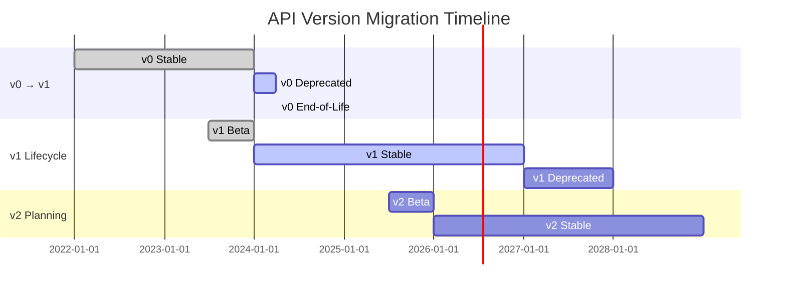

# API Versioning Guide

## Overview

The DotMac Platform follows semantic versioning (SemVer) and maintains backward compatibility within major versions. This guide explains our versioning strategy, migration paths, and best practices.

## Versioning Strategy

### Version Format

We use semantic versioning: `MAJOR.MINOR.PATCH`

- **MAJOR**: Breaking changes that require code modifications
- **MINOR**: New features, backward compatible
- **PATCH**: Bug fixes, backward compatible

### Current Versions

| API Version | Status | Support Until | Base URL |
|------------|--------|---------------|----------|
| v1 | **Stable** | December 2026 | `https://api.dotmac.com/v1` |
| v2 | Beta | - | `https://api.dotmac.com/v2` |
| v0 | Deprecated | March 2024 | `https://api.dotmac.com/v0` |

## Version Lifecycle

### 1. Beta Phase
- New API versions start in beta
- May have breaking changes between beta releases
- Not recommended for production use
- Typically lasts 3-6 months

### 2. Stable Release
- Feature complete and production-ready
- No breaking changes without version bump
- Full support and SLA coverage
- Minimum 24 months support guarantee

### 3. Deprecation
- Announced 12 months before end-of-life
- Deprecation warnings in API responses
- Migration guides provided
- Limited to security fixes only

### 4. End-of-Life
- API version no longer available
- Requests return 410 Gone status
- All traffic must migrate to newer versions

## Specifying API Version

### URL Path Versioning (Recommended)

Include the version in the URL path:

```
GET https://api.dotmac.com/v1/customers
GET https://api.dotmac.com/v2/customers
```

### Header Versioning (Alternative)

Use the `X-API-Version` header:

```http
GET https://api.dotmac.com/customers
X-API-Version: v1
```

### Query Parameter Versioning (Legacy)

Supported for backward compatibility:

```
GET https://api.dotmac.com/customers?version=v1
```

## Breaking vs Non-Breaking Changes

### Non-Breaking Changes (Minor Version)
These changes don't require API version updates:

- ✅ Adding new endpoints
- ✅ Adding optional request parameters
- ✅ Adding response fields
- ✅ Adding new enum values
- ✅ Adding new webhook events
- ✅ Performance improvements
- ✅ Bug fixes

### Breaking Changes (Major Version)
These require a new API version:

- ❌ Removing endpoints
- ❌ Removing or renaming fields
- ❌ Changing field types
- ❌ Changing authentication methods
- ❌ Modifying response structure
- ❌ Changing error codes
- ❌ Removing enum values

## Version Migration

### Migration Timeline



### Migration Checklist

- [ ] Review breaking changes documentation
- [ ] Update SDK to latest version
- [ ] Test in staging environment
- [ ] Update API endpoints in code
- [ ] Handle new response formats
- [ ] Update error handling
- [ ] Test webhook integrations
- [ ] Deploy to production
- [ ] Monitor for issues

## Version-Specific Documentation

### v1 (Current Stable)

**Base URL**: `https://api.dotmac.com/v1`

Key features:
- JWT authentication
- REST/JSON API
- Webhook support
- Rate limiting: 1000 req/min
- Multi-tenant support

### v2 (Beta)

**Base URL**: `https://api.dotmac.com/v2`

New features:
- GraphQL support
- WebSocket subscriptions
- Batch operations
- Enhanced filtering
- Field selection

Breaking changes from v1:
- Unified error response format
- Renamed customer states
- New authentication flow
- Modified pagination structure

## Backward Compatibility

### Response Expansion

We may add fields to responses without version change:

**v1 Response (Original)**:
```json
{
  "id": "cust_123",
  "name": "Acme Corp",
  "status": "active"
}
```

**v1 Response (Expanded)**:
```json
{
  "id": "cust_123",
  "name": "Acme Corp",
  "status": "active",
  "created_at": "2024-01-15T10:30:00Z",  // New field
  "tags": ["premium", "enterprise"]       // New field
}
```

### Deprecation Warnings

Deprecated features include warnings in responses:

```http
HTTP/1.1 200 OK
X-Deprecation-Warning: This endpoint is deprecated. Use /v2/customers instead.
X-Deprecation-Date: 2024-12-31
Link: <https://docs.dotmac.com/migrations/v1-to-v2>; rel="deprecation"
```

## Client Library Versioning

### SDK Version Compatibility

| SDK Version | API v0 | API v1 | API v2 |
|------------|--------|--------|--------|
| 0.x.x | ✅ | ❌ | ❌ |
| 1.x.x | ⚠️ | ✅ | ❌ |
| 2.x.x | ❌ | ✅ | ✅ |

### Installing Specific Versions

**Python**:
```bash
pip install dotmac-sdk==1.5.0  # For API v1
pip install dotmac-sdk==2.0.0  # For API v2
```

**Node.js**:
```bash
npm install @dotmac/sdk@1.5.0  # For API v1
npm install @dotmac/sdk@2.0.0  # For API v2
```

**Go**:
```bash
go get github.com/dotmac/sdk@v1.5.0  # For API v1
go get github.com/dotmac/sdk/v2@v2.0.0  # For API v2
```

## Testing Multiple Versions

### Environment-Based Version Selection

```python
import os
from dotmac import Client

# Select version based on environment
api_version = os.getenv('DOTMAC_API_VERSION', 'v1')
client = Client(
    base_url=f"https://api.dotmac.com/{api_version}",
    api_key=os.getenv('DOTMAC_API_KEY')
)
```

### Parallel Testing

Test against multiple versions simultaneously:

```javascript
const clientV1 = new DotMacClient({
  baseURL: 'https://api.dotmac.com/v1',
  apiKey: process.env.API_KEY
});

const clientV2 = new DotMacClient({
  baseURL: 'https://api.dotmac.com/v2',
  apiKey: process.env.API_KEY
});

// Compare responses
const [v1Response, v2Response] = await Promise.all([
  clientV1.customers.list(),
  clientV2.customers.list()
]);
```

## Migration Examples

### Example: Customer State Changes (v1 → v2)

**v1 Customer States**:
- `prospect`
- `active`
- `suspended`
- `churned`

**v2 Customer States**:
- `lead` (renamed from `prospect`)
- `active`
- `paused` (renamed from `suspended`)
- `inactive` (renamed from `churned`)
- `archived` (new state)

**Migration Code**:
```python
def migrate_customer_state(v1_state):
    """Convert v1 customer state to v2."""
    state_mapping = {
        'prospect': 'lead',
        'active': 'active',
        'suspended': 'paused',
        'churned': 'inactive'
    }
    return state_mapping.get(v1_state, v1_state)
```

### Example: Pagination Changes (v1 → v2)

**v1 Pagination**:
```json
{
  "items": [...],
  "total": 100,
  "page": 1,
  "limit": 20
}
```

**v2 Pagination**:
```json
{
  "data": [...],
  "meta": {
    "total": 100,
    "page": 1,
    "per_page": 20,
    "last_page": 5
  },
  "links": {
    "first": "/customers?page=1",
    "last": "/customers?page=5",
    "next": "/customers?page=2",
    "prev": null
  }
}
```

**Migration Code**:
```javascript
function adaptV2Response(v2Response) {
  // Adapt v2 response to v1 format for compatibility
  return {
    items: v2Response.data,
    total: v2Response.meta.total,
    page: v2Response.meta.page,
    limit: v2Response.meta.per_page
  };
}
```

## Best Practices

### 1. Version Pinning
Always pin to a specific API version in production:

```python
# Good
client = Client(base_url="https://api.dotmac.com/v1")

# Bad - may break when default changes
client = Client(base_url="https://api.dotmac.com")
```

### 2. Gradual Migration
Migrate incrementally using feature flags:

```python
def get_customers():
    if feature_flag('use_api_v2'):
        return client_v2.customers.list()
    else:
        response = client_v1.customers.list()
        return adapt_v1_to_v2(response)
```

### 3. Version Abstraction
Create an abstraction layer for version differences:

```typescript
interface CustomerAPI {
  list(): Promise<Customer[]>;
  get(id: string): Promise<Customer>;
}

class CustomerAPIv1 implements CustomerAPI {
  // v1 implementation
}

class CustomerAPIv2 implements CustomerAPI {
  // v2 implementation
}

// Factory based on configuration
function createCustomerAPI(version: string): CustomerAPI {
  return version === 'v2' ? new CustomerAPIv2() : new CustomerAPIv1();
}
```

### 4. Monitor Deprecations
Set up monitoring for deprecation warnings:

```python
import logging
import requests

class DeprecationMonitor:
    def check_response(self, response):
        if 'X-Deprecation-Warning' in response.headers:
            logging.warning(
                f"API Deprecation: {response.headers['X-Deprecation-Warning']}"
            )
            # Send alert to monitoring system
            self.send_alert(response.headers)
```

## Version Support Matrix

### Feature Availability by Version

| Feature | v0 | v1 | v2 |
|---------|----|----|----| 
| REST API | ✅ | ✅ | ✅ |
| GraphQL | ❌ | ❌ | ✅ |
| Webhooks | ⚠️ | ✅ | ✅ |
| WebSockets | ❌ | ❌ | ✅ |
| Batch Operations | ❌ | ⚠️ | ✅ |
| Field Selection | ❌ | ❌ | ✅ |
| Rate Limiting | ✅ | ✅ | ✅ |
| OAuth 2.0 | ❌ | ✅ | ✅ |
| API Keys | ✅ | ✅ | ✅ |

Legend:
- ✅ Fully supported
- ⚠️ Partial support
- ❌ Not available

## FAQ

### Q: How long are API versions supported?
A: We guarantee minimum 24 months support for stable versions from release date.

### Q: Can I use multiple API versions simultaneously?
A: Yes, you can use different versions for different parts of your application during migration.

### Q: Will I be notified before deprecation?
A: Yes, we send notifications 12, 6, and 1 month before deprecation via email and API responses.

### Q: How do I know which version I'm using?
A: Check the `X-API-Version` response header or the URL path in your requests.

### Q: Are bug fixes backported to older versions?
A: Critical security fixes are backported to all supported versions. Other fixes are applied to the latest version only.

### Q: Can I request features for older versions?
A: New features are only added to the latest API version. We recommend upgrading to access new functionality.

## Resources

- [API Changelog](/docs/changelog)
- [Migration Guides](/docs/migrations)
- [Deprecation Schedule](/docs/deprecations)
- [Version Comparison](/docs/versions/compare)
- [SDK Compatibility](/docs/sdks/compatibility)

## Contact

For version-related questions:
- Email: api-versioning@dotmac.com
- Slack: #api-versions
- Documentation: https://docs.dotmac.com/versioning