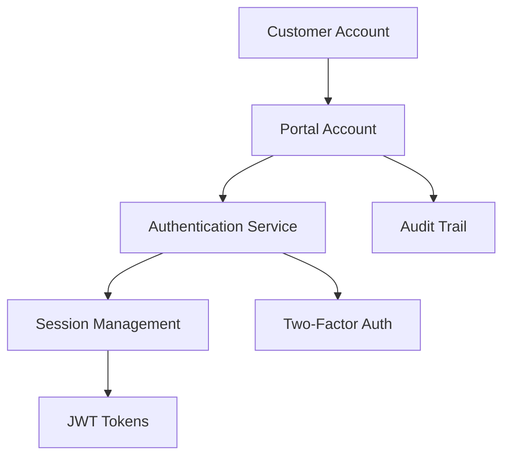
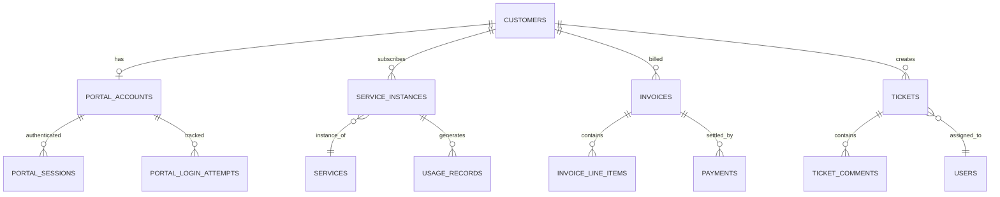
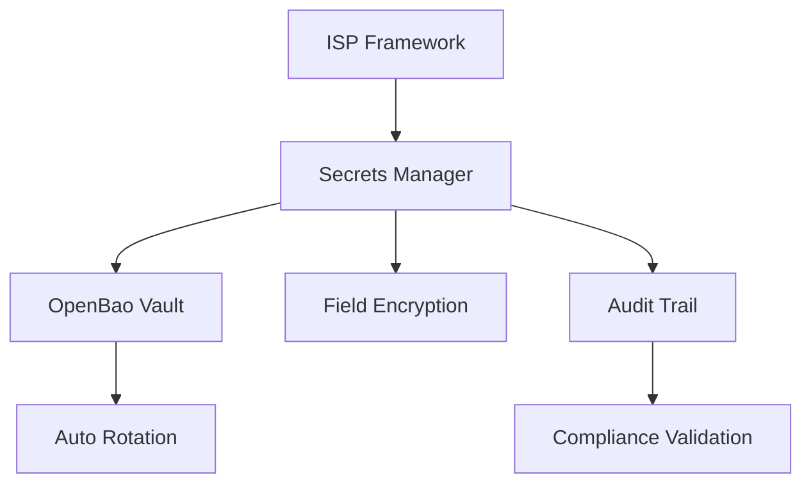

# DotMac ISP Framework - Complete System Architecture

## Table of Contents
1. [Overview](#overview)
2. [Portal ID System](#portal-id-system)
3. [Module Architecture](#module-architecture)
4. [Database Architecture](#database-architecture)
5. [API Design](#api-design)
6. [Security Architecture](#security-architecture)
7. [Deployment Architecture](#deployment-architecture)
8. [Development Patterns](#development-patterns)

## Overview

The DotMac ISP Framework is a comprehensive modular monolith designed for Internet Service Providers (ISPs). It provides complete business functionality through 13 core modules, 4 portal interfaces, and a sophisticated Portal ID authentication system.

### Key Architectural Principles

- **Modular Monolith**: Single deployable unit with clear module boundaries
- **Portal ID Authentication**: Unique customer identification and authentication system
- **Multi-Tenant Architecture**: Complete data isolation between ISP tenants
- **Event-Driven Design**: Asynchronous communication between modules
- **Security-First**: Comprehensive security controls and audit trails

### Technology Stack

- **Framework**: FastAPI with async/await support
- **Database**: PostgreSQL 12+ with SQLAlchemy 2.0 ORM
- **Cache**: Redis for sessions and caching
- **Authentication**: JWT tokens with Portal ID system
- **Validation**: Pydantic v2 for data validation and serialization
- **Background Tasks**: Celery with Redis broker
- **Documentation**: Auto-generated OpenAPI/Swagger

## Portal ID System

The Portal ID System is the **PRIMARY** authentication mechanism for ISP customers. It provides a unique, customer-friendly login experience while maintaining enterprise-grade security.

### Portal ID Architecture



### Portal ID Components

#### 1. Portal Account (`PortalAccount`)
- **Portal ID**: 8-character alphanumeric identifier (excludes confusing characters)
- **Account Types**: CUSTOMER, TECHNICIAN, RESELLER
- **Status Management**: ACTIVE, SUSPENDED, LOCKED, PENDING_ACTIVATION, DEACTIVATED
- **Security Features**: Two-factor authentication, password policies, account lockout
- **Audit Trail**: Complete security event logging

#### 2. Session Management (`PortalSession`)
- **Session Tracking**: Active session monitoring with device fingerprinting
- **Security Monitoring**: Suspicious activity detection and geo-location tracking
- **Timeout Management**: Configurable session timeouts with auto-extension
- **Multi-Device Support**: Multiple concurrent sessions per Portal ID

#### 3. Login Attempt Tracking (`PortalLoginAttempt`)
- **Risk Assessment**: Dynamic risk scoring based on login patterns
- **Fraud Detection**: Geographic anomaly detection
- **Security Analytics**: Pattern analysis for suspicious activity
- **Compliance Reporting**: Complete audit trail for regulatory compliance

### Portal ID Generation Algorithm

```python
def generate_portal_id() -> str:
    """Generate unique 8-character Portal ID."""
    # Character set: A-Z, 2-9 (excludes 0, O, I, 1 for clarity)
    characters = "ABCDEFGHJKLMNPQRSTUVWXYZ23456789"
    return ''.join(secrets.choice(characters) for _ in range(8))
```

### Portal Authentication Flow

1. **Customer Input**: Portal ID + Password (+ optional 2FA code)
2. **Account Validation**: Check account status and lockout conditions
3. **Credential Verification**: Verify password hash and 2FA if enabled
4. **Risk Assessment**: Calculate login risk score based on patterns
5. **Session Creation**: Generate session with device fingerprinting
6. **JWT Generation**: Create access and refresh tokens
7. **Audit Logging**: Record complete login attempt details

## Module Architecture

The framework consists of 13 core modules, each with specific business responsibilities:

### Core Business Modules

#### 1. Identity Module (`modules.identity`)
**Purpose**: User and customer identity management
- **Users**: System staff (admins, technicians, support)
- **Customers**: Service subscribers with Portal ID integration
- **Roles**: RBAC system with granular permissions
- **Authentication**: JWT-based system authentication

#### 2. Portal Management Module (`modules.portal_management`)
**Purpose**: Portal ID system and customer authentication
- **Portal Accounts**: Customer portal authentication
- **Session Management**: Active session tracking
- **Security Monitoring**: Login attempt analysis
- **Two-Factor Auth**: TOTP and backup code support

#### 3. Billing Module (`modules.billing`)
**Purpose**: Financial operations and payment processing
- **Invoices**: Automated invoice generation and management
- **Payments**: Multi-gateway payment processing
- **Subscriptions**: Recurring billing cycles
- **Credit Notes**: Refunds and billing adjustments

#### 4. Services Module (`modules.services`)
**Purpose**: Service catalog and provisioning
- **Service Catalog**: Internet, phone, TV offerings
- **Service Instances**: Active customer services
- **Provisioning**: Automated service activation
- **Usage Tracking**: Bandwidth and data monitoring

#### 5. Networking Module (`modules.networking`)
**Purpose**: Network infrastructure management
- **Device Management**: Router and switch monitoring
- **IPAM**: IP address allocation and management
- **RADIUS**: Network authentication integration
- **Topology Mapping**: Network infrastructure visualization

#### 6. Sales Module (`modules.sales`)
**Purpose**: Sales pipeline and CRM
- **Lead Management**: Sales opportunity tracking
- **CRM**: Customer relationship management
- **Campaigns**: Marketing campaign execution
- **Analytics**: Sales performance metrics

#### 7. Support Module (`modules.support`)
**Purpose**: Customer support operations
- **Ticketing**: Customer support ticket management
- **Knowledge Base**: Self-service documentation
- **SLA Management**: Service level agreement tracking
- **Escalation**: Automated ticket routing

#### 8. Resellers Module (`modules.resellers`)
**Purpose**: Partner and reseller management
- **Partner Onboarding**: Reseller account setup
- **Commission Tracking**: Automated commission calculations
- **Portal Access**: Dedicated reseller interface
- **Performance Analytics**: Partner performance metrics

### Operational Support Modules

#### 9. Analytics Module (`modules.analytics`)
**Purpose**: Business intelligence and reporting
- **Dashboards**: Interactive business dashboards
- **Reports**: Scheduled and on-demand reporting
- **Data Visualization**: Charts, graphs, KPI displays
- **Export Capabilities**: PDF, Excel, CSV formats

#### 10. Inventory Module (`modules.inventory`)
**Purpose**: Equipment and asset management
- **Equipment Tracking**: Router, modem, hardware inventory
- **Warehouse Management**: Multi-location inventory
- **Procurement**: Purchase order management
- **Asset Lifecycle**: Equipment deployment tracking

#### 11. Field Operations Module (`modules.field_ops`)
**Purpose**: Field technician operations
- **Work Orders**: Installation and maintenance scheduling
- **Technician Management**: Field staff coordination
- **Mobile Integration**: Technician mobile app support
- **GPS Tracking**: Real-time location services

#### 12. Compliance Module (`modules.compliance`)
**Purpose**: Regulatory compliance and audit
- **Regulatory Tracking**: FCC, GDPR compliance
- **Audit Trails**: Complete activity logging
- **Data Protection**: Privacy control implementation
- **Reporting**: Compliance report generation

#### 13. Notifications Module (`modules.notifications`)
**Purpose**: Customer communication
- **Email Templates**: Customizable email communications
- **SMS Integration**: Text message notifications
- **Push Notifications**: Mobile and web notifications
- **Automation Rules**: Event-triggered messaging

## Database Architecture

### Multi-Tenant Data Model

All entities inherit from base models that enforce tenant isolation:

```python
class TenantModel(Base):
    """Base model with tenant isolation."""
    id = Column(UUID(as_uuid=True), primary_key=True, default=uuid4)
    tenant_id = Column(UUID(as_uuid=True), nullable=False, index=True)
    created_at = Column(DateTime(timezone=True), default=datetime.utcnow)
    updated_at = Column(DateTime(timezone=True), onupdate=datetime.utcnow)
    is_deleted = Column(Boolean, default=False)
```

### Core Entity Relationships



### Database Schema Patterns

#### 1. Audit Trail Pattern
```sql
CREATE TABLE audit_log (
    id UUID PRIMARY KEY,
    tenant_id UUID NOT NULL,
    entity_type VARCHAR(50) NOT NULL,
    entity_id UUID NOT NULL,
    action VARCHAR(20) NOT NULL,
    old_values JSONB,
    new_values JSONB,
    user_id UUID,
    timestamp TIMESTAMPTZ DEFAULT NOW()
);
```

#### 2. Soft Delete Pattern
All entities use soft deletes for data retention and audit purposes:
```sql
UPDATE customers 
SET is_deleted = true, deleted_at = NOW() 
WHERE id = $1 AND tenant_id = $2;
```

#### 3. Optimistic Locking Pattern
```python
class OptimisticLockMixin:
    version = Column(Integer, default=0, nullable=False)
    
    def save(self):
        self.version += 1
        # Database constraint ensures version hasn't changed
```

## API Design

### RESTful API Structure

Each module exposes a consistent REST API following these patterns:

```
GET    /api/v1/{module}/{resource}           # List resources
POST   /api/v1/{module}/{resource}           # Create resource
GET    /api/v1/{module}/{resource}/{id}      # Get resource
PUT    /api/v1/{module}/{resource}/{id}      # Update resource
DELETE /api/v1/{module}/{resource}/{id}      # Delete resource
```

### Portal-Specific API Endpoints

Portal endpoints use Portal ID for customer-facing operations:

```
POST   /api/portal/v1/auth/login             # Portal ID login
POST   /api/portal/v1/auth/refresh           # Refresh token
GET    /api/portal/v1/account/profile        # Customer profile
GET    /api/portal/v1/services               # Customer services
GET    /api/portal/v1/billing/invoices       # Customer invoices
```

### API Response Format

Standardized response format across all endpoints:

```json
{
    "success": true,
    "data": {...},
    "message": "Operation completed successfully",
    "timestamp": "2024-01-15T10:30:00Z",
    "request_id": "uuid-request-identifier"
}
```

### Error Response Format

Consistent error responses with detailed information:

```json
{
    "success": false,
    "error": {
        "code": "VALIDATION_ERROR",
        "message": "Invalid input data",
        "details": {
            "field": "email",
            "issue": "Invalid email format"
        }
    },
    "timestamp": "2024-01-15T10:30:00Z",
    "request_id": "uuid-request-identifier"
}
```

## Security Architecture

### Enhanced Configuration Security

The DotMac ISP Framework implements **enterprise-grade configuration management** with comprehensive security controls:

#### **1. Unified Secrets Management**


- **OpenBao Integration**: Centralized vault for all sensitive configuration
- **Automatic Secret Rotation**: Configurable rotation schedules for all credentials  
- **Field-Level Encryption**: Sensitive data encrypted at rest using AES-256-GCM
- **Multi-Tenant Isolation**: Complete secret isolation per tenant with dedicated namespaces

#### **2. Configuration Hot-Reloading**
```python
# Zero-downtime configuration updates
class ConfigurationHotReload:
    async def trigger_reload(component: str, validate_only: bool = False):
        """Hot-reload configuration without service interruption"""
        # Validate new configuration
        validation_result = await self.validate_configuration(component)
        
        if not validation_result.is_valid:
            return ValidationError("Configuration validation failed")
        
        # Apply configuration with rollback capability
        reload_id = await self.apply_configuration(component)
        
        # Verify application health post-reload
        health_check = await self.verify_component_health(component)
        
        if not health_check.is_healthy:
            await self.emergency_rollback(reload_id)
            
        return reload_id
```

#### **3. Configuration Audit & Compliance**
- **Complete Audit Trail**: Every configuration change logged with approval workflows
- **Compliance Frameworks**: SOC2, GDPR, PCI DSS, ISO27001 validation
- **Change Approval**: Multi-level approval for high-risk configuration changes
- **Risk Assessment**: Automatic risk scoring for configuration modifications

#### **4. Disaster Recovery Automation**
```python
class ConfigurationDisasterRecovery:
    async def detect_disaster(self) -> DisasterAssessment:
        """Automated disaster detection and classification"""
        
    async def execute_recovery(disaster_id: str) -> RecoveryResult:
        """Automated disaster recovery execution"""
```

### Authentication Layers

1. **Portal ID Authentication**: Customer-facing authentication with enhanced security
2. **JWT System Authentication**: Internal system authentication with vault-managed keys
3. **API Key Authentication**: External system integration with secret rotation
4. **OAuth2 Integration**: Third-party service authentication with encrypted credentials

### Authorization Model

#### Role-Based Access Control (RBAC)
```python
class Permission:
    resource: str  # "customers", "invoices", "services"
    action: str    # "create", "read", "update", "delete"
    scope: str     # "own", "tenant", "global"

class Role:
    name: str
    permissions: List[Permission]
```

#### Multi-Tenant Security
- **Row-Level Security**: Database-enforced tenant isolation
- **API Filtering**: Automatic tenant-based filtering
- **Data Encryption**: Tenant-specific encryption keys
- **Audit Logging**: Complete security event tracking

### Security Controls

#### Input Validation
- **Pydantic Models**: Automatic data validation
- **SQL Injection Prevention**: ORM-based query protection
- **XSS Protection**: HTML sanitization and CSP headers
- **File Upload Security**: Type validation and virus scanning

#### Session Security
- **JWT Token Management**: Short-lived access tokens
- **Session Fingerprinting**: Device-based session validation
- **Concurrent Session Limits**: Per-user session restrictions
- **Automatic Logout**: Idle timeout enforcement

#### API Security
- **Rate Limiting**: Per-user and per-IP restrictions
- **CORS Configuration**: Strict cross-origin policies
- **TLS Enforcement**: HTTPS-only communication
- **API Versioning**: Backward-compatible API evolution

## Deployment Architecture

### Container Strategy

```dockerfile
# Multi-stage build for optimization
FROM python:3.11-slim as builder
WORKDIR /app
COPY pyproject.toml poetry.lock ./
RUN pip install poetry && poetry install --only=main

FROM python:3.11-slim as runtime
COPY --from=builder /app/.venv /app/.venv
ENV PATH="/app/.venv/bin:$PATH"
COPY src/ /app/src/
WORKDIR /app
EXPOSE 8000
CMD ["uvicorn", "dotmac_isp.main:app", "--host", "0.0.0.0", "--port", "8000"]
```

### Docker Compose Development

```yaml
version: '3.8'
services:
  app:
    build: .
    ports:
      - "8000:8000"
    environment:
      - DATABASE_URL=postgresql://user:pass@db:5432/dotmac_isp
      - REDIS_URL=redis://redis:6379/0
    depends_on:
      - db
      - redis
  
  db:
    image: postgres:15-alpine
    environment:
      - POSTGRES_DB=dotmac_isp
      - POSTGRES_USER=user
      - POSTGRES_PASSWORD=pass
    volumes:
      - postgres_data:/var/lib/postgresql/data
  
  redis:
    image: redis:7-alpine
    command: redis-server --appendonly yes
    volumes:
      - redis_data:/data

volumes:
  postgres_data:
  redis_data:
```

### Kubernetes Production Deployment

```yaml
apiVersion: apps/v1
kind: Deployment
metadata:
  name: dotmac-isp-framework
spec:
  replicas: 3
  selector:
    matchLabels:
      app: dotmac-isp
  template:
    metadata:
      labels:
        app: dotmac-isp
    spec:
      containers:
      - name: app
        image: dotmac/isp-framework:latest
        ports:
        - containerPort: 8000
        env:
        - name: DATABASE_URL
          valueFrom:
            secretKeyRef:
              name: db-credentials
              key: url
        resources:
          requests:
            memory: "512Mi"
            cpu: "500m"
          limits:
            memory: "1Gi"
            cpu: "1000m"
        livenessProbe:
          httpGet:
            path: /health
            port: 8000
          initialDelaySeconds: 30
        readinessProbe:
          httpGet:
            path: /ready
            port: 8000
          initialDelaySeconds: 5
```

## Development Patterns

### Repository Pattern

```python
class CustomerRepository(ABC):
    @abstractmethod
    async def get_by_id(self, tenant_id: UUID, customer_id: UUID) -> Optional[Customer]:
        pass
    
    @abstractmethod
    async def create(self, customer: Customer) -> Customer:
        pass
    
    @abstractmethod
    async def list_by_tenant(self, tenant_id: UUID, skip: int, limit: int) -> List[Customer]:
        pass

class SqlAlchemyCustomerRepository(CustomerRepository):
    def __init__(self, db: AsyncSession):
        self.db = db
    
    async def get_by_id(self, tenant_id: UUID, customer_id: UUID) -> Optional[Customer]:
        result = await self.db.execute(
            select(Customer).where(
                and_(
                    Customer.tenant_id == tenant_id,
                    Customer.id == customer_id,
                    Customer.is_deleted == False
                )
            )
        )
        return result.scalar_one_or_none()
```

### Service Layer Pattern

```python
class CustomerService:
    def __init__(self, customer_repo: CustomerRepository, portal_service: PortalAccountService):
        self.customer_repo = customer_repo
        self.portal_service = portal_service
    
    async def create_customer_with_portal(
        self, 
        tenant_id: UUID, 
        customer_data: CustomerCreate
    ) -> Tuple[Customer, PortalAccount]:
        """Create customer and associated portal account."""
        async with self.db.begin():
            # Create customer
            customer = await self.customer_repo.create(customer_data)
            
            # Create portal account
            portal_account = await self.portal_service.create_portal_account(
                tenant_id=tenant_id,
                customer_id=customer.id,
                account_data=PortalAccountCreate(
                    account_type=PortalAccountType.CUSTOMER,
                    customer_id=customer.id
                )
            )
            
            return customer, portal_account
```

### Dependency Injection Pattern

```python
# Dependencies
async def get_database() -> AsyncGenerator[AsyncSession, None]:
    async with async_session() as session:
        yield session

async def get_customer_repository(
    db: AsyncSession = Depends(get_database)
) -> CustomerRepository:
    return SqlAlchemyCustomerRepository(db)

async def get_customer_service(
    customer_repo: CustomerRepository = Depends(get_customer_repository),
    portal_service: PortalAccountService = Depends(get_portal_service)
) -> CustomerService:
    return CustomerService(customer_repo, portal_service)

# API Endpoint
@router.post("/customers", response_model=CustomerResponse)
async def create_customer(
    customer_data: CustomerCreate,
    customer_service: CustomerService = Depends(get_customer_service),
    current_user: User = Depends(get_current_user)
):
    customer, portal_account = await customer_service.create_customer_with_portal(
        tenant_id=current_user.tenant_id,
        customer_data=customer_data
    )
    return CustomerResponse.from_orm(customer)
```

### Event-Driven Pattern

```python
class DomainEvent(BaseModel):
    event_id: UUID = Field(default_factory=uuid4)
    event_type: str
    tenant_id: UUID
    timestamp: datetime = Field(default_factory=datetime.utcnow)
    payload: Dict[str, Any]

class CustomerCreatedEvent(DomainEvent):
    event_type: str = "customer.created"
    customer_id: UUID
    portal_id: str

class EventPublisher:
    async def publish(self, event: DomainEvent):
        # Publish to Redis pub/sub or message queue
        await redis_client.publish(
            f"events.{event.tenant_id}.{event.event_type}",
            event.json()
        )

# Usage in service
class CustomerService:
    async def create_customer(self, customer_data: CustomerCreate) -> Customer:
        customer = await self.customer_repo.create(customer_data)
        
        # Publish domain event
        await self.event_publisher.publish(
            CustomerCreatedEvent(
                tenant_id=customer.tenant_id,
                customer_id=customer.id,
                portal_id=customer.portal_account.portal_id,
                payload={"customer_type": customer.customer_type}
            )
        )
        
        return customer
```

This architecture provides a robust, scalable, and maintainable foundation for ISP management operations while ensuring security, compliance, and operational excellence.