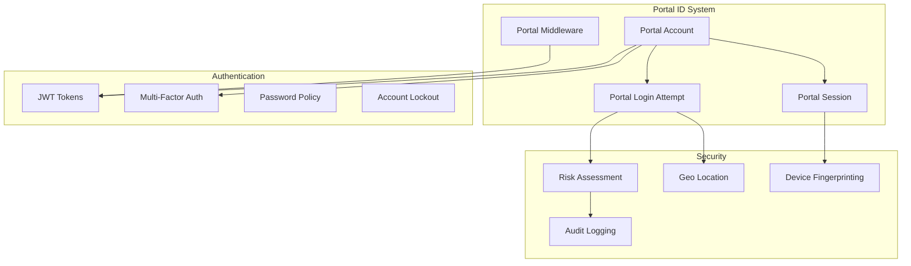
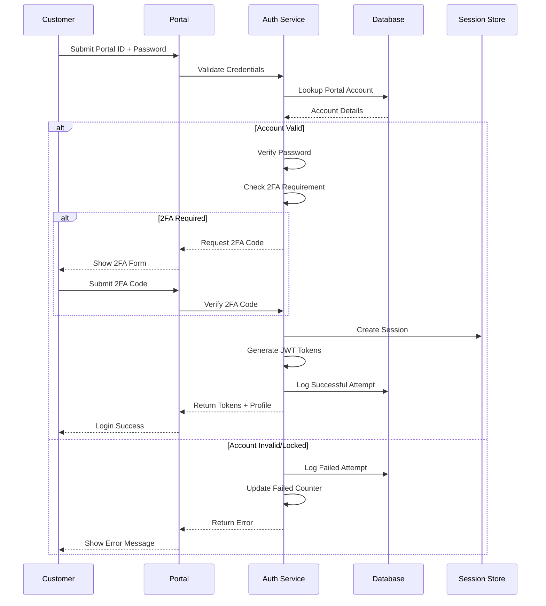

# DotMac ISP Framework - Portal ID System Guide

## Table of Contents
1. [System Overview](#system-overview)
2. [Portal ID Architecture](#portal-id-architecture)
3. [Account Management](#account-management)
4. [Authentication Flow](#authentication-flow)
5. [Session Management](#session-management)
6. [Security Features](#security-features)
7. [API Integration](#api-integration)
8. [Administrative Operations](#administrative-operations)
9. [Migration and Deployment](#migration-and-deployment)
10. [Troubleshooting](#troubleshooting)

## System Overview

The Portal ID System is the **primary customer authentication mechanism** for the DotMac ISP Framework. It provides a customer-friendly login experience while maintaining enterprise-grade security and comprehensive audit capabilities.

### Key Features

- **Unique Portal IDs**: 8-character alphanumeric identifiers for easy customer use
- **Multi-Factor Authentication**: TOTP-based 2FA with backup codes
- **Session Management**: Secure session tracking with device fingerprinting
- **Security Monitoring**: Risk assessment and suspicious activity detection
- **Audit Trail**: Complete security event logging for compliance
- **Multi-Portal Support**: Customer, technician, and reseller portals

### Business Benefits

- **Customer Experience**: Simple, memorable login credentials
- **Security**: Enterprise-grade authentication with risk assessment
- **Compliance**: Complete audit trail for regulatory requirements
- **Scalability**: Supports unlimited customer accounts per tenant
- **Integration**: RESTful APIs for external system integration

## Portal ID Architecture

### Core Components



### Database Schema

#### PortalAccount Table
```sql
CREATE TABLE portal_accounts (
    id UUID PRIMARY KEY,
    tenant_id UUID NOT NULL,
    portal_id VARCHAR(20) UNIQUE NOT NULL,
    account_type VARCHAR(20) NOT NULL DEFAULT 'customer',
    status VARCHAR(20) NOT NULL DEFAULT 'pending_activation',
    
    -- Authentication
    password_hash VARCHAR(255) NOT NULL,
    password_reset_token VARCHAR(255),
    password_reset_expires TIMESTAMPTZ,
    
    -- Security
    two_factor_enabled BOOLEAN DEFAULT FALSE,
    two_factor_secret VARCHAR(32),
    backup_codes TEXT,
    failed_login_attempts INTEGER DEFAULT 0,
    locked_until TIMESTAMPTZ,
    
    -- Password Policy
    password_changed_at TIMESTAMPTZ,
    must_change_password BOOLEAN DEFAULT TRUE,
    password_history TEXT,
    
    -- Account Settings
    session_timeout_minutes INTEGER DEFAULT 30,
    email_notifications BOOLEAN DEFAULT TRUE,
    theme_preference VARCHAR(20) DEFAULT 'light',
    
    -- Relationships
    customer_id UUID REFERENCES customers(id),
    user_id UUID REFERENCES users(id),
    
    -- Audit
    created_by_admin_id UUID,
    security_notes TEXT,
    
    created_at TIMESTAMPTZ DEFAULT NOW(),
    updated_at TIMESTAMPTZ DEFAULT NOW(),
    is_deleted BOOLEAN DEFAULT FALSE
);

CREATE INDEX idx_portal_accounts_portal_id ON portal_accounts(portal_id);
CREATE INDEX idx_portal_accounts_tenant ON portal_accounts(tenant_id) WHERE is_deleted = FALSE;
```

#### PortalSession Table
```sql
CREATE TABLE portal_sessions (
    id UUID PRIMARY KEY,
    tenant_id UUID NOT NULL,
    portal_account_id UUID NOT NULL REFERENCES portal_accounts(id),
    session_token VARCHAR(255) UNIQUE NOT NULL,
    
    -- Session Metadata
    ip_address INET,
    user_agent TEXT,
    device_fingerprint VARCHAR(255),
    location_country CHAR(2),
    location_city VARCHAR(100),
    
    -- Session Timing
    login_at TIMESTAMPTZ DEFAULT NOW(),
    last_activity TIMESTAMPTZ DEFAULT NOW(),
    expires_at TIMESTAMPTZ NOT NULL,
    logout_at TIMESTAMPTZ,
    
    -- Session State
    is_active BOOLEAN DEFAULT TRUE,
    logout_reason VARCHAR(50),
    suspicious_activity BOOLEAN DEFAULT FALSE,
    security_alerts TEXT,
    
    created_at TIMESTAMPTZ DEFAULT NOW()
);

CREATE INDEX idx_portal_sessions_token ON portal_sessions(session_token);
CREATE INDEX idx_portal_sessions_account ON portal_sessions(portal_account_id);
CREATE INDEX idx_portal_sessions_active ON portal_sessions(tenant_id, is_active, expires_at);
```

#### PortalLoginAttempt Table
```sql
CREATE TABLE portal_login_attempts (
    id UUID PRIMARY KEY,
    tenant_id UUID NOT NULL,
    portal_account_id UUID REFERENCES portal_accounts(id),
    portal_id_attempted VARCHAR(20) NOT NULL,
    
    -- Attempt Details
    success BOOLEAN NOT NULL,
    failure_reason VARCHAR(100),
    
    -- Request Context
    ip_address INET NOT NULL,
    user_agent TEXT,
    device_fingerprint VARCHAR(255),
    country_code CHAR(2),
    city VARCHAR(100),
    
    -- Security Analysis
    risk_score INTEGER DEFAULT 0,
    flagged_as_suspicious BOOLEAN DEFAULT FALSE,
    two_factor_used BOOLEAN DEFAULT FALSE,
    session_created_id UUID,
    
    created_at TIMESTAMPTZ DEFAULT NOW()
);

CREATE INDEX idx_login_attempts_portal_id ON portal_login_attempts(portal_id_attempted, created_at);
CREATE INDEX idx_login_attempts_ip ON portal_login_attempts(ip_address, created_at);
CREATE INDEX idx_login_attempts_suspicious ON portal_login_attempts(tenant_id, flagged_as_suspicious);
```

## Account Management

### Portal ID Generation

Portal IDs are automatically generated 8-character alphanumeric codes that exclude confusing characters:

```python
def generate_portal_id() -> str:
    """Generate unique 8-character Portal ID."""
    # Character set excludes: 0, O, I, 1 for visual clarity
    characters = "ABCDEFGHJKLMNPQRSTUVWXYZ23456789"
    return ''.join(secrets.choice(characters) for _ in range(8))
```

**Example Portal IDs**: `ABC23456`, `XYZ789HJ`, `DEF456GH`

### Account Creation Process

#### 1. Customer Registration
```python
async def create_customer_with_portal_account(
    tenant_id: UUID,
    customer_data: CustomerCreateRequest
) -> Tuple[Customer, PortalAccount]:
    """Create customer and associated Portal ID account."""
    
    async with database.begin():
        # Create customer record
        customer = await customer_service.create_customer(
            tenant_id=tenant_id,
            customer_data=customer_data
        )
        
        # Generate Portal ID account
        portal_account = await portal_service.create_portal_account(
            tenant_id=tenant_id,
            account_data=PortalAccountCreate(
                account_type=PortalAccountType.CUSTOMER,
                customer_id=customer.id,
                password=generate_temp_password(),
                email_notifications=True
            )
        )
        
        # Send activation email
        await notification_service.send_portal_activation(
            customer_email=customer.email,
            portal_id=portal_account.portal_id,
            activation_link=generate_activation_link(portal_account)
        )
        
        return customer, portal_account
```

#### 2. Account Activation
```python
async def activate_portal_account(
    tenant_id: UUID,
    activation_token: str,
    new_password: str
) -> PortalAccount:
    """Activate Portal ID account with user-chosen password."""
    
    # Find account by activation token
    account = await db.query(PortalAccount).filter(
        and_(
            PortalAccount.tenant_id == tenant_id,
            PortalAccount.activation_token == activation_token,
            PortalAccount.activation_expires > datetime.utcnow()
        )
    ).first()
    
    if not account:
        raise InvalidActivationTokenError()
    
    # Set password and activate account
    account.password_hash = pwd_context.hash(new_password)
    account.status = PortalAccountStatus.ACTIVE.value
    account.must_change_password = False
    account.password_changed_at = datetime.utcnow()
    account.activation_token = None
    account.activation_expires = None
    account.email_verified = True
    
    await db.commit()
    return account
```

### Account Types

#### Customer Portal Accounts
- **Purpose**: Customer service management, billing, support
- **Features**: Service dashboard, invoice access, payment processing
- **Default Permissions**: View own account, manage preferences, create tickets

#### Technician Portal Accounts  
- **Purpose**: Field technician operations
- **Features**: Work order management, customer service info, inventory
- **Default Permissions**: View assigned work orders, update installation status

#### Reseller Portal Accounts
- **Purpose**: Partner/reseller operations
- **Features**: Customer management, commission tracking, sales reporting
- **Default Permissions**: Manage sub-customers, view commissions, access sales tools

## Authentication Flow

### Standard Login Process



### Multi-Factor Authentication

#### TOTP Setup Process
```python
async def setup_two_factor_auth(
    tenant_id: UUID,
    account_id: UUID
) -> Portal2FASetupResponse:
    """Setup TOTP-based two-factor authentication."""
    
    account = await get_portal_account_by_id(tenant_id, account_id)
    
    # Generate TOTP secret
    secret = pyotp.random_base32()
    account.two_factor_secret = secret
    
    # Generate QR code for mobile app
    totp_uri = pyotp.totp.TOTP(secret).provisioning_uri(
        name=account.portal_id,
        issuer_name=f"ISP Portal - {account.tenant_id}"
    )
    
    qr_code_url = generate_qr_code(totp_uri)
    
    # Generate backup codes
    backup_codes = [secrets.token_hex(4).upper() for _ in range(10)]
    account.backup_codes = ",".join(backup_codes)
    
    await db.commit()
    
    return Portal2FASetupResponse(
        secret=secret,
        qr_code_url=qr_code_url,
        backup_codes=backup_codes
    )
```

#### 2FA Verification
```python
async def verify_two_factor_code(
    account: PortalAccount,
    code: str
) -> bool:
    """Verify TOTP or backup code."""
    
    if not account.two_factor_secret:
        return False
    
    # Check TOTP code
    totp = pyotp.TOTP(account.two_factor_secret)
    if totp.verify(code, valid_window=1):  # Allow 30-second window
        return True
    
    # Check backup codes
    if account.backup_codes:
        backup_codes = account.backup_codes.split(',')
        if code.upper() in backup_codes:
            # Remove used backup code
            backup_codes.remove(code.upper())
            account.backup_codes = ','.join(backup_codes)
            await db.commit()
            return True
    
    return False
```

## Session Management

### Session Creation
```python
async def create_portal_session(
    account: PortalAccount,
    request_context: LoginRequestContext
) -> PortalSession:
    """Create new authenticated session."""
    
    # Calculate session duration
    if request_context.remember_me:
        expires_in = timedelta(days=30)  # Extended session
    else:
        expires_in = timedelta(minutes=account.session_timeout_minutes)
    
    # Create session record
    session = PortalSession(
        tenant_id=account.tenant_id,
        portal_account_id=account.id,
        session_token=secrets.token_urlsafe(32),
        ip_address=request_context.ip_address,
        user_agent=request_context.user_agent,
        device_fingerprint=request_context.device_fingerprint,
        expires_at=datetime.utcnow() + expires_in
    )
    
    # Add geographic context if available
    if geo_info := await get_geo_location(request_context.ip_address):
        session.location_country = geo_info.country_code
        session.location_city = geo_info.city
    
    await db.add(session)
    await db.commit()
    
    return session
```

### Session Validation
```python
async def validate_portal_session(
    tenant_id: UUID,
    session_token: str
) -> Optional[PortalSession]:
    """Validate active portal session."""
    
    session = await db.query(PortalSession).filter(
        and_(
            PortalSession.tenant_id == tenant_id,
            PortalSession.session_token == session_token,
            PortalSession.is_active == True,
            PortalSession.expires_at > datetime.utcnow()
        )
    ).first()
    
    if session:
        # Update last activity
        session.last_activity = datetime.utcnow()
        
        # Check for suspicious activity
        await check_session_security(session)
        
        await db.commit()
    
    return session
```

### Concurrent Session Management
```python
async def manage_concurrent_sessions(
    account: PortalAccount,
    max_sessions: int = 5
) -> None:
    """Manage concurrent sessions per Portal ID."""
    
    active_sessions = await db.query(PortalSession).filter(
        and_(
            PortalSession.portal_account_id == account.id,
            PortalSession.is_active == True,
            PortalSession.expires_at > datetime.utcnow()
        )
    ).order_by(PortalSession.last_activity.desc()).all()
    
    # Terminate oldest sessions if limit exceeded
    if len(active_sessions) > max_sessions:
        sessions_to_terminate = active_sessions[max_sessions:]
        
        for session in sessions_to_terminate:
            session.terminate_session("concurrent_limit_exceeded")
            
        await db.commit()
```

## Security Features

### Risk Assessment

The system automatically calculates risk scores for login attempts:

```python
def calculate_login_risk_score(
    login_attempt: PortalLoginAttempt,
    account: PortalAccount,
    recent_attempts: List[PortalLoginAttempt]
) -> int:
    """Calculate risk score (0-100) for login attempt."""
    
    score = 0
    
    # Base score for failed attempts
    if not login_attempt.success:
        score += 25
    
    # Multiple attempts from same IP
    same_ip_attempts = [
        a for a in recent_attempts 
        if a.ip_address == login_attempt.ip_address 
        and a.created_at > datetime.utcnow() - timedelta(hours=1)
    ]
    if len(same_ip_attempts) > 3:
        score += 30
    
    # Geographic anomaly detection
    if account and login_attempt.country_code:
        recent_locations = [
            a.country_code for a in recent_attempts 
            if a.success and a.country_code
            and a.created_at > datetime.utcnow() - timedelta(days=30)
        ]
        if recent_locations and login_attempt.country_code not in recent_locations:
            score += 20
    
    # Time-based anomaly (unusual login hours)
    login_hour = login_attempt.created_at.hour
    if login_hour < 6 or login_hour > 22:  # Outside normal hours
        score += 10
    
    # Missing 2FA when available
    if account.two_factor_enabled and not login_attempt.two_factor_used:
        score += 15
    
    return min(score, 100)  # Cap at 100
```

### Account Lockout

```python
async def handle_failed_login(
    account: PortalAccount,
    login_attempt: PortalLoginAttempt
) -> None:
    """Handle failed login attempt with progressive lockout."""
    
    account.failed_login_attempts += 1
    account.last_failed_login = datetime.utcnow()
    
    # Progressive lockout based on attempt count
    if account.failed_login_attempts >= 5:
        lockout_minutes = min(30 * (2 ** (account.failed_login_attempts - 5)), 1440)
        account.lock_account(
            duration_minutes=lockout_minutes,
            reason="Too many failed login attempts"
        )
        
        # Notify security team for repeated violations
        if account.failed_login_attempts >= 10:
            await notify_security_team(account, "Repeated login violations")
    
    await db.commit()
```

### Security Monitoring

```python
async def monitor_session_security(
    session: PortalSession
) -> None:
    """Monitor session for suspicious activity."""
    
    security_alerts = []
    
    # Check for IP address changes
    current_ip = get_current_request_ip()
    if current_ip != session.ip_address:
        security_alerts.append({
            "type": "ip_change",
            "previous_ip": session.ip_address,
            "current_ip": current_ip,
            "timestamp": datetime.utcnow().isoformat()
        })
    
    # Check for unusual activity patterns
    recent_activity = await get_recent_session_activity(session.id)
    if is_unusual_activity_pattern(recent_activity):
        security_alerts.append({
            "type": "unusual_activity",
            "pattern": analyze_activity_pattern(recent_activity),
            "timestamp": datetime.utcnow().isoformat()
        })
    
    # Update session with security alerts
    if security_alerts:
        session.suspicious_activity = True
        session.security_alerts = json.dumps(security_alerts)
        await db.commit()
        
        # Log security event
        await log_security_event(
            event_type="suspicious_session_activity",
            session_id=session.id,
            portal_id=session.portal_account.portal_id,
            alerts=security_alerts
        )
```

## API Integration

### Authentication Endpoints

#### POST /api/portal/v1/auth/login
```python
@router.post("/auth/login", response_model=PortalLoginResponse)
async def portal_login(
    login_request: PortalLoginRequest,
    request: Request,
    auth_service: PortalAuthService = Depends(get_auth_service)
):
    """Authenticate Portal ID login."""
    
    # Extract request context
    context = LoginRequestContext(
        ip_address=request.client.host,
        user_agent=request.headers.get("user-agent"),
        device_fingerprint=login_request.device_fingerprint
    )
    
    # Authenticate login
    result = await auth_service.authenticate_portal_login(
        tenant_id=get_tenant_id(request),
        login_request=login_request,
        request_context=context
    )
    
    return result
```

#### POST /api/portal/v1/auth/refresh
```python
@router.post("/auth/refresh", response_model=TokenRefreshResponse)
async def refresh_token(
    refresh_request: TokenRefreshRequest,
    request: Request,
    auth_service: PortalAuthService = Depends(get_auth_service)
):
    """Refresh access token."""
    
    new_token = await auth_service.refresh_access_token(
        tenant_id=get_tenant_id(request),
        refresh_token=refresh_request.refresh_token
    )
    
    if not new_token:
        raise HTTPException(status_code=401, detail="Invalid refresh token")
    
    return TokenRefreshResponse(access_token=new_token)
```

### Account Management Endpoints

#### GET /api/portal/v1/account/profile
```python
@router.get("/account/profile", response_model=PortalAccountProfileResponse)
async def get_portal_profile(
    current_account: PortalAccount = Depends(get_current_portal_account)
):
    """Get Portal ID account profile."""
    
    return PortalAccountProfileResponse(
        portal_id=current_account.portal_id,
        account_type=current_account.account_type,
        status=current_account.status,
        customer=current_account.customer,
        preferences={
            "email_notifications": current_account.email_notifications,
            "theme_preference": current_account.theme_preference,
            "language_preference": current_account.language_preference,
            "timezone_preference": current_account.timezone_preference
        },
        security_settings={
            "two_factor_enabled": current_account.two_factor_enabled,
            "session_timeout_minutes": current_account.session_timeout_minutes,
            "password_changed_at": current_account.password_changed_at
        }
    )
```

#### POST /api/portal/v1/account/change-password
```python
@router.post("/account/change-password")
async def change_portal_password(
    password_change: PortalPasswordChangeRequest,
    current_account: PortalAccount = Depends(get_current_portal_account),
    account_service: PortalAccountService = Depends(get_account_service)
):
    """Change Portal ID account password."""
    
    success = await account_service.change_password(
        tenant_id=current_account.tenant_id,
        account_id=current_account.id,
        password_change=password_change
    )
    
    if not success:
        raise HTTPException(status_code=400, detail="Invalid current password")
    
    return {"message": "Password changed successfully"}
```

### Administrative Endpoints

#### GET /api/v1/admin/portal-accounts
```python
@router.get("/admin/portal-accounts", response_model=List[PortalAccountSummary])
async def list_portal_accounts(
    status: Optional[PortalAccountStatus] = None,
    account_type: Optional[PortalAccountType] = None,
    search: Optional[str] = None,
    limit: int = 20,
    offset: int = 0,
    current_user: User = Depends(get_current_admin_user),
    account_service: PortalAccountService = Depends(get_account_service)
):
    """List Portal ID accounts (admin only)."""
    
    accounts = await account_service.list_portal_accounts(
        tenant_id=current_user.tenant_id,
        filters=PortalAccountFilters(
            status=status,
            account_type=account_type,
            search=search
        ),
        limit=limit,
        offset=offset
    )
    
    return [PortalAccountSummary.from_orm(account) for account in accounts]
```

#### PUT /api/v1/admin/portal-accounts/{account_id}/status
```python
@router.put("/admin/portal-accounts/{account_id}/status")
async def update_portal_account_status(
    account_id: UUID,
    status_update: PortalAccountStatusUpdate,
    current_user: User = Depends(get_current_admin_user),
    account_service: PortalAccountService = Depends(get_account_service)
):
    """Update Portal ID account status (admin only)."""
    
    account = await account_service.update_account_status(
        tenant_id=current_user.tenant_id,
        account_id=account_id,
        new_status=status_update.status,
        reason=status_update.reason,
        admin_id=current_user.id
    )
    
    if not account:
        raise HTTPException(status_code=404, detail="Portal account not found")
    
    return {"message": f"Account status updated to {status_update.status}"}
```

## Administrative Operations

### Account Management

#### Reset Portal Account Password
```python
async def admin_reset_portal_password(
    tenant_id: UUID,
    account_id: UUID,
    admin_id: UUID
) -> str:
    """Admin-initiated password reset for Portal ID account."""
    
    account = await get_portal_account_by_id(tenant_id, account_id)
    if not account:
        raise PortalAccountNotFoundError()
    
    # Generate temporary password
    temp_password = generate_secure_temporary_password()
    
    # Update account
    account.password_hash = pwd_context.hash(temp_password)
    account.must_change_password = True
    account.password_changed_at = datetime.utcnow()
    account.failed_login_attempts = 0
    account.locked_until = None
    account.last_modified_by_admin_id = admin_id
    
    # Log admin action
    account.security_notes = (
        f"{datetime.utcnow().isoformat()}: Password reset by admin {admin_id}\n"
        f"{account.security_notes or ''}"
    )
    
    await db.commit()
    
    # Send notification to customer
    await notification_service.send_password_reset_notification(
        customer_email=account.customer.email,
        portal_id=account.portal_id,
        temporary_password=temp_password
    )
    
    return temp_password
```

#### Bulk Account Operations
```python
async def bulk_update_portal_accounts(
    tenant_id: UUID,
    account_ids: List[UUID],
    operation: BulkAccountOperation,
    admin_id: UUID
) -> BulkOperationResult:
    """Perform bulk operations on Portal ID accounts."""
    
    results = BulkOperationResult(
        total_accounts=len(account_ids),
        successful_operations=[],
        failed_operations=[]
    )
    
    for account_id in account_ids:
        try:
            account = await get_portal_account_by_id(tenant_id, account_id)
            
            if operation.action == "suspend":
                account.status = PortalAccountStatus.SUSPENDED.value
                account.last_modified_by_admin_id = admin_id
                results.successful_operations.append(account_id)
                
            elif operation.action == "activate":
                account.status = PortalAccountStatus.ACTIVE.value
                account.locked_until = None
                account.failed_login_attempts = 0
                account.last_modified_by_admin_id = admin_id
                results.successful_operations.append(account_id)
                
            elif operation.action == "force_password_change":
                account.must_change_password = True
                account.last_modified_by_admin_id = admin_id
                results.successful_operations.append(account_id)
                
            # Log admin action
            account.security_notes = (
                f"{datetime.utcnow().isoformat()}: Bulk {operation.action} by admin {admin_id}\n"
                f"{account.security_notes or ''}"
            )
            
        except Exception as e:
            results.failed_operations.append({
                "account_id": account_id,
                "error": str(e)
            })
    
    await db.commit()
    return results
```

### Security Administration

#### Security Event Dashboard
```python
async def get_security_dashboard(
    tenant_id: UUID,
    time_period: str = "24h"
) -> SecurityDashboard:
    """Get security dashboard data for Portal ID system."""
    
    time_filter = get_time_filter(time_period)
    
    # Failed login attempts
    failed_attempts = await db.query(func.count(PortalLoginAttempt.id)).filter(
        and_(
            PortalLoginAttempt.tenant_id == tenant_id,
            PortalLoginAttempt.success == False,
            PortalLoginAttempt.created_at >= time_filter
        )
    ).scalar()
    
    # Locked accounts
    locked_accounts = await db.query(func.count(PortalAccount.id)).filter(
        and_(
            PortalAccount.tenant_id == tenant_id,
            PortalAccount.status == PortalAccountStatus.LOCKED.value,
            PortalAccount.locked_until > datetime.utcnow()
        )
    ).scalar()
    
    # High-risk login attempts
    high_risk_attempts = await db.query(func.count(PortalLoginAttempt.id)).filter(
        and_(
            PortalLoginAttempt.tenant_id == tenant_id,
            PortalLoginAttempt.risk_score >= 75,
            PortalLoginAttempt.created_at >= time_filter
        )
    ).scalar()
    
    # Geographic distribution of login attempts
    geo_distribution = await db.query(
        PortalLoginAttempt.country_code,
        func.count(PortalLoginAttempt.id).label('count')
    ).filter(
        and_(
            PortalLoginAttempt.tenant_id == tenant_id,
            PortalLoginAttempt.created_at >= time_filter
        )
    ).group_by(PortalLoginAttempt.country_code).all()
    
    return SecurityDashboard(
        failed_login_attempts=failed_attempts,
        locked_accounts=locked_accounts,
        high_risk_attempts=high_risk_attempts,
        geographic_distribution=dict(geo_distribution),
        time_period=time_period
    )
```

### Audit and Compliance

#### Generate Security Report
```python
async def generate_security_report(
    tenant_id: UUID,
    report_type: str,
    date_from: datetime,
    date_to: datetime
) -> SecurityReport:
    """Generate comprehensive security report."""
    
    if report_type == "login_attempts":
        return await generate_login_attempts_report(tenant_id, date_from, date_to)
    elif report_type == "account_changes":
        return await generate_account_changes_report(tenant_id, date_from, date_to)
    elif report_type == "risk_assessment":
        return await generate_risk_assessment_report(tenant_id, date_from, date_to)
    else:
        raise UnsupportedReportTypeError(report_type)

async def generate_login_attempts_report(
    tenant_id: UUID,
    date_from: datetime,
    date_to: datetime
) -> LoginAttemptsReport:
    """Generate detailed login attempts report."""
    
    query = db.query(PortalLoginAttempt).filter(
        and_(
            PortalLoginAttempt.tenant_id == tenant_id,
            PortalLoginAttempt.created_at >= date_from,
            PortalLoginAttempt.created_at <= date_to
        )
    ).order_by(PortalLoginAttempt.created_at.desc())
    
    attempts = await query.all()
    
    # Generate summary statistics
    total_attempts = len(attempts)
    successful_attempts = len([a for a in attempts if a.success])
    failed_attempts = total_attempts - successful_attempts
    unique_portal_ids = len(set(a.portal_id_attempted for a in attempts))
    unique_ip_addresses = len(set(str(a.ip_address) for a in attempts))
    high_risk_attempts = len([a for a in attempts if a.risk_score >= 75])
    
    return LoginAttemptsReport(
        period={"from": date_from, "to": date_to},
        summary={
            "total_attempts": total_attempts,
            "successful_attempts": successful_attempts,
            "failed_attempts": failed_attempts,
            "success_rate": successful_attempts / total_attempts if total_attempts > 0 else 0,
            "unique_portal_ids": unique_portal_ids,
            "unique_ip_addresses": unique_ip_addresses,
            "high_risk_attempts": high_risk_attempts
        },
        attempts=[LoginAttemptDetail.from_orm(attempt) for attempt in attempts]
    )
```

## Migration and Deployment

### Database Migrations

#### Initial Portal ID System Setup
```sql
-- Migration: 001_create_portal_id_system.sql

-- Create Portal Account Status enum
CREATE TYPE portal_account_status AS ENUM (
    'active', 'suspended', 'locked', 'pending_activation', 'deactivated'
);

CREATE TYPE portal_account_type AS ENUM (
    'customer', 'technician', 'reseller'
);

-- Create portal_accounts table
CREATE TABLE portal_accounts (
    id UUID PRIMARY KEY DEFAULT gen_random_uuid(),
    tenant_id UUID NOT NULL,
    portal_id VARCHAR(20) UNIQUE NOT NULL,
    account_type portal_account_type NOT NULL DEFAULT 'customer',
    status portal_account_status NOT NULL DEFAULT 'pending_activation',
    
    -- Authentication fields
    password_hash VARCHAR(255) NOT NULL,
    password_reset_token VARCHAR(255),
    password_reset_expires TIMESTAMPTZ,
    
    -- Security fields
    two_factor_enabled BOOLEAN DEFAULT FALSE,
    two_factor_secret VARCHAR(32),
    backup_codes TEXT,
    failed_login_attempts INTEGER DEFAULT 0,
    locked_until TIMESTAMPTZ,
    last_successful_login TIMESTAMPTZ,
    last_failed_login TIMESTAMPTZ,
    
    -- Password policy fields
    password_changed_at TIMESTAMPTZ,
    must_change_password BOOLEAN DEFAULT TRUE,
    password_history TEXT,
    
    -- Account preferences
    session_timeout_minutes INTEGER DEFAULT 30,
    auto_logout_enabled BOOLEAN DEFAULT TRUE,
    email_notifications BOOLEAN DEFAULT TRUE,
    sms_notifications BOOLEAN DEFAULT FALSE,
    theme_preference VARCHAR(20) DEFAULT 'light',
    language_preference VARCHAR(10) DEFAULT 'en',
    timezone_preference VARCHAR(50) DEFAULT 'UTC',
    
    -- Relationships
    customer_id UUID REFERENCES customers(id),
    user_id UUID REFERENCES users(id),
    
    -- Activation fields
    activation_token VARCHAR(255),
    activation_expires TIMESTAMPTZ,
    email_verified BOOLEAN DEFAULT FALSE,
    phone_verified BOOLEAN DEFAULT FALSE,
    
    -- Audit fields
    created_by_admin_id UUID,
    last_modified_by_admin_id UUID,
    security_notes TEXT,
    
    -- Standard fields
    created_at TIMESTAMPTZ DEFAULT NOW(),
    updated_at TIMESTAMPTZ DEFAULT NOW(),
    is_deleted BOOLEAN DEFAULT FALSE,
    
    CONSTRAINT portal_accounts_tenant_portal_unique UNIQUE(tenant_id, portal_id)
);

-- Create indexes
CREATE INDEX idx_portal_accounts_portal_id ON portal_accounts(portal_id);
CREATE INDEX idx_portal_accounts_tenant ON portal_accounts(tenant_id) WHERE is_deleted = FALSE;
CREATE INDEX idx_portal_accounts_customer ON portal_accounts(customer_id);
CREATE INDEX idx_portal_accounts_status ON portal_accounts(tenant_id, status);

-- Create portal_sessions table
CREATE TABLE portal_sessions (
    id UUID PRIMARY KEY DEFAULT gen_random_uuid(),
    tenant_id UUID NOT NULL,
    portal_account_id UUID NOT NULL REFERENCES portal_accounts(id) ON DELETE CASCADE,
    session_token VARCHAR(255) UNIQUE NOT NULL,
    
    -- Session metadata
    ip_address INET,
    user_agent TEXT,
    device_fingerprint VARCHAR(255),
    location_country CHAR(2),
    location_city VARCHAR(100),
    
    -- Session timing
    login_at TIMESTAMPTZ DEFAULT NOW(),
    last_activity TIMESTAMPTZ DEFAULT NOW(),
    expires_at TIMESTAMPTZ NOT NULL,
    logout_at TIMESTAMPTZ,
    
    -- Session state
    is_active BOOLEAN DEFAULT TRUE,
    logout_reason VARCHAR(50),
    suspicious_activity BOOLEAN DEFAULT FALSE,
    security_alerts TEXT,
    
    created_at TIMESTAMPTZ DEFAULT NOW()
);

-- Create indexes for portal_sessions
CREATE INDEX idx_portal_sessions_token ON portal_sessions(session_token);
CREATE INDEX idx_portal_sessions_account ON portal_sessions(portal_account_id);
CREATE INDEX idx_portal_sessions_active ON portal_sessions(tenant_id, is_active, expires_at);
CREATE INDEX idx_portal_sessions_cleanup ON portal_sessions(expires_at, is_active);

-- Create portal_login_attempts table
CREATE TABLE portal_login_attempts (
    id UUID PRIMARY KEY DEFAULT gen_random_uuid(),
    tenant_id UUID NOT NULL,
    portal_account_id UUID REFERENCES portal_accounts(id),
    portal_id_attempted VARCHAR(20) NOT NULL,
    
    -- Attempt details
    success BOOLEAN NOT NULL,
    failure_reason VARCHAR(100),
    
    -- Request metadata
    ip_address INET NOT NULL,
    user_agent TEXT,
    device_fingerprint VARCHAR(255),
    country_code CHAR(2),
    city VARCHAR(100),
    
    -- Security analysis
    risk_score INTEGER DEFAULT 0,
    flagged_as_suspicious BOOLEAN DEFAULT FALSE,
    security_notes TEXT,
    two_factor_used BOOLEAN DEFAULT FALSE,
    session_created_id UUID,
    
    created_at TIMESTAMPTZ DEFAULT NOW()
);

-- Create indexes for portal_login_attempts
CREATE INDEX idx_login_attempts_portal_id ON portal_login_attempts(portal_id_attempted, created_at);
CREATE INDEX idx_login_attempts_ip ON portal_login_attempts(ip_address, created_at);
CREATE INDEX idx_login_attempts_suspicious ON portal_login_attempts(tenant_id, flagged_as_suspicious);
CREATE INDEX idx_login_attempts_tenant_date ON portal_login_attempts(tenant_id, created_at);

-- Add constraints
ALTER TABLE portal_sessions ADD CONSTRAINT portal_sessions_expires_check 
    CHECK (expires_at > created_at);

ALTER TABLE portal_accounts ADD CONSTRAINT portal_accounts_timeout_check 
    CHECK (session_timeout_minutes > 0 AND session_timeout_minutes <= 480);

-- Add update trigger
CREATE OR REPLACE FUNCTION update_updated_at_column()
RETURNS TRIGGER AS $$
BEGIN
    NEW.updated_at = NOW();
    RETURN NEW;
END;
$$ language 'plpgsql';

CREATE TRIGGER update_portal_accounts_updated_at 
    BEFORE UPDATE ON portal_accounts 
    FOR EACH ROW EXECUTE FUNCTION update_updated_at_column();
```

#### Migration from Legacy Authentication
```python
async def migrate_customers_to_portal_accounts(tenant_id: UUID) -> MigrationResult:
    """Migrate existing customers to Portal ID system."""
    
    result = MigrationResult(
        total_customers=0,
        successful_migrations=0,
        failed_migrations=[],
        portal_ids_created=[]
    )
    
    # Get customers without Portal IDs
    customers = await db.query(Customer).filter(
        and_(
            Customer.tenant_id == tenant_id,
            ~exists().where(PortalAccount.customer_id == Customer.id)
        )
    ).all()
    
    result.total_customers = len(customers)
    
    for customer in customers:
        try:
            # Generate unique Portal ID
            portal_id = generate_unique_portal_id(tenant_id)
            
            # Create Portal Account
            portal_account = PortalAccount(
                tenant_id=tenant_id,
                portal_id=portal_id,
                customer_id=customer.id,
                account_type=PortalAccountType.CUSTOMER.value,
                status=PortalAccountStatus.PENDING_ACTIVATION.value,
                password_hash=pwd_context.hash(generate_temp_password()),
                email_notifications=True,
                must_change_password=True
            )
            
            db.add(portal_account)
            await db.commit()
            
            result.successful_migrations += 1
            result.portal_ids_created.append({
                "customer_id": str(customer.id),
                "portal_id": portal_id
            })
            
            # Send activation email
            await send_portal_activation_email(customer, portal_account)
            
        except Exception as e:
            result.failed_migrations.append({
                "customer_id": str(customer.id),
                "error": str(e)
            })
            await db.rollback()
    
    return result
```

### Deployment Configuration

#### Environment Variables
```bash
# Portal ID System Configuration
PORTAL_ID_LENGTH=8
PORTAL_ID_CHARSET="ABCDEFGHJKLMNPQRSTUVWXYZ23456789"
PORTAL_SESSION_DEFAULT_TIMEOUT=30
PORTAL_MAX_CONCURRENT_SESSIONS=5

# Security Settings
PORTAL_MAX_LOGIN_ATTEMPTS=5
PORTAL_LOCKOUT_DURATION_MINUTES=30
PORTAL_PASSWORD_MIN_LENGTH=8
PORTAL_REQUIRE_2FA=false

# JWT Configuration
PORTAL_JWT_ALGORITHM=HS256
PORTAL_ACCESS_TOKEN_EXPIRE_MINUTES=60
PORTAL_REFRESH_TOKEN_EXPIRE_DAYS=30

# Risk Assessment
PORTAL_HIGH_RISK_THRESHOLD=75
PORTAL_ENABLE_GEO_BLOCKING=false
PORTAL_SUSPICIOUS_ACTIVITY_THRESHOLD=3
```

#### Docker Configuration
```yaml
# docker-compose.yml
services:
  dotmac-isp:
    environment:
      - PORTAL_ID_LENGTH=${PORTAL_ID_LENGTH:-8}
      - PORTAL_SESSION_DEFAULT_TIMEOUT=${PORTAL_SESSION_DEFAULT_TIMEOUT:-30}
      - PORTAL_MAX_LOGIN_ATTEMPTS=${PORTAL_MAX_LOGIN_ATTEMPTS:-5}
      - PORTAL_JWT_ALGORITHM=${PORTAL_JWT_ALGORITHM:-HS256}
      - PORTAL_ACCESS_TOKEN_EXPIRE_MINUTES=${PORTAL_ACCESS_TOKEN_EXPIRE_MINUTES:-60}
    depends_on:
      - postgres
      - redis
    
  # Session cleanup job
  session-cleanup:
    image: dotmac/isp-framework:latest
    command: python -m dotmac_isp.jobs.session_cleanup
    environment:
      - DATABASE_URL=${DATABASE_URL}
    depends_on:
      - postgres
    restart: unless-stopped
```

### Background Jobs

#### Session Cleanup Job
```python
# jobs/session_cleanup.py
import asyncio
from datetime import datetime, timedelta
from sqlalchemy import and_, or_

async def cleanup_expired_sessions():
    """Clean up expired and inactive sessions."""
    
    cutoff_time = datetime.utcnow() - timedelta(hours=24)
    
    # Mark expired sessions as inactive
    expired_sessions = await db.query(PortalSession).filter(
        and_(
            PortalSession.expires_at < datetime.utcnow(),
            PortalSession.is_active == True
        )
    ).all()
    
    for session in expired_sessions:
        session.is_active = False
        session.logout_at = datetime.utcnow()
        session.logout_reason = "expired"
    
    # Delete old inactive sessions (keep for 30 days)
    old_cutoff = datetime.utcnow() - timedelta(days=30)
    old_sessions = await db.query(PortalSession).filter(
        or_(
            PortalSession.logout_at < old_cutoff,
            and_(
                PortalSession.expires_at < old_cutoff,
                PortalSession.is_active == False
            )
        )
    ).delete()
    
    await db.commit()
    
    print(f"Cleaned up {len(expired_sessions)} expired sessions")
    print(f"Deleted {old_sessions} old session records")

if __name__ == "__main__":
    asyncio.run(cleanup_expired_sessions())
```

## Troubleshooting

### Common Issues

#### Portal ID Not Found
**Symptoms**: Customer cannot log in, receives "Portal ID not found" error
**Diagnosis**:
```sql
-- Check if Portal ID exists
SELECT * FROM portal_accounts 
WHERE portal_id = 'ABC12345' AND is_deleted = FALSE;

-- Check customer linkage
SELECT pa.*, c.customer_number, c.email 
FROM portal_accounts pa
LEFT JOIN customers c ON pa.customer_id = c.id
WHERE pa.portal_id = 'ABC12345';
```
**Resolution**: Verify Portal ID spelling, check tenant isolation, recreate if necessary

#### Account Locked
**Symptoms**: Customer receives "Account locked" message
**Diagnosis**:
```sql
-- Check account lock status
SELECT portal_id, status, failed_login_attempts, locked_until, security_notes
FROM portal_accounts 
WHERE portal_id = 'ABC12345';

-- Check recent login attempts
SELECT * FROM portal_login_attempts
WHERE portal_id_attempted = 'ABC12345'
ORDER BY created_at DESC LIMIT 10;
```
**Resolution**: 
```python
# Unlock account (admin operation)
await portal_service.unlock_account(
    tenant_id=tenant_id,
    portal_id="ABC12345",
    admin_id=admin_user.id
)
```

#### 2FA Issues
**Symptoms**: Customer cannot complete 2FA verification
**Diagnosis**:
```sql
-- Check 2FA configuration
SELECT portal_id, two_factor_enabled, two_factor_secret, backup_codes
FROM portal_accounts 
WHERE portal_id = 'ABC12345';
```
**Resolution**: 
```python
# Reset 2FA (admin operation)
await portal_service.disable_2fa(
    tenant_id=tenant_id,
    account_id=account_id,
    admin_id=admin_user.id
)

# Customer can re-setup 2FA
await portal_service.setup_2fa(tenant_id, account_id)
```

#### Session Issues
**Symptoms**: Customer frequently logged out, session not persisting
**Diagnosis**:
```sql
-- Check active sessions
SELECT * FROM portal_sessions 
WHERE portal_account_id = (
    SELECT id FROM portal_accounts WHERE portal_id = 'ABC12345'
) AND is_active = TRUE;

-- Check session configuration
SELECT session_timeout_minutes, auto_logout_enabled 
FROM portal_accounts 
WHERE portal_id = 'ABC12345';
```
**Resolution**: Check session timeout configuration, verify JWT token handling

### Performance Optimization

#### Database Optimization
```sql
-- Optimize login attempt queries
CREATE INDEX CONCURRENTLY idx_login_attempts_recent 
ON portal_login_attempts(tenant_id, created_at DESC, portal_id_attempted);

-- Optimize active sessions queries  
CREATE INDEX CONCURRENTLY idx_sessions_active_lookup
ON portal_sessions(tenant_id, session_token, is_active, expires_at)
WHERE is_active = TRUE;

-- Partition large tables by date
CREATE TABLE portal_login_attempts_y2024m01 PARTITION OF portal_login_attempts
FOR VALUES FROM ('2024-01-01') TO ('2024-02-01');
```

#### Redis Caching
```python
# Cache Portal Account lookups
@cached(ttl=300)  # 5 minutes
async def get_portal_account_cached(tenant_id: UUID, portal_id: str):
    return await get_portal_account_by_portal_id(tenant_id, portal_id)

# Cache session validation
@cached(ttl=60)  # 1 minute
async def validate_session_cached(tenant_id: UUID, session_token: str):
    return await validate_portal_session(tenant_id, session_token)
```

### Security Monitoring

#### Security Alert System
```python
async def setup_security_monitoring():
    """Setup automated security monitoring."""
    
    # Monitor for brute force attacks
    await create_alert_rule(
        name="portal_brute_force",
        condition="failed_login_attempts > 10 in 1 hour from same IP",
        action="block_ip_temporarily"
    )
    
    # Monitor for credential stuffing
    await create_alert_rule(
        name="portal_credential_stuffing", 
        condition="failed_attempts > 50 different portal_ids from same IP in 1 hour",
        action="notify_security_team"
    )
    
    # Monitor for geographic anomalies
    await create_alert_rule(
        name="portal_geo_anomaly",
        condition="successful_login from new country for portal_id",
        action="require_additional_verification"
    )
```

This comprehensive guide provides everything needed to implement, deploy, and maintain the Portal ID System in the DotMac ISP Framework.