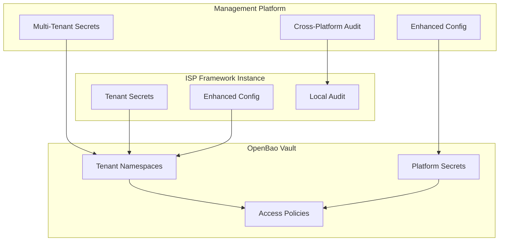

# DotMac Management Platform Architecture

## 🎯 **Project Overview**

The DotMac Management Platform is a comprehensive SaaS solution for deploying, managing, and monitoring multiple DotMac ISP Framework instances across different cloud providers and tenants.

## 📁 **Module Architecture & Objectives**

### **Core Services (`src/mgmt/services/`)**

#### **1. Tenant Management (`tenant_management/`)**
**Purpose**: Manage ISP customer lifecycle and tenant isolation

```python
# Files & Objectives:
├── onboarding.py          # ISP customer registration & validation
├── provisioning.py        # Tenant resource allocation & setup  
├── lifecycle.py           # Tenant status management (active, suspended, cancelled)
├── configuration.py       # Tenant-specific settings & customization
├── billing_integration.py # Link tenants to billing system
└── models.py              # Tenant data models & schemas

# Key Features:
- Multi-tenant customer onboarding workflow
- Tenant resource quota management
- Custom branding & domain configuration
- Tenant status lifecycle automation
- Integration with billing and deployment services
```

#### **2. Deployment Engine (`deployment_engine/`)**
**Purpose**: Automated infrastructure provisioning and DotMac deployment

```python
# Files & Objectives:
├── opentofu/
│   ├── orchestrator.py    # OpenTofu execution engine
│   ├── state_manager.py   # Terraform state management
│   ├── workspace_manager.py # Multi-tenant workspace isolation
│   └── resource_tracker.py # Infrastructure resource tracking
├── provisioning.py        # Cloud resource provisioning
├── monitoring.py          # Infrastructure health monitoring  
├── scaling.py             # Auto-scaling management
├── backup_manager.py      # Automated backup orchestration
└── deployment_workflows.py # End-to-end deployment processes

# Key Features:
- Multi-cloud infrastructure provisioning (AWS, Azure, GCP, DO)
- Zero-downtime deployments and updates
- Infrastructure state management and drift detection  
- Automated scaling based on usage metrics
- Disaster recovery and backup automation
```

#### **3. Secrets Management (`secrets_management/`)**
**Purpose**: OpenBao integration for secure credential management

```python
# Files & Objectives:
├── openbao_client.py      # OpenBao API client wrapper
├── secret_provisioning.py # Per-tenant secret provisioning
├── credential_rotation.py # Automated credential rotation
├── access_policies.py     # OpenBao policy management
├── audit_logging.py       # Secret access auditing
└── encryption_utils.py    # Additional encryption utilities

# Key Features:
- Per-tenant secret isolation in OpenBao
- Automated credential rotation schedules
- Policy-based access control
- Comprehensive audit logging
- Integration with deployment engine for secure bootstrapping
```

#### **4. Billing SaaS (`billing_saas/`)**
**Purpose**: Platform subscription billing and revenue management

```python
# Files & Objectives:
├── subscriptions.py       # Platform subscription management
├── usage_tracking.py      # Resource usage monitoring & billing
├── pricing_engine.py      # Dynamic pricing calculations
├── invoicing.py           # Automated invoice generation
├── payment_processing.py  # Payment gateway integration (Stripe)
├── revenue_analytics.py   # Revenue reporting & forecasting
└── commission_engine.py   # Reseller commission calculations

# Key Features:
- Flexible subscription models (per-tenant, usage-based)
- Real-time usage tracking and billing
- Automated invoice generation and payment processing
- Revenue analytics and forecasting
- Reseller commission tracking and payouts
```

#### **5. Instance Management (`instance_management/`)**
**Purpose**: DotMac instance lifecycle and operations management

```python
# Files & Objectives:
├── deployment.py          # DotMac instance deployment orchestration
├── updates.py             # Instance updates & patch management
├── backups.py             # Automated backup management
├── monitoring.py          # Instance health monitoring
├── scaling.py             # Instance scaling operations
├── migrations.py          # Data migration tools
├── maintenance.py         # Scheduled maintenance workflows
└── disaster_recovery.py   # DR procedures and automation

# Key Features:
- Automated DotMac platform deployment to tenant infrastructure
- Rolling updates with zero-downtime
- Comprehensive backup and recovery automation
- Real-time health monitoring and alerting
- Horizontal and vertical scaling automation
```

#### **6. Support Orchestration (`support_orchestration/`)**
**Purpose**: Cross-tenant support coordination and escalation

```python
# Files & Objectives:
├── ticket_routing.py      # Cross-instance ticket routing
├── escalation_management.py # Support escalation workflows
├── knowledge_sharing.py   # Shared knowledge base management
├── sla_monitoring.py      # SLA tracking across tenants
├── support_analytics.py   # Support performance metrics
├── communication_hub.py   # Unified communication center
└── expert_matching.py     # Match tickets to subject matter experts

# Key Features:
- Centralized ticket routing across all tenant instances
- Automated escalation based on SLA and severity
- Shared knowledge base with AI-powered recommendations
- Support team performance analytics
- Integration with tenant-specific support systems
```

#### **7. Reseller Network (`reseller_network/`)**
**Purpose**: Channel partner management and commission tracking

```python
# Files & Objectives:
├── partner_management.py  # Reseller partner onboarding & management
├── commission_engine.py   # Commission calculations & tracking
├── territory_management.py # Geographic territory assignments
├── sales_tools.py         # Sales enablement tools & resources
├── performance_tracking.py # Reseller performance analytics
├── lead_distribution.py   # Automated lead routing
└── white_labeling.py      # Partner branding customization

# Key Features:
- Comprehensive reseller partner onboarding
- Automated commission calculations and payouts
- Territory management and conflict resolution
- Sales enablement tools and training materials
- Performance dashboards and analytics
```

#### **8. Kubernetes Orchestrator (`kubernetes_orchestrator/`)**
**Purpose**: Container-based tenant deployment and lifecycle management

```python
# Files & Objectives:
├── service.py             # Kubernetes deployment orchestration
├── models.py              # Tenant deployment tracking models
├── exceptions.py          # Orchestration error handling
└── __init__.py           # Service exports

# Key Features:
- Automated Kubernetes tenant deployment with resource tiers
- Container-based ISP Framework instance management
- Per-tenant namespace isolation and security
- Horizontal/vertical scaling based on subscription plans
- Health monitoring and automated recovery
- Template-based deployment with tenant customization
```

#### **9. Plugin Licensing (`plugin_licensing/`)**
**Purpose**: Plugin subscription management and billing integration

```python
# Files & Objectives:
├── service.py             # Plugin licensing business logic
├── models.py              # Plugin catalog and subscription models
├── exceptions.py          # Licensing error handling
└── __init__.py           # Service exports

# Key Features:
- Tiered plugin catalog (free, basic, premium, enterprise)
- Usage-based billing with metrics tracking
- Feature entitlements and access control
- Trial management and conversion workflows
- License validation and compliance monitoring
- Integration with main billing system
```

#### **10. SaaS Monitoring (`saas_monitoring/`)**
**Purpose**: Tenant health checks and SLA compliance monitoring

```python
# Files & Objectives:
├── service.py             # Health check orchestration
├── models.py              # Health metrics and alert models
├── exceptions.py          # Monitoring error handling
└── __init__.py           # Service exports

# Key Features:
- Comprehensive tenant health monitoring
- Real-time alerting with severity levels
- SLA metrics calculation and compliance tracking
- Multi-tenant monitoring with privacy isolation
- Performance benchmarking and optimization insights
- Automated escalation and incident management
```

#### **11. Analytics Platform (`analytics_platform/`)**
**Purpose**: Platform-wide business intelligence and insights

```python
# Files & Objectives:
├── tenant_analytics.py    # Cross-tenant analytics and insights
├── usage_analytics.py     # Resource usage pattern analysis
├── business_intelligence.py # Advanced BI and reporting
├── performance_metrics.py # Platform performance monitoring
├── forecasting.py         # Growth and capacity forecasting
├── churn_analysis.py      # Customer churn prediction
└── dashboard_engine.py    # Dynamic dashboard generation

# Key Features:
- Cross-tenant analytics while maintaining privacy
- Resource usage optimization recommendations  
- Business intelligence dashboards for decision makers
- Predictive analytics for capacity planning
- Customer health scoring and churn prevention
```

### **Shared Infrastructure (`src/mgmt/shared/`)**

#### **Database Layer (`database/`)**
```python
├── models/                # SQLAlchemy models for all services
├── migrations/            # Alembic database migrations  
├── repositories/          # Repository pattern implementations
├── connections.py         # Database connection management
└── multi_tenant.py        # Multi-tenant data isolation utilities
```

#### **Event System (`events/`)**
```python
├── bus.py                 # In-process event bus
├── handlers/              # Event handler implementations
├── schemas.py             # Event schemas and validation
├── middleware.py          # Event processing middleware
└── integrations.py        # External event system integrations
```

#### **Authentication & Authorization (`auth/`)**
```python
├── jwt.py                 # JWT token handling
├── permissions.py         # RBAC permission system
├── middleware.py          # Authentication middleware
├── providers.py           # Auth provider integrations (LDAP, OAuth)
└── tenant_isolation.py    # Tenant-based access control
```

#### **OpenBao Integration (`openbao_integration/`)**
```python
├── client.py              # OpenBao client wrapper
├── policy_manager.py      # Dynamic policy management
├── secret_templates.py    # Secret provisioning templates
├── rotation_scheduler.py  # Credential rotation automation
└── audit_processor.py     # Audit log processing
```

#### **Monitoring (`monitoring/`)**
```python
├── signoz_client.py       # SignOz integration client
├── metrics_collector.py   # Custom metrics collection
├── trace_instrumentation.py # Distributed tracing setup
├── log_aggregation.py     # Structured logging
├── alerting.py            # Alert management
├── dashboards.py          # Dashboard management
└── tenant_isolation.py    # Multi-tenant observability
```

## 🌐 **Portal Architecture & Objectives**

### **1. Master Admin Portal (`portals/master_admin/`)**
**Users**: Platform operators and administrators
**Purpose**: Complete platform oversight and management

```typescript
// Portal Structure & Features:
├── dashboard/             # Platform-wide overview dashboard
│   ├── metrics-overview.tsx      # Key platform metrics
│   ├── tenant-health.tsx         # Tenant health monitoring  
│   ├── resource-usage.tsx        # Infrastructure utilization
│   └── financial-summary.tsx     # Revenue and cost overview

├── tenant_management/     # ISP customer management
│   ├── tenant-list.tsx           # All tenants overview
│   ├── tenant-onboarding.tsx     # New tenant registration
│   ├── tenant-details.tsx        # Individual tenant management
│   ├── resource-quotas.tsx       # Tenant resource allocation
│   └── tenant-billing.tsx        # Tenant billing management

├── deployment_console/    # Infrastructure deployment management
│   ├── deployment-queue.tsx      # Deployment pipeline status
│   ├── cloud-resources.tsx       # Multi-cloud resource overview
│   ├── infrastructure-costs.tsx  # Cost analysis per tenant
│   └── deployment-templates.tsx  # Deployment configuration templates

├── support_coordination/  # Cross-tenant support management
│   ├── support-dashboard.tsx     # Support metrics overview
│   ├── ticket-routing.tsx        # Ticket distribution management
│   ├── escalation-matrix.tsx     # Support escalation rules
│   └── knowledge-base.tsx        # Shared knowledge management

├── reseller_network/      # Partner network management
│   ├── partner-overview.tsx      # Reseller network dashboard
│   ├── partner-onboarding.tsx    # New partner registration
│   ├── commission-management.tsx # Commission tracking & payouts
│   └── territory-mapping.tsx     # Geographic territory management

├── analytics_dashboard/   # Platform business intelligence
│   ├── business-metrics.tsx      # Key business KPIs
│   ├── usage-analytics.tsx       # Platform usage insights
│   ├── financial-reporting.tsx   # Revenue and profitability
│   └── forecasting.tsx           # Growth projections

└── system_settings/       # Platform configuration
    ├── feature-flags.tsx         # Feature flag management
    ├── integration-settings.tsx  # External service configs
    ├── security-policies.tsx     # Security configuration
    └── backup-settings.tsx       # Backup and recovery settings
```

### **2. Tenant Admin Portal (`portals/tenant_admin/`)**
**Users**: ISP customers managing their DotMac instance  
**Purpose**: Self-service instance management and monitoring

```typescript
// Portal Structure & Features:
├── dashboard/             # Tenant-specific dashboard
│   ├── instance-overview.tsx     # DotMac instance status
│   ├── customer-metrics.tsx      # Their end-customer metrics
│   ├── service-health.tsx        # Service uptime and performance
│   └── recent-activity.tsx       # Recent system activities

├── instance_management/   # DotMac instance controls
│   ├── instance-settings.tsx     # Instance configuration
│   ├── scaling-controls.tsx      # Scale up/down controls
│   ├── backup-management.tsx     # Backup scheduling and restore
│   ├── update-management.tsx     # Platform updates and patches
│   └── maintenance-windows.tsx   # Scheduled maintenance

├── billing_portal/        # Subscription and billing
│   ├── subscription-overview.tsx # Current subscription details
│   ├── usage-metrics.tsx         # Resource usage and costs
│   ├── invoice-history.tsx       # Billing history
│   ├── payment-methods.tsx       # Payment method management
│   └── billing-alerts.tsx        # Usage alerts and notifications

├── support_portal/        # Support and help center
│   ├── support-dashboard.tsx     # Support ticket overview
│   ├── create-ticket.tsx         # New ticket creation
│   ├── ticket-history.tsx        # Support ticket history
│   ├── knowledge-base.tsx        # Self-help documentation
│   └── contact-support.tsx       # Direct support contact

├── configuration/         # Instance customization
│   ├── branding-settings.tsx     # Custom branding options
│   ├── domain-management.tsx     # Custom domain setup
│   ├── feature-toggles.tsx       # Available feature management
│   ├── integration-setup.tsx     # Third-party integrations
│   └── user-management.tsx       # Instance user administration

└── analytics/             # Tenant-specific analytics
    ├── performance-metrics.tsx   # Instance performance data
    ├── customer-insights.tsx     # Their customer analytics
    ├── usage-patterns.tsx        # Usage pattern analysis
    └── custom-reports.tsx        # Custom report builder
```

### **3. Reseller Portal (`portals/reseller/`)**
**Users**: Channel partners selling DotMac instances
**Purpose**: Sales pipeline and commission management

```typescript
// Portal Structure & Features:
├── dashboard/             # Reseller performance dashboard  
│   ├── sales-overview.tsx        # Sales metrics and pipeline
│   ├── commission-summary.tsx    # Commission earnings overview
│   ├── territory-performance.tsx # Geographic performance
│   └── target-tracking.tsx       # Sales targets and achievements

├── customer_pipeline/     # Sales pipeline management
│   ├── lead-management.tsx       # Lead tracking and nurturing
│   ├── opportunity-pipeline.tsx  # Sales opportunity management
│   ├── quote-generator.tsx       # Automated quote generation
│   ├── proposal-builder.tsx      # Sales proposal creation
│   └── customer-onboarding.tsx   # New customer onboarding

├── commission_tracking/   # Commission and payments
│   ├── commission-dashboard.tsx  # Commission overview
│   ├── earnings-history.tsx      # Historical earnings
│   ├── payout-schedule.tsx       # Payment schedule and status
│   ├── performance-bonuses.tsx   # Bonus tracking
│   └── tax-reporting.tsx         # Tax documentation

├── territory_management/  # Geographic territory management
│   ├── territory-map.tsx         # Interactive territory map
│   ├── territory-performance.tsx # Territory-specific metrics
│   ├── competitor-analysis.tsx   # Market competition insights
│   └── market-opportunities.tsx  # Identified market opportunities

├── sales_tools/           # Sales enablement resources
│   ├── product-catalog.tsx       # DotMac product information
│   ├── pricing-calculator.tsx    # Interactive pricing tool
│   ├── demo-scheduler.tsx        # Product demo scheduling
│   ├── marketing-materials.tsx   # Sales collateral library
│   └── training-center.tsx       # Sales training resources

└── performance_metrics/   # Performance analytics
    ├── sales-analytics.tsx       # Detailed sales analytics
    ├── customer-satisfaction.tsx # Customer feedback metrics
    ├── competitive-positioning.tsx # Market position analysis
    └── growth-projections.tsx    # Territory growth forecasts
```

## 🔄 **Integration Points and Data Flow**

### **Management Platform → ISP Framework (Kubernetes)**
```python
# Tenant Orchestration API:
POST /api/v1/tenant-orchestration/deployments    # Create tenant deployment
PATCH /api/v1/tenant-orchestration/deployments/{tenant_id}  # Update deployment
POST /api/v1/tenant-orchestration/deployments/{tenant_id}/scale  # Scale tenant
DELETE /api/v1/tenant-orchestration/deployments/{tenant_id}  # Delete tenant
GET /api/v1/tenant-orchestration/deployments     # List all deployments
GET /api/v1/tenant-orchestration/cluster/health  # Cluster health
```

### **Plugin Licensing Integration**
```python
# Plugin Management API:
GET /api/v1/plugins/catalog                      # Available plugins
POST /api/v1/plugins/subscriptions               # Create plugin subscription
PUT /api/v1/plugins/subscriptions/{id}           # Upgrade/modify subscription
POST /api/v1/plugins/usage                       # Record plugin usage
GET /api/v1/plugins/entitlements/{tenant_id}     # Get tenant entitlements
```

### **ISP Framework → Management Platform**  
```python
# Health & Telemetry:
POST /api/v1/monitoring/health-checks            # Health check results
POST /api/v1/monitoring/metrics                  # Performance metrics
POST /api/v1/monitoring/alerts                   # Alert notifications
POST /api/v1/plugins/usage-events                # Plugin usage tracking
```

### **SaaS Architecture Flow**
```
┌─────────────────────┐    ┌──────────────────────┐    ┌─────────────────────┐
│  Management Platform │────│ Kubernetes Cluster   │────│ ISP Framework       │
│  - Tenant Onboarding │    │ - Tenant Deployments │    │ - Per-Tenant Instance│
│  - Plugin Licensing  │    │ - Resource Management│    │ - Plugin System     │
│  - SaaS Monitoring   │    │ - Health Monitoring  │    │ - Portal Customers  │
└─────────────────────┘    └──────────────────────┘    └─────────────────────┘
```

## 🎯 **SaaS Business Model Implementation**

### **Revenue Streams**

#### **1. Tenant Subscriptions**
- **Per-ISP Monthly Recurring Revenue**: Base platform subscription
- **Resource Tiers**: Micro, Small, Medium, Large, XLarge with different resource allocations
- **Geographic Pricing**: Regional pricing strategies for global expansion

#### **2. Plugin Licensing System**
```python
# Plugin Tiers:
FREE_PLUGINS = ["basic_customer_management", "basic_billing", "basic_reporting"]
BASIC_PLUGINS = ["advanced_billing", "crm_integration", "api_access"] 
PREMIUM_PLUGINS = ["advanced_analytics", "custom_integrations", "white_labeling"]
ENTERPRISE_PLUGINS = ["ai_insights", "predictive_analytics", "unlimited_apis"]
```

#### **3. Usage-Based Billing**
- **API Calls**: Per-request pricing for heavy API users
- **Storage**: GB-based pricing for data storage
- **Transactions**: Payment processing volume-based pricing
- **Advanced Features**: Usage-based pricing for AI/ML features

#### **4. Channel Partner Revenue**
- **Reseller Commissions**: Recurring revenue sharing with partners
- **Territory Management**: Geographic sales territory allocation
- **Performance Bonuses**: Incentive-based commission structure

### **Tenant Isolation Architecture**

#### **Kubernetes-Based Multi-Tenancy**
```yaml
# Per-tenant deployment example:
apiVersion: apps/v1
kind: Deployment
metadata:
  name: dotmac-tenant-{tenant-id}
  namespace: dotmac-tenant-{tenant-id}
spec:
  template:
    spec:
      containers:
      - name: isp-framework
        env:
        - name: ISP_TENANT_ID
          value: "{tenant-id}"
        - name: PLUGIN_LICENSE_TIER
          value: "{license-tier}"
```

#### **Plugin System Integration**
```python
# License-based feature gating:
def check_plugin_access(tenant_id: str, plugin_id: str) -> bool:
    subscription = get_plugin_subscription(tenant_id, plugin_id)
    if not subscription or not subscription.is_active:
        return False
    return subscription.validate_usage_limits()
```

### **Deployment Architecture**

#### **Three-Tier SaaS Model**
1. **Management Platform** (Single Instance)
   - Orchestrates all tenant deployments
   - Manages plugin licensing and billing
   - Provides master admin, tenant admin, and reseller portals

2. **ISP Framework Instances** (Per Tenant)
   - Containerized deployment per ISP customer
   - Plugin-based feature activation
   - Isolated data and processing

3. **Portal Customers** (Per ISP)
   - End customers of each ISP
   - Managed through tenant-specific ISP Framework instance
   - Complete data isolation per ISP

This architecture enables true SaaS scalability while maintaining complete tenant isolation and flexible monetization through plugin licensing.

## 🔐 Enhanced Cross-Platform Configuration Architecture

### Unified Configuration Security Model

The Management Platform implements **unified configuration management** that resolves the "inverted security pattern" - ensuring the orchestrator has security parity with the orchestrated systems:



### Security Architecture Components

#### **1. Multi-Tenant Secrets Orchestration**

```python
class MultiTenantSecretsManager(BaseSecretsManager):
    """Enhanced secrets management for multi-tenant SaaS platform"""
    
    async def create_tenant_secret_namespace(self, tenant_id: str) -> Dict[str, Any]:
        """Create isolated secret namespace for tenant"""
        namespace_path = f"dotmac/tenants/{tenant_id}"
        
        # Create tenant-specific policies
        await self.openbao_client.create_policy(
            name=f"tenant-{tenant_id}-secrets",
            policy=self._generate_tenant_policy(tenant_id)
        )
        
        # Initialize tenant secrets structure
        await self._initialize_tenant_secrets(tenant_id)
        
        return {
            "namespace": namespace_path,
            "policies": [f"tenant-{tenant_id}-secrets"],
            "isolation_level": "strict"
        }
    
    async def provision_tenant_secrets(self, tenant_id: str, secrets: Dict[str, Any]):
        """Provision secrets for tenant and sync to ISP Framework instance"""
        
        # Store secrets in Management Platform namespace
        mgmt_result = await self.store_management_secrets(tenant_id, secrets)
        
        # Propagate to tenant ISP Framework instance
        isp_result = await self.sync_to_tenant_isp_framework(tenant_id, secrets)
        
        # Log cross-platform secret operation
        await self.audit_orchestrator.log_secret_operation(
            operation="provision",
            tenant_id=tenant_id,
            platforms=["management", "tenant_isp_framework"]
        )
        
        return {
            "management_platform": mgmt_result,
            "tenant_isp_framework": isp_result,
            "sync_status": "completed"
        }
```

#### **2. Cross-Platform Configuration Orchestration**

```python
class ConfigurationOrchestrator:
    """Coordinate configuration updates across Management Platform and ISP Framework"""
    
    async def coordinate_tenant_config_update(
        self, 
        tenant_id: str, 
        config_data: Dict[str, Any],
        coordination_strategy: str = "management_first"
    ) -> ConfigurationCoordinationResult:
        """Coordinate configuration updates ensuring consistency"""
        
        coordination_id = f"coord_{uuid4()}"
        
        try:
            if coordination_strategy == "management_first":
                # Update Management Platform configuration first
                mgmt_result = await self.update_management_platform_config(
                    tenant_id, config_data
                )
                
                # Propagate to tenant ISP Framework
                isp_result = await self.update_tenant_isp_framework(
                    tenant_id, config_data
                )
                
            elif coordination_strategy == "synchronized":
                # Update both platforms simultaneously
                mgmt_task = self.update_management_platform_config(tenant_id, config_data)
                isp_task = self.update_tenant_isp_framework(tenant_id, config_data)
                
                mgmt_result, isp_result = await asyncio.gather(mgmt_task, isp_task)
            
            # Validate cross-platform consistency
            consistency_check = await self.validate_cross_platform_consistency(tenant_id)
            
            # Log coordination event
            await self.audit_orchestrator.log_coordinated_update(
                coordination_id=coordination_id,
                tenant_id=tenant_id,
                config_data=config_data,
                results={"management": mgmt_result, "isp_framework": isp_result}
            )
            
            return ConfigurationCoordinationResult(
                coordination_id=coordination_id,
                status="completed",
                consistency_validated=consistency_check.is_consistent,
                platforms_updated=["management", "tenant_isp_framework"]
            )
            
        except Exception as e:
            # Execute rollback on failure
            await self.rollback_coordinated_update(coordination_id, tenant_id)
            raise ConfigurationOrchestrationError(f"Coordination failed: {str(e)}")
```

#### **3. Cross-Platform Audit Orchestration**

```python
class CrossPlatformAuditOrchestrator:
    """Orchestrate audit trails across Management Platform and ISP Framework instances"""
    
    async def log_cross_platform_event(
        self,
        source: str,
        target: str,
        tenant_id: str,
        event_type: str,
        event_data: Dict[str, Any],
        correlation_id: Optional[str] = None
    ) -> str:
        """Log events that span multiple platforms"""
        
        audit_event = CrossPlatformAuditEvent(
            id=f"audit_{uuid4()}",
            timestamp=datetime.utcnow(),
            source_platform=source,
            target_platform=target,
            tenant_id=tenant_id,
            event_type=event_type,
            event_data=event_data,
            correlation_id=correlation_id or f"corr_{uuid4()}"
        )
        
        # Store in Management Platform audit log
        await self.store_audit_event(audit_event)
        
        # Forward to tenant ISP Framework audit system
        if target == "tenant_isp_framework":
            await self.forward_to_tenant_audit_system(tenant_id, audit_event)
        
        # Generate compliance report if required
        if self._requires_compliance_reporting(event_type):
            await self.generate_compliance_report_entry(audit_event)
            
        return audit_event.id
    
    async def generate_tenant_audit_summary(
        self,
        tenant_id: str,
        start_date: datetime,
        end_date: datetime
    ) -> TenantAuditSummary:
        """Generate comprehensive audit summary across both platforms"""
        
        # Aggregate events from Management Platform
        mgmt_events = await self.get_management_platform_events(
            tenant_id, start_date, end_date
        )
        
        # Aggregate events from tenant ISP Framework
        isp_events = await self.get_tenant_isp_framework_events(
            tenant_id, start_date, end_date
        )
        
        # Correlate cross-platform events
        correlated_events = await self._correlate_cross_platform_events(
            mgmt_events, isp_events
        )
        
        return TenantAuditSummary(
            tenant_id=tenant_id,
            period={"start": start_date, "end": end_date},
            management_platform_events=len(mgmt_events),
            isp_framework_events=len(isp_events),
            cross_platform_correlations=len(correlated_events),
            compliance_status=await self._assess_compliance_status(tenant_id),
            security_incidents=await self._identify_security_incidents(correlated_events)
        )
```

#### **4. Coordinated Disaster Recovery**

```python
class CoordinatedDisasterRecovery:
    """Coordinate disaster recovery across Management Platform and ISP Framework"""
    
    async def detect_cross_platform_disaster(
        self, 
        tenant_ids: List[str]
    ) -> CrossPlatformDisasterAssessment:
        """Detect disasters that affect multiple platforms"""
        
        disaster_indicators = []
        
        for tenant_id in tenant_ids:
            # Check Management Platform tenant configuration
            mgmt_health = await self.check_management_platform_tenant_health(tenant_id)
            
            # Check tenant ISP Framework instance
            isp_health = await self.check_tenant_isp_framework_health(tenant_id)
            
            # Analyze cross-platform consistency
            consistency = await self.validate_cross_platform_consistency(tenant_id)
            
            if not (mgmt_health.is_healthy and isp_health.is_healthy and consistency.is_consistent):
                disaster_indicators.append(
                    DisasterIndicator(
                        tenant_id=tenant_id,
                        management_health=mgmt_health,
                        isp_framework_health=isp_health,
                        consistency_status=consistency
                    )
                )
        
        return CrossPlatformDisasterAssessment(
            disaster_detected=len(disaster_indicators) > 0,
            affected_tenants=len(disaster_indicators),
            disaster_indicators=disaster_indicators,
            recommended_recovery_strategy=self._determine_recovery_strategy(disaster_indicators)
        )
    
    async def execute_coordinated_recovery(
        self,
        disaster_id: str,
        affected_tenants: List[str],
        recovery_strategy: str
    ) -> CoordinatedRecoveryResult:
        """Execute disaster recovery across both platforms"""
        
        recovery_results = {}
        
        for tenant_id in affected_tenants:
            tenant_recovery = await self._execute_tenant_recovery(
                tenant_id=tenant_id,
                recovery_strategy=recovery_strategy,
                coordination_mode="sequential"  # Ensure ordered recovery
            )
            
            recovery_results[tenant_id] = tenant_recovery
            
            # Validate recovery success before proceeding
            post_recovery_health = await self._validate_tenant_recovery(tenant_id)
            if not post_recovery_health.is_recovered:
                # Halt recovery and escalate
                await self._escalate_recovery_failure(disaster_id, tenant_id)
                break
        
        return CoordinatedRecoveryResult(
            disaster_id=disaster_id,
            overall_status="completed" if all(r.success for r in recovery_results.values()) else "partial",
            tenant_results=recovery_results,
            total_recovery_time=await self._calculate_recovery_time(disaster_id)
        )
```

### Security Model: Resolution of "Inverted Security Pattern"

#### **Problem Identified**
Previously, the Management Platform had **weaker security** than the ISP Framework instances it manages - creating an "inverted security model" where the orchestrator was less secure than the orchestrated systems.

#### **Security Parity Implementation**

✅ **Enhanced Management Platform Security:**
- Same encryption standards as ISP Framework (AES-256-GCM)
- OpenBao vault integration with multi-tenant namespaces
- Field-level encryption for sensitive management data
- Cross-platform audit orchestration
- Coordinated disaster recovery capabilities

✅ **Unified Security Architecture:**
- Shared security components between platforms
- Consistent authentication and authorization models
- Synchronized compliance validation
- Cross-platform secret management with automatic rotation

✅ **Enhanced Multi-Tenant Isolation:**
- Management Platform now provides **enhanced** security for multi-tenant operations
- Per-tenant secret namespaces with strict access policies
- Cross-platform configuration consistency validation
- Unified audit trails with correlation across platforms

This architecture ensures that the **Management Platform security matches or exceeds** the security of the ISP Framework instances it orchestrates, resolving the security inversion and providing a robust foundation for multi-tenant SaaS operations.