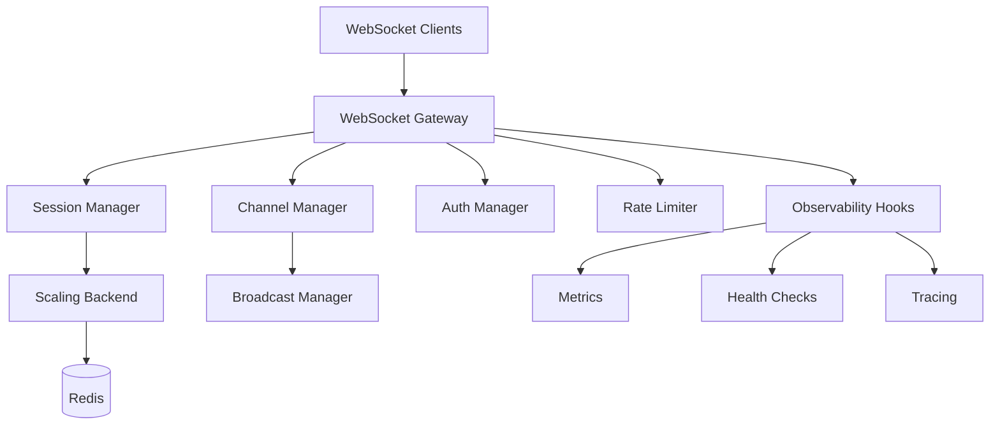
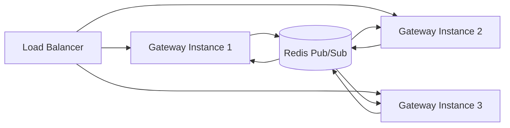

# DotMac WebSocket Gateway

A comprehensive, production-ready WebSocket gateway with advanced features like multi-tenant support, Redis scaling, authentication, rate limiting, and observability.

## Features

### Core Functionality
- **High-performance WebSocket server** built on `websockets` library
- **Session management** with automatic cleanup and health monitoring
- **Channel system** for real-time broadcasting and subscriptions
- **Multi-tenant isolation** with tenant-aware routing
- **Horizontal scaling** with Redis pub/sub backend

### Authentication & Security
- **JWT-based authentication** with role and permission support
- **Rate limiting** per IP, user, and tenant with burst capacity
- **Tenant isolation** for multi-tenant deployments
- **Middleware system** for custom authentication and validation

### Observability & Monitoring
- **Health checks** with component-level status monitoring
- **Metrics collection** with Prometheus-compatible exports
- **OpenTelemetry integration** for distributed tracing
- **Comprehensive logging** with structured events

### Advanced Features
- **Advanced broadcasting** with role and permission targeting
- **Channel abstractions** with persistent subscriptions
- **Background task management** for cleanup and monitoring
- **Graceful shutdown** with connection draining

## Quick Start

### Installation

```bash
pip install dotmac-websockets

# With optional dependencies
pip install dotmac-websockets[redis,auth,observability,all]
```

### Basic Usage

```python
import asyncio
from dotmac.websockets import WebSocketGateway, create_development_config

async def main():
    # Create configuration
    config = create_development_config(host="0.0.0.0", port=8765)
    
    # Create and start gateway
    gateway = WebSocketGateway(config)
    
    # Add custom message handler
    async def handle_echo(session, data):
        await session.send_message("echo_response", data)
    
    gateway.add_message_handler("echo", handle_echo)
    
    # Start server
    async with gateway:
        print("WebSocket server running on ws://localhost:8765/ws")
        await asyncio.Event().wait()  # Run forever

if __name__ == "__main__":
    asyncio.run(main())
```

### Advanced Configuration

```python
from dotmac.websockets import (
    WebSocketGateway, 
    WebSocketConfig, 
    RedisConfig, 
    AuthConfig,
    BackendType
)

config = WebSocketConfig(
    host="0.0.0.0",
    port=8765,
    
    # Redis scaling
    backend_type=BackendType.REDIS,
    redis_config=RedisConfig(host="localhost", port=6379),
    
    # Authentication
    auth_config=AuthConfig(
        enabled=True,
        jwt_secret_key="your-secret-key",
        require_token=True
    ),
    
    # Rate limiting
    rate_limit_config=dict(
        enabled=True,
        messages_per_minute=60,
        max_connections_per_ip=20
    ),
    
    # Multi-tenancy
    tenant_isolation_enabled=True
)

gateway = WebSocketGateway(config)
```

## Architecture

### Core Components



### Session Lifecycle

1. **Connection**: Client connects, session created
2. **Authentication**: Optional JWT validation
3. **Channel Subscriptions**: Client subscribes to channels/rooms
4. **Message Handling**: Custom message routing and processing
5. **Broadcasting**: Messages sent to channels, users, or tenants
6. **Cleanup**: Session cleanup on disconnect or timeout

### Scaling Architecture



## Authentication

### JWT Authentication

```python
from dotmac.websockets import AuthConfig

auth_config = AuthConfig(
    enabled=True,
    jwt_secret_key="your-secret-key",
    jwt_algorithm="HS256",
    require_token=True
)

# JWT payload should include:
{
    "sub": "user_id",
    "tenant_id": "tenant_123",
    "roles": ["user", "admin"],
    "permissions": ["read", "write"],
    "exp": 1234567890
}
```

### Custom Authentication

```python
async def custom_auth_handler(session, data):
    token = data.get("token")
    # Custom validation logic
    if valid_token(token):
        session.set_user_info("user_123", "tenant_456")
        await session.send_message("auth_success", {"user_id": "user_123"})
    else:
        await session.send_message("auth_failed", {"error": "Invalid token"})

gateway.add_message_handler("custom_auth", custom_auth_handler)
```

## Channel System

### Basic Channels

```python
# Client subscribes to a channel
await session.send_message("subscribe", {"channel": "notifications"})

# Broadcast to channel
await gateway.broadcast_to_channel(
    "notifications",
    "notification",
    {"message": "System maintenance in 5 minutes"}
)
```

### Advanced Broadcasting

```python
from dotmac.websockets import BroadcastManager, BroadcastTarget, BroadcastScope

# Broadcast to users with specific role
await broadcast_manager.broadcast_to_role(
    "admin",
    "admin_alert",
    {"message": "High priority alert"}
)

# Broadcast to tenant
await broadcast_manager.broadcast_to_tenant(
    "tenant_123",
    "tenant_news",
    {"message": "New features available"}
)
```

## Multi-Tenancy

### Tenant Isolation

```python
config = WebSocketConfig(
    tenant_isolation_enabled=True,
    # Channels automatically prefixed with tenant ID
)

# Tenant-aware channel subscriptions
# "general" becomes "tenant:tenant_123:general"
await gateway.channel_manager.subscribe_session(session, "general")
```

### Tenant Extraction

Tenants can be identified from:
- URL path: `/ws/tenant/tenant_123`
- Query parameters: `/ws?tenant=tenant_123`
- Headers: `X-Tenant-ID: tenant_123`
- Subdomains: `tenant123.yourdomain.com`

## Rate Limiting

### Configuration

```python
rate_limit_config = dict(
    enabled=True,
    max_connections_per_ip=50,
    max_connections_per_user=10,
    max_connections_per_tenant=500,
    messages_per_minute=120,
    burst_size=20
)
```

### Rate Limit Status

```python
status = gateway.rate_limit_middleware.get_rate_limit_status(session)
# Returns current limits and usage
```

## Observability

### Health Checks

```python
health = await gateway.health_check()
# Returns:
{
    "status": "healthy",
    "components": {
        "server": {"status": "healthy"},
        "sessions": {"status": "healthy", "total_sessions": 42},
        "scaling_backend": {"status": "healthy"}
    }
}
```

### Metrics

```python
from dotmac.websockets import create_dotmac_observability_hooks

# OpenTelemetry integration
hooks = create_dotmac_observability_hooks("my-websocket-service")
gateway.set_observability_hooks(hooks)

# Custom metrics
stats = gateway.get_stats()
prometheus_metrics = gateway.get_prometheus_metrics()
```

### Custom Observability

```python
async def on_connection(session):
    print(f"New connection: {session.session_id}")

async def on_message(session, message):
    print(f"Message from {session.session_id}: {len(message)} bytes")

hooks = create_default_hooks()
hooks.add_connection_handler(on_connection)
hooks.add_message_handler(on_message)
```

## Examples

### Basic WebSocket Server

See [examples/basic_usage.py](examples/basic_usage.py) for a complete basic example with:
- Connection handling
- Custom message routing
- Channel subscriptions
- Broadcasting

### Advanced Features

See [examples/advanced_features.py](examples/advanced_features.py) for advanced features:
- JWT authentication
- Redis scaling
- Rate limiting
- Multi-tenancy
- Observability

### Client Testing

See [examples/client_test.py](examples/client_test.py) for comprehensive client tests:
- Connection testing
- Authentication flows
- Load testing
- Feature validation

## Testing

Run the test suite:

```bash
# Basic tests
pytest

# With specific markers
pytest -m unit
pytest -m integration
pytest -m redis  # Requires Redis
```

## Production Deployment

### Docker

```dockerfile
FROM python:3.11-slim

WORKDIR /app
COPY requirements.txt .
RUN pip install -r requirements.txt

COPY . .
CMD ["python", "app.py"]
```

### Environment Variables

```bash
# Server
WS_HOST=0.0.0.0
WS_PORT=8765
WS_PATH=/ws

# Redis
REDIS_URL=redis://redis:6379/0

# Authentication
JWT_SECRET_KEY=your-secret-key
JWT_ALGORITHM=HS256

# Rate Limiting
RATE_LIMIT_ENABLED=true
MAX_CONNECTIONS_PER_IP=100
MESSAGES_PER_MINUTE=120
```

### High Availability Setup

```yaml
# docker-compose.yml
version: '3.8'
services:
  websocket-1:
    build: .
    environment:
      - REDIS_URL=redis://redis:6379/0
    depends_on:
      - redis
  
  websocket-2:
    build: .
    environment:
      - REDIS_URL=redis://redis:6379/0
    depends_on:
      - redis
  
  redis:
    image: redis:7-alpine
    command: redis-server --appendonly yes
    volumes:
      - redis_data:/data
  
  nginx:
    image: nginx:alpine
    ports:
      - "80:80"
    volumes:
      - ./nginx.conf:/etc/nginx/nginx.conf
```

### Monitoring

```python
# Prometheus metrics endpoint
from fastapi import FastAPI
from dotmac.websockets import create_fastapi_websocket_app

app = create_fastapi_websocket_app(config)

@app.get("/metrics")
async def metrics():
    return gateway.get_prometheus_metrics()

@app.get("/health")
async def health():
    return await gateway.health_check()
```

## Migration from dotmac_shared.websockets

The new `dotmac.websockets` package replaces `dotmac_shared.websockets`. Migration is straightforward:

```python
# Old
from dotmac_shared.websockets import WebSocketManager, WebSocketConfig

# New  
from dotmac.websockets import WebSocketGateway, create_development_config

# Old
config = WebSocketConfig(host="0.0.0.0", port=8765)
manager = WebSocketManager(config)

# New
config = create_development_config(host="0.0.0.0", port=8765)
gateway = WebSocketGateway(config)
```

See the [migration guide](src/dotmac_shared/websockets/__init__.py) for detailed migration instructions.

## API Reference

### WebSocketGateway

Main gateway class for WebSocket server management.

```python
class WebSocketGateway:
    def __init__(self, config: WebSocketConfig)
    async def start_server()
    async def stop_server()
    async def broadcast_to_user(user_id: str, message_type: str, data: Any)
    async def broadcast_to_tenant(tenant_id: str, message_type: str, data: Any)
    async def broadcast_to_channel(channel: str, message_type: str, data: Any)
    def add_message_handler(message_type: str, handler: Callable)
    async def health_check() -> Dict[str, Any]
```

### Configuration Classes

```python
@dataclass
class WebSocketConfig:
    host: str = "0.0.0.0"
    port: int = 8765
    path: str = "/ws"
    backend_type: BackendType = BackendType.LOCAL
    auth_config: AuthConfig = AuthConfig()
    rate_limit_config: RateLimitConfig = RateLimitConfig()
    # ... more options

@dataclass
class RedisConfig:
    host: str = "localhost"
    port: int = 6379
    db: int = 0
    # ... more options

@dataclass  
class AuthConfig:
    enabled: bool = True
    jwt_secret_key: Optional[str] = None
    require_token: bool = True
    # ... more options
```

### Session Management

```python
class WebSocketSession:
    @property
    def session_id() -> str
    @property
    def user_id() -> Optional[str]
    @property
    def tenant_id() -> Optional[str]
    @property
    def is_authenticated() -> bool
    
    async def send_message(message_type: str, data: Any) -> bool
    def set_user_info(user_id: str, tenant_id: str = None, **extra)
```

## Contributing

1. Fork the repository
2. Create a feature branch
3. Add tests for new functionality
4. Ensure all tests pass
5. Submit a pull request

## License

MIT License - see [LICENSE](LICENSE) file for details.

## Support

- Documentation: [https://docs.dotmac.com/websockets](https://docs.dotmac.com/websockets)
- Issues: [GitHub Issues](https://github.com/dotmac/dotmac-websockets/issues)
- Discord: [DotMac Community](https://discord.gg/dotmac)