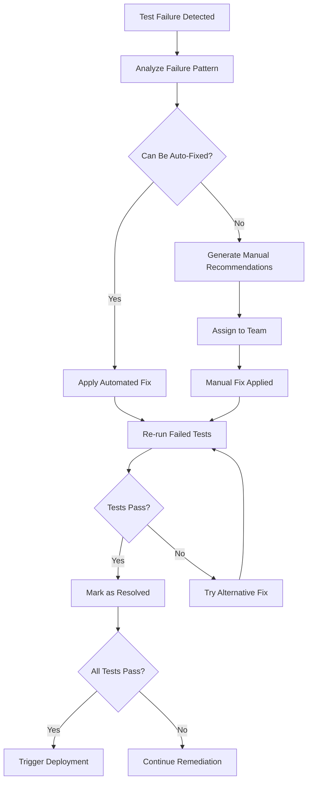

# Intelligent CI/CD Pipeline Documentation

## Overview

The DotMac Framework features an **Intelligent CI/CD Pipeline** that automatically makes deployment decisions based on comprehensive test results. The system operates on a simple but powerful principle:

- **If ALL tests pass (100% success rate)**: Automatically start production server
- **If ANY tests fail**: Continue alignment and remediation work

This eliminates manual intervention while ensuring only fully validated code reaches production.

## Table of Contents

- [Architecture Overview](#architecture-overview)
- [Pipeline Stages](#pipeline-stages)
- [Intelligent Decision Engine](#intelligent-decision-engine)
- [Server Startup Automation](#server-startup-automation)
- [Alignment and Remediation](#alignment-and-remediation)
- [Monitoring and Alerting](#monitoring-and-alerting)
- [Configuration Management](#configuration-management)
- [Runbooks](#runbooks)
- [Troubleshooting](#troubleshooting)

## Architecture Overview

```
┌─────────────────┐    ┌─────────────────┐    ┌─────────────────┐
│  Code Commit    │ => │  Comprehensive  │ => │  Intelligent    │
│                 │    │  Test Validation│    │  Decision Engine│
└─────────────────┘    └─────────────────┘    └─────────────────┘
                                                        │
                          ┌─────────────────────────────┼─────────────────────────────┐
                          │ ALL TESTS PASS (100%)       │ ANY TESTS FAIL              │
                          ▼                             ▼                             │
                ┌─────────────────┐           ┌─────────────────┐                    │
                │  Automatic      │           │ Automated       │                    │
                │  Production     │           │ Remediation     │                    │
                │  Deployment     │           │ & Alignment     │                    │
                │  - 7 Portals    │           │ - Fix Issues    │                    │
                │  - Load Balance │           │ - Re-run Tests  │                    │
                │  - Monitoring   │           │ - Iterate       │                    │
                └─────────────────┘           └─────────────────┘                    │
                          │                             │                             │
                          ▼                             └─────────────────────────────┘
                ┌─────────────────┐                             │
                │   Production    │                             │
                │     Ready!      │ <───────────────────────────┘
                └─────────────────┘
```

### Key Components

1. **GitHub Actions Workflow** (`intelligent-deployment.yml`)
2. **Intelligent Decision Engine** (`intelligent-decision-engine.py`)
3. **Production Server Startup** (`production-server-startup.py`)
4. **Automated Remediation** (`automated-remediation.py`)
5. **Monitoring Dashboard** (`setup-monitoring.py`)
6. **Environment Configurations** (development, staging, production)

## Pipeline Stages

### Stage 1: Code Quality Gate

**Duration**: ~20 minutes  
**Scope**: Static analysis and code quality checks

- **Backend Quality**: Linting, type checking, security scanning
- **Frontend Quality**: ESLint, TypeScript, Prettier, security rules
- **Complexity Analysis**: McCabe complexity, function length, argument count
- **Documentation**: Docstring coverage, README validation

**Quality Gate Criteria**:
- All linting rules pass
- Type checking passes
- Security scans show no critical vulnerabilities
- Code complexity within limits (≤10 McCabe complexity)

### Stage 2: Security Validation

**Duration**: ~25 minutes  
**Scope**: Comprehensive security analysis

- **Dependency Scanning**: npm audit, pip-audit, safety
- **Static Security Analysis**: Bandit, ESLint security rules
- **Secret Detection**: TruffleHog, custom secret scanners
- **Container Security**: Docker image vulnerability scanning
- **OWASP Compliance**: Security headers, input validation

**Security Gate Criteria**:
- No high/critical vulnerabilities in dependencies
- No hardcoded secrets detected
- All security headers configured
- OWASP compliance verified

### Stage 3: Unit Tests Matrix

**Duration**: ~20 minutes (parallel execution)  
**Scope**: Component-level testing across all services

**Test Matrix**:
- `backend-core`: Core business logic tests
- `backend-services`: Service layer tests
- `frontend-admin`: Admin portal component tests
- `frontend-customer`: Customer portal component tests
- `frontend-reseller`: Reseller portal component tests
- `frontend-technician`: Technician portal component tests

**Unit Test Criteria**:
- **Coverage**: Minimum 80% line coverage, 70% branch coverage
- **Success Rate**: 100% test pass rate
- **Performance**: Tests complete within 5 minutes per component

### Stage 4: Integration Tests

**Duration**: ~45 minutes  
**Scope**: Cross-service and database integration

**Test Coverage**:
- Database connectivity and migrations
- Service-to-service communication
- API contract validation
- Message queue integration
- Cache layer integration
- External API integration

**Integration Criteria**:
- All service endpoints respond correctly
- Database operations complete successfully
- Cross-service communication validated
- API contracts maintained

### Stage 5: E2E Tests (7 Portals)

**Duration**: ~30 minutes per portal-browser combination  
**Scope**: Complete user workflows across all portals

**Portal Coverage**:
1. **Customer Portal**: Registration, login, service management, billing
2. **Admin Portal**: User management, system configuration, monitoring
3. **Reseller Portal**: Partner management, commission tracking, sales tools
4. **Technician Portal**: Work orders, inventory, offline sync
5. **Master Admin Portal**: Multi-tenant management, platform configuration
6. **Tenant Admin Portal**: Tenant-specific administration
7. **API Gateway Portal**: Service routing, rate limiting, monitoring

**Browser Matrix**: Chromium, Firefox, WebKit  
**Total Test Runs**: 21 (7 portals × 3 browsers)

**E2E Criteria**:
- All critical user workflows complete successfully
- Cross-browser compatibility verified
- Mobile responsiveness validated
- Performance thresholds met

### Stage 6: Performance Benchmarks

**Duration**: ~60 minutes (optional - can be skipped)  
**Scope**: Performance and Core Web Vitals validation

**Performance Tests**:
- **Lighthouse Audits**: Performance, Accessibility, Best Practices, SEO
- **Core Web Vitals**: LCP ≤2.5s, FID ≤100ms, CLS ≤0.1
- **Load Testing**: 100 concurrent users, 5-minute duration
- **API Performance**: Response times ≤500ms P95, ≤1000ms P99

**Performance Criteria**:
- Core Web Vitals meet thresholds
- API response times within limits
- Error rate ≤1% under load
- Resource utilization ≤80%

### Stage 7: Accessibility Validation

**Duration**: ~25 minutes  
**Scope**: WCAG compliance and accessibility testing

**Accessibility Tests**:
- **Automated Scanning**: axe-core, Pa11y, Lighthouse a11y
- **Screen Reader Testing**: NVDA, JAWS compatibility
- **Keyboard Navigation**: Tab order, focus management
- **Color Contrast**: WCAG AA compliance (4.5:1 ratio)
- **ARIA Compliance**: Labels, roles, properties

**Accessibility Criteria**:
- WCAG 2.1 AA compliance (minimum 95% score)
- No critical accessibility violations
- Keyboard navigation functional
- Screen reader compatibility verified

## Intelligent Decision Engine

The **Intelligent Decision Engine** (`intelligent-decision-engine.py`) is the heart of the pipeline. It analyzes all test results using a weighted scoring system and makes deployment decisions.

### Decision Matrix

| Category | Weight | Blocking | Description |
|----------|--------|----------|-------------|
| Quality | 25% | Yes | Code quality, complexity, documentation |
| Security | 30% | Yes | Vulnerabilities, secrets, compliance |
| Unit Tests | 15% | Yes | Component testing, coverage |
| Integration | 15% | Yes | Service communication, data flow |
| E2E Tests | 10% | Yes | User workflows, browser compatibility |
| Performance | 3% | No | Response times, Core Web Vitals |
| Accessibility | 2% | No | WCAG compliance, usability |

### Decision Logic

```python
def make_deployment_decision(overall_score, blocking_failures, force_deployment):
    # Perfect score (100%) and no blocking failures = automatic deployment
    if overall_score >= 100.0 and len(blocking_failures) == 0:
        return "deploy"
    
    # Any blocking failures = continue alignment
    if len(blocking_failures) > 0:
        return "remediate"
    
    # High score but not perfect = continue alignment for perfection
    return "remediate"
```

### Sample Decision Output

```yaml
decision_report:
  timestamp: "2025-08-20T14:30:00Z"
  overall_score: 97.5
  deployment_ready: false
  deployment_action: "remediate"
  blocking_failures: ["unit_tests"]
  test_results:
    quality: { passed: true, score: 100.0, weight: 0.25 }
    security: { passed: true, score: 100.0, weight: 0.30 }
    unit_tests: { passed: false, score: 85.0, weight: 0.15 }
    integration: { passed: true, score: 100.0, weight: 0.15 }
    e2e: { passed: true, score: 100.0, weight: 0.10 }
  failure_analysis:
    - category: "unit_tests"
      severity: "CRITICAL"
      issues: ["12 unit tests failing in customer portal"]
      estimated_fix_time: 90
```

## Server Startup Automation

When ALL tests pass (100% success rate), the **Production Server Startup** script (`production-server-startup.py`) automatically:

### 1. Pre-deployment Validation
- System resource checks (CPU <85%, Memory <90%, Disk <95%)
- Port availability verification
- Database connectivity validation
- SSL certificate validation

### 2. Application Building
- Backend services compilation
- Frontend application builds (Next.js production builds)
- Asset optimization and compression
- Docker image preparation

### 3. Service Deployment
- **Backend Services**: 7 microservices
  - API Gateway (port 8000)
  - Identity Service (port 8001)
  - Billing Service (port 8002)
  - Services Management (port 8003)
  - Networking Service (port 8004)
  - Analytics Service (port 8005)
  - Platform Service (port 8006)

- **Frontend Portals**: 4 Next.js applications
  - Admin Portal (port 3001)
  - Customer Portal (port 3002)
  - Reseller Portal (port 3003)
  - Technician Portal (port 3004)

### 4. Load Balancer Configuration
- Nginx reverse proxy setup
- SSL/TLS certificate installation
- Security headers configuration
- Rate limiting rules
- Health check endpoints

### 5. Monitoring Initialization
- Prometheus metrics collection
- Grafana dashboard provisioning
- AlertManager notification setup
- Health check monitoring
- Performance monitoring

### 6. Security Hardening
- SSL certificate installation
- Security headers (HSTS, CSP, X-Frame-Options)
- CORS configuration
- Rate limiting implementation
- Firewall rules

### 7. Health Verification
- Service health checks
- Database connectivity tests
- Load balancer validation
- SSL certificate verification
- End-to-end smoke tests

### Sample Deployment Output

```yaml
deployment_report:
  deployment_status: "success"
  deployment_duration: "00:18:45"
  total_services: 11
  running_services: 11
  server_urls:
    - "https://admin.dotmac.framework"
    - "https://customer.dotmac.framework"
    - "https://reseller.dotmac.framework"
    - "https://technician.dotmac.framework"
    - "https://api.dotmac.framework"
  resource_usage:
    cpu_percent: 65.2
    memory_percent: 72.8
    disk_percent: 45.1
```

## Alignment and Remediation

When ANY tests fail, the **Automated Remediation System** (`automated-remediation.py`) automatically:

### 1. Failure Analysis
- **Root Cause Analysis**: Identify specific failure patterns
- **Priority Classification**: Critical → High → Medium → Low
- **Impact Assessment**: Evaluate failure scope and dependencies
- **Historical Analysis**: Learn from previous failures

### 2. Automated Fixes
The system applies category-specific fixes:

#### Code Quality Fixes
- **Black**: Automatic code formatting
- **isort**: Import statement organization
- **Ruff**: Linting rule auto-fixes
- **Autoflake**: Remove unused imports and variables

#### Security Fixes
- **Dependency Updates**: Upgrade vulnerable packages
- **Secret Removal**: Detect and remove hardcoded secrets
- **Security Headers**: Add missing security configurations
- **npm audit --fix**: Frontend security fixes

#### Unit Test Fixes
- **Import Errors**: Fix missing imports and path issues
- **Fixture Issues**: Resolve pytest fixture problems
- **Test Data**: Update mocks and test data
- **Assertion Updates**: Fix common assertion patterns

#### Integration Test Fixes
- **Service Restarts**: Restart failed services
- **Environment Variables**: Update configuration
- **Database Issues**: Fix connection and migration problems
- **Timeout Adjustments**: Increase timeouts for slow services

#### E2E Test Fixes
- **Browser Updates**: Update Playwright browser drivers
- **Selector Updates**: Fix outdated page selectors
- **Timeout Increases**: Adjust test timeouts
- **Data Cleanup**: Reset test data between runs

#### Performance Fixes
- **Bundle Optimization**: Apply webpack optimizations
- **Cache Configuration**: Enable performance caching
- **Image Optimization**: Compress and optimize assets
- **Code Splitting**: Implement dynamic imports

#### Accessibility Fixes
- **Alt Text**: Add missing alt attributes
- **ARIA Labels**: Add required ARIA attributes
- **Color Contrast**: Adjust colors for compliance
- **Focus Management**: Fix keyboard navigation

### 3. Iterative Improvement
- **Fix Application**: Apply automated remediation
- **Test Re-run**: Execute failed test categories
- **Progress Tracking**: Monitor fix success rates
- **Learning**: Update remediation strategies based on results

### 4. Manual Recommendations
For issues that cannot be automatically fixed:

```yaml
manual_recommendations:
  - category: "integration"
    priority: "HIGH"
    estimated_time: 90
    team: "Backend Team"
    manual_steps:
      - "Debug service communication timeout between billing and identity services"
      - "Review API contract changes in billing service v2.1.0"
      - "Update integration test scenarios for new authentication flow"
```

### 5. Remediation Workflow



## Monitoring and Alerting

The **Monitoring Dashboard** (`setup-monitoring.py`) provides comprehensive observability:

### 1. Metrics Collection
- **Prometheus**: Time-series metrics database
- **Node Exporter**: System metrics (CPU, memory, disk, network)
- **Blackbox Exporter**: Endpoint availability monitoring
- **Application Metrics**: Custom business metrics

### 2. Dashboard Visualization
- **Grafana**: Interactive dashboards and visualizations
- **Overview Dashboard**: System-wide health and performance
- **Portal Dashboards**: Per-portal metrics and analytics
- **Infrastructure Dashboard**: Server and resource monitoring

### 3. Alert Management
- **AlertManager**: Alert routing and notification management
- **Slack Integration**: Real-time alerts to development channels
- **Email Notifications**: Critical alerts to operations teams
- **PagerDuty**: Escalation for critical system failures

### 4. Performance Monitoring
- **Response Time Tracking**: API and page load performance
- **Error Rate Monitoring**: HTTP error rates and patterns
- **Resource Utilization**: CPU, memory, and disk usage
- **Database Performance**: Query times and connection pooling

### 5. User Experience Monitoring
- **Core Web Vitals**: LCP, FID, CLS tracking
- **User Session Analytics**: Session duration and bounce rates
- **Error Tracking**: JavaScript errors and stack traces
- **Accessibility Monitoring**: WCAG compliance tracking

### 6. Security Monitoring
- **Failed Authentication**: Login attempt monitoring
- **Rate Limiting**: API abuse detection
- **Security Headers**: CSP and HSTS compliance
- **Vulnerability Alerts**: New security advisories

### Sample Alert Configuration

```yaml
alert_rules:
  - alert: ServiceDown
    expr: up == 0
    for: 1m
    labels:
      severity: critical
    annotations:
      summary: "Service {{ $labels.job }} is down"
      description: "Service has been down for more than 1 minute"
      
  - alert: HighErrorRate
    expr: rate(http_requests_total{status=~"5.."}[5m]) > 0.1
    for: 2m
    labels:
      severity: warning
    annotations:
      summary: "High error rate detected"
      description: "Error rate is {{ $value }} requests/sec"
```

## Configuration Management

### Environment-Specific Configurations

#### Development Environment (`development-config.yml`)
- **Purpose**: Local development and testing
- **Security**: Relaxed (no SSL, permissive CORS)
- **Resources**: Minimal (single replicas, low limits)
- **Logging**: Debug level, verbose output
- **Features**: Hot reload, debug tools, test data seeding

#### Staging Environment (`staging-config.yml`)
- **Purpose**: Pre-production testing and validation
- **Security**: Production-like (SSL enabled, strict CORS)
- **Resources**: Moderate (limited replicas and resources)
- **Testing**: Extended test suites, performance testing
- **Features**: Data refresh from production, synthetic data

#### Production Environment (`production-config.yml`)
- **Purpose**: Live production deployment
- **Security**: Maximum security (SSL, CSP, HSTS)
- **Resources**: Full scaling (multiple replicas, high limits)
- **Monitoring**: Comprehensive metrics and alerting
- **Features**: Full monitoring, backup, disaster recovery

### Configuration Hierarchy

```yaml
base_config:
  environment: production
  
environment_overrides:
  development:
    log_level: debug
    ssl_enabled: false
    
  staging:
    log_level: info
    replicas: { min: 1, max: 3 }
    
  production:
    log_level: warn
    replicas: { min: 2, max: 10 }
```

## Runbooks

### Deployment Runbook

#### Pre-Deployment Checklist
- [ ] All feature branches merged to main
- [ ] Database migrations reviewed and tested
- [ ] Configuration changes documented
- [ ] Rollback plan prepared
- [ ] Monitoring dashboards ready

#### Deployment Process
1. **Trigger Deployment**
   ```bash
   # Automatic trigger on push to main
   git push origin main
   
   # Manual trigger with workflow dispatch
   gh workflow run intelligent-deployment.yml
   ```

2. **Monitor Pipeline Progress**
   ```bash
   # View workflow status
   gh run list --workflow=intelligent-deployment.yml
   
   # Watch live logs
   gh run watch
   ```

3. **Verify Deployment**
   ```bash
   # Check service health
   curl https://api.dotmac.framework/health
   
   # Verify portal accessibility
   curl https://customer.dotmac.framework
   ```

#### Post-Deployment Verification
- [ ] All services responding to health checks
- [ ] Database migrations completed
- [ ] Monitoring dashboards showing green
- [ ] Critical user workflows functional
- [ ] Performance metrics within thresholds

### Rollback Runbook

#### Automatic Rollback Triggers
- Service health checks failing for >3 attempts
- Error rate >10% for >5 minutes
- Response time >2000ms P95 for >5 minutes
- Critical security alert

#### Manual Rollback Process
1. **Initiate Rollback**
   ```bash
   # Trigger rollback workflow
   gh workflow run rollback.yml -f rollback_to=previous
   ```

2. **Monitor Rollback**
   ```bash
   # Watch rollback progress
   gh run watch
   ```

3. **Verify Rollback**
   ```bash
   # Confirm previous version deployed
   curl https://api.dotmac.framework/version
   ```

#### Post-Rollback Actions
- [ ] Incident report created
- [ ] Root cause analysis initiated
- [ ] Fix developed and tested
- [ ] Communication sent to stakeholders

### Troubleshooting Runbook

#### Common Issues and Solutions

##### Test Failures
**Symptom**: Pipeline fails at test stage
**Diagnosis**:
```bash
# Check test logs
gh run view --log

# Run tests locally
make test
pnpm test
```
**Resolution**:
- Review test failure logs
- Apply automated remediation
- Fix underlying code issues

##### Deployment Failures
**Symptom**: Deployment stage fails
**Diagnosis**:
```bash
# Check deployment logs
kubectl logs -l app=dotmac-framework

# Verify resource availability
kubectl get pods
kubectl describe pod <pod-name>
```
**Resolution**:
- Check resource constraints
- Verify configuration values
- Review database connectivity

##### Performance Issues
**Symptom**: Slow response times or high resource usage
**Diagnosis**:
```bash
# Check Prometheus metrics
curl http://localhost:9090/api/v1/query?query=http_request_duration_seconds

# Review Grafana dashboards
# Navigate to http://localhost:3000
```
**Resolution**:
- Scale up resources
- Optimize database queries
- Enable caching
- Review code performance

##### Security Alerts
**Symptom**: Security scanning failures
**Diagnosis**:
```bash
# Review security scan results
make security
npm audit
```
**Resolution**:
- Update vulnerable dependencies
- Remove hardcoded secrets
- Configure security headers
- Review access controls

## Troubleshooting

### Pipeline Debugging

#### Enable Debug Logging
```yaml
# In GitHub Actions workflow
env:
  DEBUG: true
  LOG_LEVEL: debug
```

#### Access Pipeline Artifacts
```bash
# Download pipeline artifacts
gh run download <run-id>

# View specific artifact
unzip test-results.zip
cat junit.xml
```

#### Local Pipeline Testing
```bash
# Run pipeline stages locally
make check  # Quality gates
make test   # All tests
make build  # Build applications

# Test decision engine locally
python scripts/intelligent-decision-engine.py \
  --quality-passed=true \
  --security-passed=true \
  --unit-passed=false
```

### Service Debugging

#### Check Service Status
```bash
# Docker services
docker ps
docker logs <container-id>

# Systemd services
systemctl status dotmac-*
journalctl -u dotmac-api-gateway -f
```

#### Database Debugging
```bash
# PostgreSQL connection
psql -h localhost -U dotmac_user -d dotmac_prod

# Check migrations
python -c "from alembic import command; command.current()"

# Redis connection
redis-cli ping
redis-cli info
```

#### Network Debugging
```bash
# Check port connectivity
telnet localhost 8000
nc -zv localhost 3001

# Verify SSL certificates
openssl s_client -connect localhost:443

# Check DNS resolution
nslookup api.dotmac.framework
```

### Performance Debugging

#### Profile Application Performance
```bash
# Backend profiling
python -m cProfile -o profile.stats main.py
python -c "import pstats; pstats.Stats('profile.stats').sort_stats('cumulative').print_stats(20)"

# Frontend profiling
# Use browser dev tools Performance tab
# Lighthouse CLI: lighthouse https://customer.dotmac.framework
```

#### Database Query Analysis
```sql
-- Enable query logging
ALTER SYSTEM SET log_statement = 'all';
SELECT pg_reload_conf();

-- Analyze slow queries
SELECT query, calls, total_time, mean_time 
FROM pg_stat_statements 
ORDER BY mean_time DESC 
LIMIT 10;
```

#### Memory and CPU Analysis
```bash
# Process monitoring
top -p $(pgrep -f dotmac)
htop

# Memory analysis
free -h
ps aux --sort=-%mem | head

# I/O monitoring
iotop
iostat -x 1
```

## Best Practices

### Development Workflow
1. **Feature Branch Development**: Always develop in feature branches
2. **Test-Driven Development**: Write tests before implementation
3. **Code Reviews**: Require peer review before merging
4. **Small Commits**: Keep commits focused and atomic
5. **Documentation**: Update documentation with code changes

### Testing Strategy
1. **Test Pyramid**: 70% unit, 20% integration, 10% e2e tests
2. **Test Coverage**: Maintain >80% code coverage
3. **Fast Feedback**: Unit tests must run in <5 minutes
4. **Reliable Tests**: Fix flaky tests immediately
5. **Test Data**: Use factories and fixtures for consistent data

### Deployment Strategy
1. **Infrastructure as Code**: All configuration in version control
2. **Immutable Deployments**: Never modify running services
3. **Rolling Updates**: Zero-downtime deployments
4. **Health Checks**: Comprehensive service health validation
5. **Observability**: Monitor everything, alert on anomalies

### Security Practices
1. **Security by Design**: Build security into the pipeline
2. **Automated Scanning**: Continuous security validation
3. **Principle of Least Privilege**: Minimal required permissions
4. **Secret Management**: Never commit secrets to code
5. **Regular Updates**: Keep dependencies up to date

## Conclusion

The Intelligent CI/CD Pipeline for the DotMac Framework represents a significant advancement in automated deployment practices. By requiring 100% test success for automatic deployment and providing comprehensive automated remediation for failures, the system ensures:

- **Quality Assurance**: Only fully tested code reaches production
- **Reliability**: Automated validation prevents human error
- **Efficiency**: Reduced manual intervention and faster feedback
- **Scalability**: Consistent deployment across all 7 portals
- **Observability**: Comprehensive monitoring and alerting

The pipeline serves as a foundation for continuous improvement, learning from failures and refining remediation strategies over time. This creates a self-improving system that becomes more reliable and efficient with each deployment cycle.

For questions, issues, or contributions, please refer to the [Contributing Guide](CONTRIBUTING.md) or contact the DevOps team at devops@dotmac.framework.