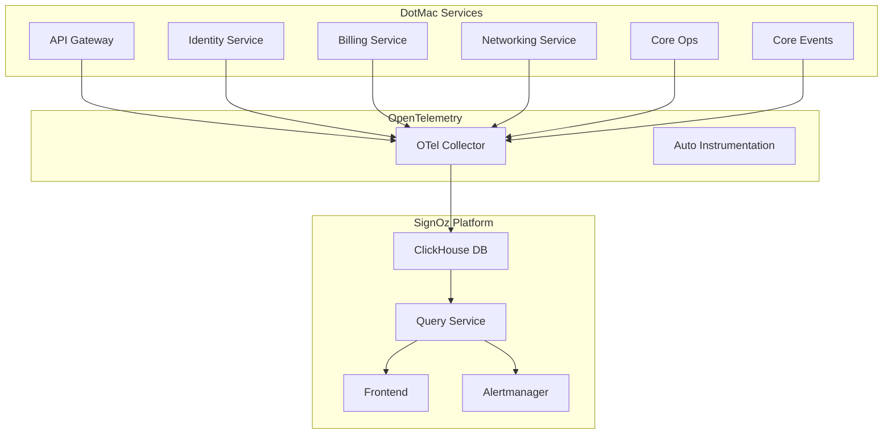

# SignOz Integration Plan for DotMac Platform

## 🎯 Overview

SignOz provides complete observability for the DotMac microservices platform with:
- **Distributed Tracing**: Track requests across all 10 microservices
- **Metrics Monitoring**: Application and infrastructure metrics
- **Log Management**: Centralized logging with correlation
- **Performance Monitoring**: Latency, throughput, error rates
- **Custom Dashboards**: Service-specific monitoring views

## 📐 Architecture



## 🔑 Key Integration Points

### 1. **Telemetry Collection**
- OpenTelemetry SDK in each Python service
- Automatic instrumentation for FastAPI, SQLAlchemy, Redis
- Custom spans for business operations
- Baggage propagation for tenant context

### 2. **Metrics Strategy**

#### Application Metrics (RED Method)
- **Rate**: Requests per second per endpoint
- **Errors**: Error rate by service and endpoint
- **Duration**: P50, P95, P99 latencies

#### Business Metrics
- Active tenants per service
- Billing transactions per hour
- Network devices monitored
- Event bus throughput
- API Gateway rate limit hits

#### Infrastructure Metrics
- Container CPU/Memory usage
- Database connection pool status
- Redis cache hit rates
- Kafka lag (if using Kafka adapter)

### 3. **Distributed Tracing Strategy**

#### Trace Sampling
```yaml
sampling_strategy:
  default_rate: 0.1  # 10% for normal traffic
  error_rate: 1.0    # 100% for errors
  slow_request_rate: 1.0  # 100% for requests > 1s
  tenant_overrides:
    premium: 0.5  # Higher sampling for premium tenants
```

#### Critical Traces to Capture
1. **Cross-Service Flows**
   - User authentication flow (Gateway → Identity → Redis)
   - Billing calculation (Billing → Services → Events)
   - Device provisioning (Networking → Ops → Events)

2. **Async Operations**
   - Event bus publish/subscribe
   - Background job processing
   - Scheduled tasks

### 4. **Log Aggregation**

#### Structured Logging Format
```json
{
  "timestamp": "2024-01-20T10:30:00Z",
  "level": "INFO",
  "service": "dotmac_billing",
  "trace_id": "abc123",
  "span_id": "def456",
  "tenant_id": "tenant-001",
  "user_id": "user-123",
  "message": "Invoice generated",
  "attributes": {
    "invoice_id": "INV-2024-001",
    "amount": 99.99
  }
}
```

## 🚀 Implementation Phases

### Phase 1: Core Setup (Week 1)
- [ ] Deploy SignOz with ClickHouse
- [ ] Configure OTel Collector
- [ ] Basic instrumentation for API Gateway
- [ ] Create first dashboard

### Phase 2: Service Instrumentation (Week 2)
- [ ] Instrument all 10 microservices
- [ ] Add custom spans for business logic
- [ ] Configure trace sampling
- [ ] Set up basic alerts

### Phase 3: Advanced Features (Week 3)
- [ ] Custom dashboards per service
- [ ] SLO/SLI configuration
- [ ] Anomaly detection rules
- [ ] Integration with PagerDuty/Slack

### Phase 4: Optimization (Week 4)
- [ ] Performance baseline establishment
- [ ] Cost optimization (retention policies)
- [ ] Advanced correlation rules
- [ ] Chaos engineering observability

## 📊 Dashboard Strategy

### 1. **Executive Dashboard**
- Platform health score
- Active users and tenants
- Revenue metrics
- System availability

### 2. **Service Dashboards**
Each service gets dedicated dashboard with:
- Golden signals (latency, traffic, errors, saturation)
- Service-specific metrics
- Dependency health
- Recent deployments correlation

### 3. **Tenant Dashboard**
- Per-tenant resource usage
- API quota consumption
- Error rates by tenant
- Billing metrics

## 🔔 Alerting Rules

### Critical Alerts (P1)
- Service down > 1 minute
- Error rate > 10%
- Database connection pool exhausted
- Payment processing failures

### Warning Alerts (P2)
- Latency P95 > 1s
- CPU usage > 80%
- Disk space < 20%
- Rate limit violations spike

### Info Alerts (P3)
- Deployment completed
- Backup successful
- Certificate expiration < 30 days

## 💾 Data Retention Policy

| Data Type | Retention | Sampling | Storage |
|-----------|-----------|----------|---------|
| Raw Traces | 7 days | 10% normal, 100% errors | ~50GB/day |
| Metrics (1m) | 15 days | 100% | ~10GB/day |
| Metrics (1h) | 90 days | Aggregated | ~1GB/day |
| Logs | 30 days | 100% | ~100GB/day |
| Aggregates | 1 year | Daily rollups | ~100MB/day |

## 🔒 Security Considerations

1. **Data Privacy**
   - PII masking in traces and logs
   - Tenant data isolation
   - Encryption at rest (ClickHouse)
   - TLS for all communications

2. **Access Control**
   - RBAC for SignOz UI
   - Service accounts for collectors
   - API key rotation
   - Audit logging

3. **Compliance**
   - GDPR data retention
   - Trace data anonymization
   - Export capabilities for audits

## 📈 Success Metrics

### Technical KPIs
- MTTD (Mean Time to Detect) < 2 minutes
- MTTR (Mean Time to Resolve) < 30 minutes
- Observability coverage > 95%
- False positive rate < 5%

### Business KPIs
- Reduced incident impact by 50%
- Improved API performance by 30%
- Reduced debugging time by 70%
- Cost per GB of telemetry < $0.50

## 🔧 Configuration Management

### Environment Variables
```bash
# SignOz Configuration
SIGNOZ_ENDPOINT=http://signoz-otel-collector:4317
SIGNOZ_ACCESS_TOKEN=${SIGNOZ_ACCESS_TOKEN}
OTEL_SERVICE_NAME=${SERVICE_NAME}
OTEL_RESOURCE_ATTRIBUTES="environment=${ENV},tenant=${TENANT_ID}"
OTEL_TRACES_EXPORTER=otlp
OTEL_METRICS_EXPORTER=otlp
OTEL_LOGS_EXPORTER=otlp
```

### Service Discovery
```yaml
signoz:
  collectors:
    - endpoint: collector-1:4317
      weight: 50
    - endpoint: collector-2:4317
      weight: 50
  load_balancing: round_robin
  retry_policy:
    max_attempts: 3
    backoff: exponential
```

## 🎯 Next Steps

1. Review and approve integration plan
2. Provision infrastructure for SignOz
3. Create proof of concept with API Gateway
4. Roll out to remaining services
5. Train team on SignOz usage
6. Establish on-call procedures