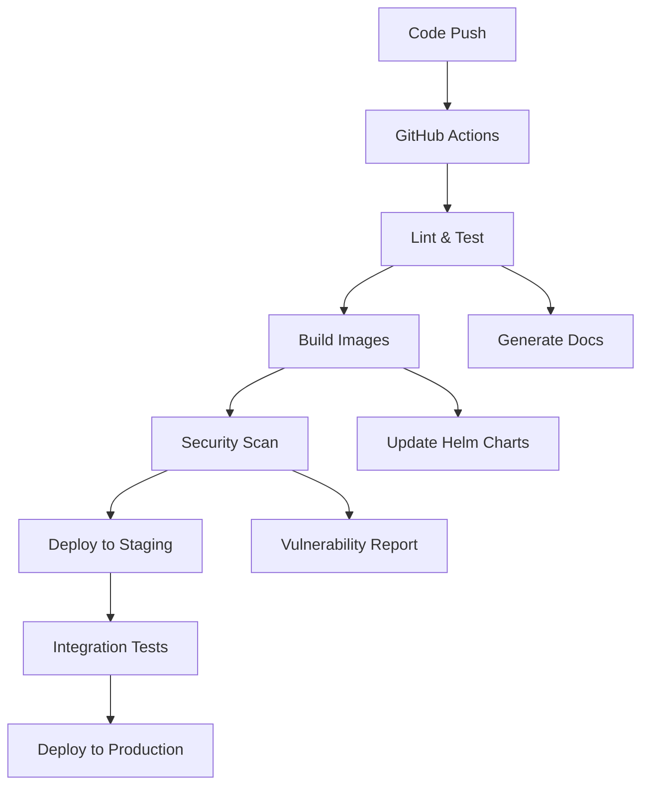

# DotMac Operations Guide

This guide covers running DotMac locally, common operational tasks, and troubleshooting.

## Quick Start

### Development Environment

```bash
# Start everything with one command
make dev

# Or start components individually
./scripts/start/backend.sh -p "backend,database" -d
./scripts/start/frontend.sh -a "admin,customer"
./scripts/start/monitoring.sh -s signoz -d
```

### Production Environment

```bash
# Start backend in production mode
./scripts/start/backend.sh -e production -d

# Start frontend in production mode
./scripts/start/frontend.sh -m production -d

# Stop everything gracefully
./scripts/stop/all.sh
```

## Docker Compose Profiles

DotMac uses Docker Compose profiles to manage service combinations:

### Available Profiles

| Profile | Services | Purpose |
|---------|----------|---------|
| `backend` | Core backend services | API development |
| `database` | PostgreSQL, Redis, TimescaleDB | Data persistence |
| `monitoring` | SigNoz, OTEL collector | Observability |
| `frontend` | Admin, Customer, Reseller portals | UI development |
| `dev` | All development services | Full local development |
| `prod` | Production-optimized services | Production deployment |

### Profile Configuration

Set profiles via environment variable:

```bash
export COMPOSE_PROFILES="backend,database,monitoring"
./scripts/start/backend.sh
```

Or pass directly to scripts:

```bash
./scripts/start/backend.sh -p "backend,database"
```

### Docker Compose Files

- `docker-compose.yml` - Main development configuration
- `docker-compose.production.yml` - Production-optimized services
- `docker-compose.signoz.yml` - SigNoz observability stack
- `docker-compose.monitoring.yml` - Prometheus/Grafana stack

## Common Scripts

### Start Scripts

#### Backend Services

```bash
./scripts/start/backend.sh [OPTIONS]

# Examples:
./scripts/start/backend.sh                     # Start with default profiles
./scripts/start/backend.sh -p "backend,database"  # Start specific profiles
./scripts/start/backend.sh -e production -d    # Production mode, detached
```

#### Frontend Applications

```bash
./scripts/start/frontend.sh [OPTIONS]

# Examples:
./scripts/start/frontend.sh                    # Start all apps in development
./scripts/start/frontend.sh -a "admin"        # Start only admin portal
./scripts/start/frontend.sh -m production -d  # Production mode, detached
```

#### Monitoring Stack

```bash
./scripts/start/monitoring.sh [OPTIONS]

# Examples:
./scripts/start/monitoring.sh                 # Start SigNoz
./scripts/start/monitoring.sh -s prometheus  # Start Prometheus stack
./scripts/start/monitoring.sh --setup -d     # Setup and start detached
```

### Stop Scripts

#### Graceful Shutdown

```bash
./scripts/stop/all.sh [OPTIONS]

# Examples:
./scripts/stop/all.sh                         # Stop all services gracefully
./scripts/stop/all.sh -s backend             # Stop only backend
./scripts/stop/all.sh -f                     # Force stop (no graceful timeout)
./scripts/stop/all.sh -t 60                  # 60-second timeout
```

### Deploy Scripts

#### Helm Deployment

```bash
./scripts/deploy/helm-deploy.sh [COMMAND] [OPTIONS]

# Examples:
./scripts/deploy/helm-deploy.sh install               # Install to Kubernetes
./scripts/deploy/helm-deploy.sh upgrade -e production # Upgrade to production
./scripts/deploy/helm-deploy.sh status               # Check deployment status
```

### Development Tools

#### OpenAPI Documentation

```bash
./scripts/dev-tools/generate-openapi.sh [OPTIONS]

# Examples:
./scripts/dev-tools/generate-openapi.sh              # Generate all docs
./scripts/dev-tools/generate-openapi.sh --serve     # Generate and serve
./scripts/dev-tools/generate-openapi.sh -s "identity,billing"  # Specific services
```

#### SigNoz Migration

```bash
./scripts/dev-tools/migrate_to_signoz.py [OPTIONS]

# Examples:
python3 scripts/dev-tools/migrate_to_signoz.py --setup-dashboards
python3 scripts/dev-tools/migrate_to_signoz.py --migrate-data
```

## Environment Variables

### Global Configuration

```bash
# Docker Compose
export COMPOSE_PROFILES="backend,database,monitoring"
export COMPOSE_FILE="docker-compose.yml"
export ENVIRONMENT="development"

# Database
export POSTGRES_DB="dotmac_dev"
export POSTGRES_USER="dotmac"
export POSTGRES_PASSWORD="secure_password"

# API Configuration
export API_URL="http://localhost:8000"
export WEBSOCKET_URL="ws://localhost:3001"

# Monitoring
export OTEL_ENDPOINT="http://localhost:4318"
export SIGNOZ_VERSION="latest"
```

### Service-Specific

```bash
# Backend Services
export LOG_LEVEL="debug"
export REDIS_URL="redis://localhost:6379"

# Frontend Applications
export NEXT_PUBLIC_API_URL="http://localhost:8000"
export NEXT_PUBLIC_WEBSOCKET_URL="ws://localhost:3001"
export NEXT_PUBLIC_APP_NAME="DotMac Portal"

# Monitoring
export MONITORING_STACK="signoz"
export PROMETHEUS_RETENTION="15d"
```

## CI/CD Flow



### Pipeline Stages

1. **Code Quality**
   - ESLint, Prettier (Frontend)
   - Black, isort, pylint (Backend)
   - Type checking (TypeScript, mypy)

2. **Testing**
   - Unit tests (Jest, pytest)
   - Integration tests (Playwright, pytest)
   - E2E tests (Playwright)

3. **Build & Package**
   - Docker image builds
   - Multi-architecture support
   - Image vulnerability scanning

4. **Deploy**
   - Helm chart updates
   - Kubernetes deployment
   - Health checks & monitoring

## Health Checks

### Service Endpoints

| Service | Health Check | Port |
|---------|--------------|------|
| Admin Portal | `GET /api/health` | 3000 |
| Customer Portal | `GET /api/health` | 3001 |
| Reseller Portal | `GET /api/health` | 3002 |
| API Gateway | `GET /health/live`, `GET /health/ready`, `GET /health/startup` | 8000 |
| Core Events | `GET /health/live`, `GET /health/ready`, `GET /health/startup` | 8001 |
| Core Ops | `GET /health/live`, `GET /health/ready`, `GET /health/startup` | 8002 |
| Identity | `GET /health/live`, `GET /health/ready`, `GET /health/startup` | 8003 |
| SigNoz | `GET /api/v1/health` | 3301 |

### Check All Services

```bash
# Check backend services
curl -f http://localhost:8000/health

# Check frontend services
curl -f http://localhost:3000/api/health
curl -f http://localhost:3001/api/health
curl -f http://localhost:3002/api/health

# Check monitoring
curl -f http://localhost:3301/api/v1/health
```

## Troubleshooting

### Common Issues

#### Services Won't Start

1. **Port Conflicts**

   ```bash
   # Check what's using the port
   lsof -i :8000

   # Kill conflicting process
   kill -9 <PID>
   ```

2. **Docker Issues**

   ```bash
   # Clean Docker resources
   docker system prune -f
   docker volume prune -f

   # Restart Docker daemon
   sudo systemctl restart docker
   ```

3. **Database Connection**

   ```bash
   # Check PostgreSQL status
   docker-compose logs postgres

   # Connect to database
   docker-compose exec postgres psql -U dotmac -d dotmac_dev
   ```

#### Frontend Build Failures

1. **Dependency Issues**

   ```bash
   # Clear node_modules and reinstall
   cd frontend
   rm -rf node_modules pnpm-lock.yaml
   pnpm install
   ```

2. **TypeScript Errors**

   ```bash
   # Run type checking
   pnpm type-check

   # Generate types
   pnpm build
   ```

#### Monitoring Not Working

1. **SigNoz Issues**

   ```bash
   # Check SigNoz logs
   docker-compose -f docker-compose.signoz.yml logs

   # Restart SigNoz
   docker-compose -f docker-compose.signoz.yml restart
   ```

2. **OTEL Collection**

   ```bash
   # Check OTEL collector status
   curl http://localhost:13133/

   # Verify endpoints
   curl http://localhost:4318/v1/traces
   ```

### Log Locations

- **Backend Services**: `logs/*.log`
- **Frontend Apps**: Browser console + `apps/*/logs/`
- **Docker Containers**: `docker-compose logs <service>`
- **Kubernetes**: `kubectl logs -n dotmac <pod>`

### Performance Monitoring

#### SigNoz Dashboards

- **Application Performance**: <http://localhost:3301/application>
- **Infrastructure**: <http://localhost:3301/infrastructure>
- **Logs**: <http://localhost:3301/logs>
- **Alerts**: <http://localhost:3301/alerts>

#### Key Metrics

- API response time: `< 500ms p95`
- Frontend load time: `< 2s`
- Database query time: `< 100ms p95`
- Error rate: `< 1%`
- CPU usage: `< 70%`
- Memory usage: `< 80%`

## Advanced Operations

### Database Management

```bash
# Backup database
docker-compose exec postgres pg_dump -U dotmac dotmac_dev > backup.sql

# Restore database
docker-compose exec -T postgres psql -U dotmac dotmac_dev < backup.sql

# Run migrations
docker-compose exec api-gateway alembic upgrade head
```

### Scaling Services

```bash
# Scale backend services
docker-compose up -d --scale api-gateway=3

# Kubernetes scaling
kubectl scale deployment api-gateway --replicas=5 -n dotmac
```

### Security Scans

```bash
# Scan Docker images
docker run --rm -v /var/run/docker.sock:/var/run/docker.sock \
  aquasec/trivy image dotmac/api-gateway:latest

# Scan dependencies
cd frontend && pnpm audit --audit-level=high
cd backend && safety check
```

## Support

- **Documentation**: `/docs/`
- **API Reference**: <http://localhost:8000/docs>
- **Issues**: Create GitHub issue with logs and reproduction steps
- **Logs**: Always include relevant logs when reporting issues

---

**Last Updated**: $(date)
**Version**: 1.0.0
