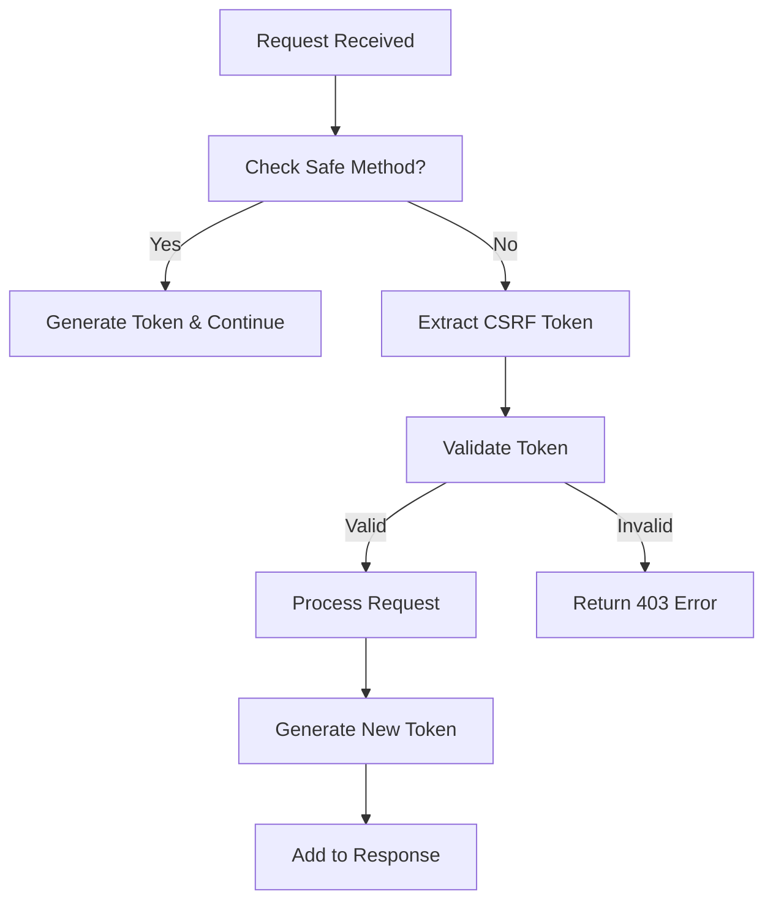

# DotMac Platform Security Standards and Guidelines

## Overview

This document outlines the comprehensive security standards and guidelines for the DotMac platform, covering secrets management, CSRF protection, environment-specific security validation, and portal-specific security configurations.

## Table of Contents

1. [Secrets Management](#secrets-management)
2. [CSRF Protection Strategy](#csrf-protection-strategy)
3. [Environment-Specific Security](#environment-specific-security)
4. [Portal Security Configurations](#portal-security-configurations)
5. [Security Middleware Stack](#security-middleware-stack)
6. [Implementation Guidelines](#implementation-guidelines)
7. [Compliance and Auditing](#compliance-and-auditing)

## Secrets Management

### OpenBao/HashiCorp Vault Requirements

#### Production Environment
- **MANDATORY**: All secrets MUST be stored in OpenBao/HashiCorp Vault
- **NO EXCEPTIONS**: Environment variables are NOT allowed for production secrets
- **Required Secrets**: JWT keys, database credentials, service API keys, encryption keys

#### Development/Testing Environment
- **PRIMARY**: OpenBao/Vault preferred when available
- **FALLBACK**: Environment variables allowed with warnings logged
- **VALIDATION**: System validates vault availability on startup

### Secret Types and Policies

```python
# Secret type classifications with specific policies
JWT_SECRET:
  - Production: Vault required
  - Rotation: 30 days
  - Min length: 64 characters
  - Complexity: Required

DATABASE_CREDENTIAL:
  - Production: Vault required
  - Rotation: 90 days
  - Min length: 32 characters
  - Complexity: Required

API_KEY:
  - Production: Vault required
  - Rotation: 60 days
  - Min length: 32 characters
  - Complexity: Optional

ENCRYPTION_KEY:
  - Production: Vault required (NO fallback)
  - Rotation: 180 days
  - Min length: 32 characters
  - Complexity: Required
```

### Implementation Standards

#### 1. Secret Retrieval
```python
from dotmac_shared.security import hardened_secret_factory

# Correct usage - production enforced
jwt_secret = await hardened_secret_factory.get_jwt_secret(tenant_id)
db_creds = await hardened_secret_factory.get_database_credentials("main", tenant_id)
```

#### 2. Environment Validation
```python
# System validates on startup
compliance = await hardened_secret_factory.validate_security_compliance()
if not compliance["compliant"]:
    # Production: FAIL startup
    # Development: LOG warnings
```

#### 3. Secret Rotation
```python
# Automated rotation support
results = await hardened_secret_factory.rotate_secrets([
    SecretType.JWT_SECRET,
    SecretType.DATABASE_CREDENTIAL
], tenant_id)
```

## CSRF Protection Strategy

### Unified CSRF Approach

The platform implements a unified CSRF strategy that handles both Server-Side Rendered (SSR) and API scenarios across all portals.

#### Core Principles

1. **Double-Submit Cookie Pattern**: Primary protection mechanism
2. **Token Binding**: Optional session/user ID binding for enhanced security
3. **Portal-Specific Configuration**: Tailored settings per portal type
4. **Hybrid Mode Support**: SSR + API in same application

### CSRF Configuration by Portal

#### Admin Portal
```python
CSRFConfig(
    mode=CSRFMode.HYBRID,
    token_delivery=CSRFTokenDelivery.BOTH,
    portal_name="admin",
    require_referer_check=True,
    cookie_samesite="Strict"
)
```

#### Customer Portal
```python
CSRFConfig(
    mode=CSRFMode.HYBRID,
    token_delivery=CSRFTokenDelivery.BOTH,
    portal_name="customer",
    require_referer_check=True,
    cookie_samesite="Lax"  # More permissive for customer flows
)
```

#### Technician Portal
```python
CSRFConfig(
    mode=CSRFMode.HYBRID,
    token_delivery=CSRFTokenDelivery.BOTH,
    portal_name="technician",
    require_referer_check=False,  # Mobile/field usage
    cookie_samesite="Lax"
)
```

### Token Delivery Methods

#### 1. Header-Based (API Requests)
```http
POST /api/v1/customers
X-CSRF-Token: timestamp:randomdata:signature
Content-Type: application/json
```

#### 2. Cookie-Based (Double-Submit)
```http
POST /portal/billing
Cookie: csrf_token=timestamp:randomdata:signature
Content-Type: application/x-www-form-urlencoded
csrf_token=timestamp:randomdata:signature
```

#### 3. Form Hidden Field (SSR)
```html
<form method="POST" action="/portal/billing">
    <input type="hidden" name="csrf_token" value="timestamp:randomdata:signature">
    <!-- form fields -->
</form>
```

### CSRF Validation Flow



## Environment-Specific Security

### Security Tier by Environment

#### Production
- **Secrets**: OpenBao/Vault REQUIRED
- **CSRF**: Strict mode enabled
- **Headers**: Full security headers
- **Rate Limiting**: Enabled with strict limits
- **Logging**: Security events only
- **TLS**: Required for all connections

#### Staging
- **Secrets**: OpenBao/Vault preferred, env fallback warned
- **CSRF**: Strict mode enabled
- **Headers**: Full security headers
- **Rate Limiting**: Enabled with relaxed limits
- **Logging**: Security + debug events
- **TLS**: Required for external connections

#### Development
- **Secrets**: OpenBao/Vault optional, env fallback allowed
- **CSRF**: Relaxed mode or disabled
- **Headers**: Minimal security headers
- **Rate Limiting**: Disabled or very relaxed
- **Logging**: All events
- **TLS**: Optional

### Environment Detection

```python
def determine_security_environment():
    # 1. Check ENVIRONMENT variable
    env_var = os.getenv("ENVIRONMENT", "development").lower()
    
    # 2. Check deployment context
    if deployment_context.mode == DeploymentMode.TENANT_CONTAINER:
        # Check if production deployment
        if env_var in ["production", "prod"]:
            return Environment.PRODUCTION
    
    # 3. Fallback to environment variable
    return Environment(env_var)
```

### Security Validation

```python
async def validate_environment_security():
    """Validate security configuration matches environment."""
    
    environment = determine_security_environment()
    
    violations = []
    
    # Validate secrets management
    if environment == Environment.PRODUCTION:
        if not vault_client_available():
            violations.append("Production requires OpenBao/Vault")
    
    # Validate CSRF settings
    if environment == Environment.PRODUCTION:
        if csrf_config.mode == CSRFMode.DISABLED:
            violations.append("Production requires CSRF protection")
    
    return {
        "environment": environment.value,
        "compliant": len(violations) == 0,
        "violations": violations
    }
```

## Portal Security Configurations

### Admin Portal Security

**Highest Security Tier** - Internal administrative access

- **Authentication**: Multi-factor required
- **CSRF**: Strict with referer checking
- **Session**: Short timeout (30 minutes)
- **Rate Limiting**: Conservative limits
- **Audit Logging**: All actions logged
- **IP Restrictions**: Optional whitelist support

```python
admin_security_config = SecurityConfig(
    csrf_enabled=True,
    csrf_strict_mode=True,
    rate_limit_requests_per_minute=60,
    session_timeout=1800,  # 30 minutes
    require_mfa=True,
    audit_all_actions=True
)
```

### Customer Portal Security

**Balanced Security** - Public-facing with customer data protection

- **Authentication**: Standard login + optional MFA
- **CSRF**: Enabled with customer-friendly settings
- **Session**: Medium timeout (2 hours)
- **Rate Limiting**: Balanced limits
- **Audit Logging**: Financial/sensitive actions
- **Public Access**: Some endpoints public

```python
customer_security_config = SecurityConfig(
    csrf_enabled=True,
    csrf_strict_mode=False,
    rate_limit_requests_per_minute=120,
    session_timeout=7200,  # 2 hours
    require_mfa=False,
    audit_financial_actions=True
)
```

### Management Portal Security

**High Security** - Multi-tenant management

- **Authentication**: Strong authentication required
- **CSRF**: Strict with tenant isolation
- **Session**: Medium timeout (1 hour)
- **Rate Limiting**: Moderate limits
- **Audit Logging**: All management actions
- **Tenant Isolation**: Strict enforcement

```python
management_security_config = SecurityConfig(
    csrf_enabled=True,
    csrf_strict_mode=True,
    rate_limit_requests_per_minute=100,
    session_timeout=3600,  # 1 hour
    require_mfa=True,
    audit_management_actions=True,
    enforce_tenant_isolation=True
)
```

### Reseller Portal Security

**Moderate Security** - Partner access with commission data

- **Authentication**: Partner authentication
- **CSRF**: Enabled with partner workflow support
- **Session**: Long timeout (4 hours)
- **Rate Limiting**: Partner-friendly limits
- **Audit Logging**: Commission-related actions
- **Multi-tenant**: Partner-scoped access

```python
reseller_security_config = SecurityConfig(
    csrf_enabled=True,
    csrf_strict_mode=False,
    rate_limit_requests_per_minute=150,
    session_timeout=14400,  # 4 hours
    require_mfa=False,
    audit_commission_actions=True
)
```

### Technician Portal Security

**Field-Optimized Security** - Mobile/field technician access

- **Authentication**: Mobile-friendly login
- **CSRF**: Relaxed for mobile/offline scenarios
- **Session**: Very long timeout (8 hours)
- **Rate Limiting**: Field-friendly limits
- **Offline Support**: Cached authentication
- **GPS Verification**: Location validation

```python
technician_security_config = SecurityConfig(
    csrf_enabled=True,
    csrf_strict_mode=False,
    csrf_require_referer=False,  # Mobile networks vary
    rate_limit_requests_per_minute=200,
    session_timeout=28800,  # 8 hours
    support_offline_mode=True,
    verify_gps_location=True
)
```

## Security Middleware Stack

### Standard Security Pipeline

```python
# Applied in this order:
1. Input Validation Middleware
2. Rate Limiting Middleware  
3. CSRF Protection Middleware
4. Security Headers Middleware
```

### Middleware Configuration

```python
def create_security_stack(portal_type: str, environment: Environment):
    # Base security configuration
    security_config = create_portal_security_config(portal_type, environment)
    
    # Create middleware stack
    middlewares = [
        InputValidationMiddleware(config=security_config),
        RateLimitingMiddleware(config=security_config),
        UnifiedCSRFMiddleware(config=create_csrf_config(portal_type)),
        SecurityHeadersMiddleware(config=security_config)
    ]
    
    return middlewares
```

### Environment-Specific Middleware

#### Production Stack
```python
production_middlewares = [
    # Comprehensive input validation
    InputValidationMiddleware(config=strict_validation_config),
    # Strict rate limiting
    RateLimitingMiddleware(config=production_rate_limits),
    # Full CSRF protection
    UnifiedCSRFMiddleware(config=strict_csrf_config),
    # Complete security headers
    SecurityHeadersMiddleware(config=production_headers),
    # Additional production-only middleware
    SecurityAuditMiddleware(),
    ThreatDetectionMiddleware()
]
```

#### Development Stack
```python
development_middlewares = [
    # Basic input validation
    InputValidationMiddleware(config=relaxed_validation_config),
    # Minimal rate limiting
    RateLimitingMiddleware(config=development_rate_limits),
    # Optional CSRF protection
    UnifiedCSRFMiddleware(config=relaxed_csrf_config),
    # Basic security headers
    SecurityHeadersMiddleware(config=development_headers)
]
```

## Implementation Guidelines

### 1. Security-First Development

#### Secure by Default
```python
# Always use secure defaults
config = SecurityConfig(
    csrf_enabled=True,        # Default enabled
    rate_limiting_enabled=True,  # Default enabled
    input_validation_enabled=True  # Default enabled
)

# Explicitly disable only when necessary
if environment == Environment.DEVELOPMENT:
    config.csrf_enabled = False  # Explicit decision
```

#### Environment-Aware Security
```python
# Check environment before applying security
security_manager = create_security_manager(environment)

# Production: Strict validation
# Development: Relaxed validation with warnings
await security_manager.initialize(deployment_context)
```

### 2. Consistent Error Handling

#### Security Error Responses
```python
# API responses
{
    "error": "CSRF token validation failed",
    "error_code": "CSRF_TOKEN_INVALID", 
    "portal": "admin"
}

# SSR responses
# Redirect to error page or show inline message
```

#### Security Logging
```python
# Structured security logging
logger.warning(
    "Security violation detected",
    violation_type="csrf_token_invalid",
    portal=portal_name,
    user_id=user_id,
    client_ip=client_ip,
    path=request_path
)
```

### 3. Testing Security Features

#### Unit Tests
```python
def test_csrf_protection():
    # Test valid token acceptance
    # Test invalid token rejection  
    # Test token expiration
    # Test token binding validation

def test_secrets_management():
    # Test production vault requirement
    # Test development fallback
    # Test environment compliance validation
```

#### Integration Tests
```python
def test_portal_security_integration():
    # Test full security stack
    # Test portal-specific configurations
    # Test environment-specific behavior
```

## Compliance and Auditing

### Security Compliance Checks

#### Automated Validation
```python
async def run_security_compliance_check():
    """Run comprehensive security compliance validation."""
    
    compliance_report = {
        "secrets_management": await validate_secrets_compliance(),
        "csrf_protection": await validate_csrf_compliance(),
        "environment_security": await validate_environment_security(),
        "portal_configurations": await validate_portal_security()
    }
    
    return compliance_report
```

#### Compliance Monitoring
- **Startup Validation**: Check compliance on application startup
- **Runtime Monitoring**: Monitor security violations
- **Periodic Audits**: Regular compliance reports
- **Alert Integration**: Security alerts for violations

### Security Metrics

#### Key Metrics to Monitor
```python
security_metrics = {
    # CSRF protection metrics
    "csrf_tokens_generated": counter,
    "csrf_tokens_validated_success": counter,
    "csrf_tokens_validated_failed": counter,
    
    # Secrets management metrics  
    "secrets_retrieved_from_vault": counter,
    "secrets_fallback_to_env": counter,
    "secrets_compliance_failures": counter,
    
    # Rate limiting metrics
    "requests_rate_limited": counter,
    "clients_blocked": counter,
    
    # General security metrics
    "security_violations_detected": counter,
    "input_validation_failures": counter
}
```

### Audit Requirements

#### Security Event Logging
- **Authentication Events**: Login, logout, MFA
- **Authorization Failures**: Access denied, permission errors
- **CSRF Violations**: Token validation failures
- **Rate Limiting**: Clients blocked, limits exceeded
- **Input Validation**: Malicious input detected
- **Configuration Changes**: Security settings modified

#### Audit Data Retention
- **Production**: 2 years minimum
- **Staging**: 6 months
- **Development**: 30 days

### Security Incident Response

#### Incident Classification
1. **Critical**: Production security breach
2. **High**: Repeated security violations
3. **Medium**: Configuration compliance failure
4. **Low**: Development security warnings

#### Response Procedures
1. **Detection**: Automated monitoring alerts
2. **Assessment**: Security team evaluation
3. **Containment**: Block malicious requests
4. **Investigation**: Root cause analysis
5. **Recovery**: Restore secure operations
6. **Documentation**: Incident report and lessons learned

## Best Practices Summary

### Development Guidelines
1. **Security by Default**: Enable security features by default
2. **Environment Awareness**: Apply appropriate security per environment
3. **Consistent Implementation**: Use shared security components
4. **Comprehensive Testing**: Test security features thoroughly
5. **Continuous Monitoring**: Monitor security metrics and compliance

### Operational Guidelines
1. **Regular Audits**: Perform periodic security audits
2. **Compliance Validation**: Validate environment compliance
3. **Incident Response**: Follow established incident procedures
4. **Documentation**: Maintain current security documentation
5. **Training**: Keep development team security-aware

### Security Configuration Management
1. **Version Control**: Track security configuration changes
2. **Environment Consistency**: Maintain consistent security across environments
3. **Change Management**: Follow change control for security modifications
4. **Backup and Recovery**: Backup security configurations
5. **Access Control**: Limit access to security configurations