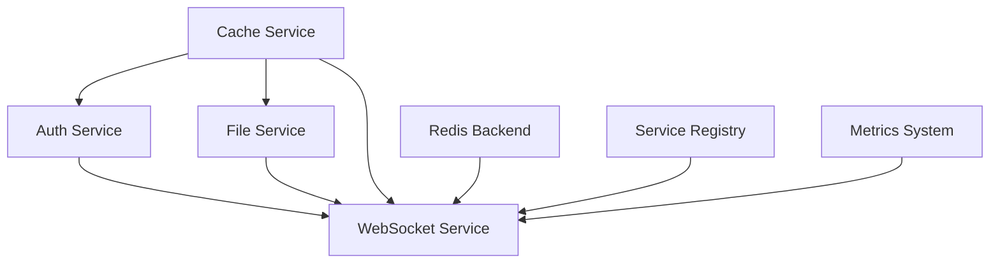
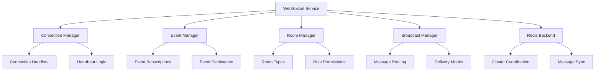

# DotMac WebSocket Service Package

A comprehensive, production-ready WebSocket service for real-time communication with multi-tenant support, horizontal scaling, and deep integration with the DotMac service ecosystem.

## 🚀 Key Features

### Core WebSocket Management

- **High-Performance Connection Management**: Handle 10,000+ concurrent connections per instance
- **Multi-Tenant Isolation**: Complete tenant separation for security and data privacy
- **Intelligent Heartbeat System**: Automatic connection monitoring and cleanup
- **Graceful Connection Lifecycle**: Proper connection establishment, maintenance, and cleanup

### Advanced Real-Time Events

- **Comprehensive Event System**: Type-safe event publishing and subscription
- **Event Filtering & Routing**: Sophisticated filtering by tenant, user, room, and metadata
- **Event Persistence & Replay**: Replay missed events for reconnected clients
- **Priority-Based Delivery**: Critical events get guaranteed delivery

### Sophisticated Room Management

- **Hierarchical Room Structure**: Support for nested and related rooms
- **Role-Based Permissions**: Granular control with owner, admin, moderator roles
- **Room Types**: Public, private, protected, temporary, and persistent rooms
- **Advanced Moderation**: Ban management, message filtering, and audit trails

### High-Performance Broadcasting

- **Intelligent Message Routing**: Optimized delivery to thousands of connections
- **Delivery Modes**: Best effort, reliable, and guaranteed delivery options
- **Batch Processing**: Efficient handling of large-scale broadcasts
- **Rate Limiting**: Prevent abuse with configurable rate limits

### Horizontal Scaling

- **Redis-Based Clustering**: Scale across multiple instances seamlessly
- **Cross-Instance Communication**: Message broadcasting between instances
- **Connection Migration**: Graceful handling of instance failures
- **Distributed State Management**: Shared connection and room state

### Service Registry Integration

- **Health Monitoring**: Comprehensive health checks for all components
- **Service Discovery**: Automatic registration with service registry
- **Metrics Collection**: Detailed performance and operational metrics
- **Dependency Management**: Proper integration with cache, auth, and file services

## 📦 Installation

```bash
pip install dotmac-websocket-service
```

Or install from source:

```bash
cd /path/to/dotmac_shared/websockets
pip install -e .
```

## 🏃 Quick Start

### Basic WebSocket Service

```python
from dotmac_shared.websockets import create_websocket_service
from dotmac_shared.websockets.core.config import WebSocketConfig

# Create configuration
config = WebSocketConfig(
    max_connections=10000,
    heartbeat_interval=30,
    redis_url="redis://localhost:6379",
    tenant_isolation=True,
    enable_persistence=True
)

# Create and start service
websocket_service = await create_websocket_service(config.to_dict())
await websocket_service.start()
```

### With All Service Dependencies

```python
from dotmac_shared.websockets import UnifiedServiceFactory

# Global configuration for all services
global_config = {
    'cache': {
        'redis_url': 'redis://localhost:6379/0',
        'tenant_isolation': True,
    },
    'auth': {
        'jwt_secret_key': 'your-secret-key',
        'session_timeout': 3600,
    },
    'files': {
        'storage_backend': 's3',
        'aws_s3_bucket': 'your-bucket',
    },
    'websocket': {
        'max_connections': 10000,
        'redis_url': 'redis://localhost:6379/1',
        'enable_persistence': True,
    }
}

# Create all services with proper dependencies
factory = UnifiedServiceFactory(global_config)
services = await factory.initialize_all_services()

# Access WebSocket service
websocket_service = services['websocket']
```

## 🔧 Core Components

### 1. WebSocket Connection Manager

```python
from dotmac_shared.websockets.core.manager import WebSocketManager
from fastapi import WebSocket

# Initialize manager
manager = WebSocketManager(config)
await manager.start()

# Connect WebSocket
@app.websocket("/ws/{tenant_id}/{user_id}")
async def websocket_endpoint(
    websocket: WebSocket,
    tenant_id: str,
    user_id: str
):
    connection_id = await manager.connect(
        websocket,
        user_id=user_id,
        tenant_id=tenant_id,
        metadata={'client': 'web', 'version': '1.0'}
    )

    try:
        while True:
            # Handle incoming messages
            data = await websocket.receive_text()
            message = json.loads(data)

            # Process message based on type
            if message['type'] == 'join_room':
                await manager.join_room(connection_id, message['room'])
            elif message['type'] == 'send_message':
                await manager.broadcast_to_room(
                    message['room'],
                    message['content']
                )

    except WebSocketDisconnect:
        await manager.disconnect(connection_id)
```

### 2. Event Publishing & Subscription

```python
from dotmac_shared.websockets.core.events import EventManager, WebSocketEvent, EventPriority

# Subscribe to events
await event_manager.subscribe(
    connection_id,
    event_types=['user_notification', 'system_alert'],
    tenant_id='tenant_123',
    priority_min=EventPriority.NORMAL
)

# Publish event
event = WebSocketEvent(
    event_type='user_notification',
    data={
        'title': 'New Message',
        'message': 'You have a new message from John',
        'action_url': '/messages/123'
    },
    user_id='user_456',
    tenant_id='tenant_123',
    priority=EventPriority.HIGH,
    expires_at=datetime.utcnow() + timedelta(hours=24)
)

result = await event_manager.publish_event(event)
print(f"Delivered to {result['delivered']} connections")
```

### 3. Advanced Room Management

```python
from dotmac_shared.websockets.patterns.rooms import RoomManager, RoomType, MemberRole

# Create room
room = await room_manager.create_room(
    room_id='support_chat_123',
    name='Customer Support - Ticket #123',
    room_type=RoomType.PRIVATE,
    creator_connection_id=connection_id,
    tenant_id='tenant_123',
    max_members=10,
    description='Customer support conversation'
)

# Join room with specific role
await room_manager.join_room(
    connection_id=customer_connection_id,
    room_id='support_chat_123',
    role=MemberRole.MEMBER
)

await room_manager.join_room(
    connection_id=agent_connection_id,
    room_id='support_chat_123',
    role=MemberRole.MODERATOR
)

# Send message to room
await room_manager.send_room_message(
    connection_id=agent_connection_id,
    room_id='support_chat_123',
    message={
        'type': 'chat_message',
        'text': 'Hello! How can I help you today?',
        'timestamp': datetime.utcnow().isoformat()
    }
)
```

### 4. High-Performance Broadcasting

```python
from dotmac_shared.websockets.patterns.broadcasting import BroadcastManager, DeliveryMode, BroadcastFilter

# Broadcast to all tenant users
result = await broadcast_manager.broadcast_to_tenant(
    tenant_id='tenant_123',
    message={
        'type': 'system_maintenance',
        'title': 'Scheduled Maintenance',
        'message': 'System will be down for maintenance at 2 AM UTC',
        'scheduled_time': '2024-01-15T02:00:00Z'
    },
    delivery_mode=DeliveryMode.GUARANTEED
)

# Filtered broadcast with custom criteria
broadcast_filter = BroadcastFilter(
    tenant_ids={'tenant_123'},
    user_metadata={'role': 'admin', 'notifications_enabled': True},
    min_connection_age=timedelta(minutes=5),
    max_connections=1000
)

result = await broadcast_manager.broadcast_filtered(
    message={
        'type': 'admin_alert',
        'severity': 'high',
        'message': 'Multiple failed login attempts detected'
    },
    broadcast_filter=broadcast_filter,
    delivery_mode=DeliveryMode.RELIABLE
)

print(f"Broadcast completed: {result.delivered}/{result.total_targets} delivered")
```

### 5. Redis Scaling Backend

```python
from dotmac_shared.websockets.scaling.redis_backend import RedisWebSocketBackend

# Configure Redis backend
redis_backend = RedisWebSocketBackend(config)
await redis_backend.start()

# Broadcast event across all instances
event = WebSocketEvent(
    event_type='global_announcement',
    data={'message': 'Welcome to our new feature!'},
    priority=EventPriority.HIGH
)

# This will be sent to all instances in the cluster
instances_reached = await redis_backend.broadcast_event(event)
print(f"Event sent to {instances_reached} instances")

# Get cluster statistics
total_connections = await redis_backend.get_connection_count()
instance_info = await redis_backend.get_instance_info()

print(f"Cluster has {total_connections} total connections across {len(instance_info)} instances")
```

## 🔧 Configuration

### Environment Variables

```bash
# WebSocket Configuration
WEBSOCKET_MAX_CONNECTIONS=10000
WEBSOCKET_HEARTBEAT_INTERVAL=30
WEBSOCKET_CONNECTION_TIMEOUT=300
WEBSOCKET_MESSAGE_TTL=300
WEBSOCKET_MAX_MESSAGE_SIZE=1048576

# Redis Configuration
REDIS_URL=redis://localhost:6379/0
REDIS_CLUSTER_NODES=redis://node1:6379,redis://node2:6379,redis://node3:6379
REDIS_MAX_CONNECTIONS=100

# Security Configuration
WEBSOCKET_CORS_ORIGINS=https://app.example.com,https://admin.example.com
WEBSOCKET_REQUIRE_AUTH=true
WEBSOCKET_TENANT_ISOLATION=true

# Feature Flags
WEBSOCKET_ENABLE_PERSISTENCE=true
WEBSOCKET_ENABLE_METRICS=true
WEBSOCKET_ENABLE_HEALTH_CHECKS=true

# Service Registry
SERVICE_REGISTRY_ENABLED=true
HEALTH_CHECK_INTERVAL=30
METRICS_PORT=9090

# Logging
LOG_LEVEL=INFO
```

### Advanced Configuration

```python
from dotmac_shared.websockets.core.config import WebSocketConfig

config = WebSocketConfig(
    # Connection management
    max_connections=10000,
    heartbeat_interval=30,
    connection_timeout=300,

    # Message handling
    message_ttl=300,
    max_message_size=1024*1024,  # 1MB
    message_queue_size=1000,

    # Redis scaling
    redis_url="redis://localhost:6379/0",
    redis_cluster_nodes=["redis://node1:6379", "redis://node2:6379"],
    redis_max_connections=100,

    # Security
    cors_origins=["https://app.example.com"],
    require_auth=True,
    tenant_isolation=True,

    # Performance
    worker_count=4,
    buffer_size=65536,

    # Features
    enable_persistence=True,
    enable_metrics=True,
    enable_health_checks=True,

    # Service integration
    service_registry_enabled=True,
    health_check_interval=30,
    metrics_port=9090
)

# Create service with custom config
websocket_service = await create_websocket_service(config.to_dict())
```

## 📊 Monitoring & Observability

### Health Checks

```python
# Service health check
health = await websocket_service.health_check()
print(f"Service Status: {health.status}")
print(f"Message: {health.message}")

# Component-specific health
for component, status in health.metadata['service_checks'].items():
    print(f"{component}: {status['status']}")
```

### Metrics Collection

```python
# Service metrics
metrics = websocket_service.get_metrics()
print(f"Active connections: {metrics['websocket_manager']['active_connections']}")
print(f"Messages sent: {metrics['websocket_manager']['messages_sent']}")
print(f"Events published: {metrics['event_manager']['events_published']}")

# Broadcasting statistics
broadcast_stats = broadcast_manager.get_broadcast_stats()
print(f"Average delivery time: {broadcast_stats['avg_delivery_time']:.3f}s")
print(f"Success rate: {broadcast_stats['delivery_success_rate']:.1f}%")

# Redis cluster metrics
redis_metrics = redis_backend.get_metrics()
print(f"Cluster instances: {redis_metrics['registered_instances']}")
print(f"Messages published: {redis_metrics['messages_published']}")
```

### Prometheus Integration

```python
# Enable Prometheus metrics
from prometheus_client import start_http_server, Counter, Gauge, Histogram

# Start metrics server
start_http_server(config.metrics_port)

# Track custom metrics
websocket_connections = Gauge('websocket_connections_total', 'Total WebSocket connections')
message_processing_time = Histogram('websocket_message_processing_seconds', 'Message processing time')

# Update metrics
websocket_connections.set(len(websocket_manager.active_connections))
```

## 🧪 Testing

### Unit Tests

```bash
# Run all tests
pytest tests/

# Run with coverage
pytest --cov=dotmac_shared.websockets tests/

# Run integration tests only
pytest -m integration tests/

# Run performance tests
pytest -m performance tests/
```

### Integration Testing

```python
import pytest
from dotmac_shared.websockets import create_websocket_service

@pytest.mark.asyncio
async def test_websocket_service_integration():
    # Create service with test configuration
    config = WebSocketConfig.for_testing()
    service = await create_websocket_service(config.to_dict())

    try:
        await service.start()

        # Test service health
        health = await service.health_check()
        assert health.status == ServiceStatus.READY

        # Test basic functionality
        # ... test implementation

    finally:
        await service.stop()
```

## 🏗 Architecture

### Service Dependencies



### WebSocket Service Components



## 🚀 Production Deployment

### Docker Configuration

```dockerfile
FROM python:3.11-slim

# Install dependencies
COPY requirements.txt .
RUN pip install -r requirements.txt

# Copy application
COPY . /app
WORKDIR /app

# Expose ports
EXPOSE 8000 9090

# Health check
HEALTHCHECK --interval=30s --timeout=10s --start-period=40s --retries=3 \
    CMD curl -f http://localhost:9090/health || exit 1

# Start service
CMD ["uvicorn", "main:app", "--host", "0.0.0.0", "--port", "8000"]
```

### Kubernetes Deployment

```yaml
apiVersion: apps/v1
kind: Deployment
metadata:
  name: websocket-service
spec:
  replicas: 3
  selector:
    matchLabels:
      app: websocket-service
  template:
    metadata:
      labels:
        app: websocket-service
    spec:
      containers:
      - name: websocket-service
        image: dotmac/websocket-service:latest
        ports:
        - containerPort: 8000
        - containerPort: 9090
        env:
        - name: REDIS_URL
          value: "redis://redis-cluster:6379"
        - name: WEBSOCKET_MAX_CONNECTIONS
          value: "10000"
        resources:
          requests:
            cpu: 500m
            memory: 512Mi
          limits:
            cpu: 2000m
            memory: 2Gi
        readinessProbe:
          httpGet:
            path: /health
            port: 9090
          initialDelaySeconds: 30
          periodSeconds: 10
        livenessProbe:
          httpGet:
            path: /health
            port: 9090
          initialDelaySeconds: 60
          periodSeconds: 30
```

### Load Balancer Configuration

```yaml
apiVersion: v1
kind: Service
metadata:
  name: websocket-service
  annotations:
    nginx.ingress.kubernetes.io/proxy-read-timeout: "3600"
    nginx.ingress.kubernetes.io/proxy-send-timeout: "3600"
spec:
  selector:
    app: websocket-service
  ports:
  - name: websocket
    port: 8000
    targetPort: 8000
  - name: metrics
    port: 9090
    targetPort: 9090
  type: LoadBalancer
```

## 🤝 Contributing

1. Fork the repository
2. Create a feature branch
3. Make your changes with tests
4. Ensure all tests pass
5. Submit a pull request

### Development Setup

```bash
# Clone repository
git clone https://github.com/dotmac-framework/websocket-service
cd websocket-service

# Create virtual environment
python -m venv venv
source venv/bin/activate  # Linux/Mac
# or
venv\Scripts\activate  # Windows

# Install development dependencies
pip install -e .[dev,testing,production]

# Install pre-commit hooks
pre-commit install

# Run tests
pytest
```

## 📝 License

MIT License - see [LICENSE](LICENSE) file for details.

## 🔗 Links

- [Documentation](https://docs.dotmac.dev/websocket)
- [API Reference](https://docs.dotmac.dev/websocket/api)
- [GitHub Repository](https://github.com/dotmac-framework/websocket-service)
- [Issue Tracker](https://github.com/dotmac-framework/websocket-service/issues)
- [PyPI Package](https://pypi.org/project/dotmac-websocket-service/)

## 💬 Support

- GitHub Issues: [Report bugs or request features](https://github.com/dotmac-framework/websocket-service/issues)
- Documentation: [Comprehensive guides and API reference](https://docs.dotmac.dev/websocket)
- Email: [support@dotmac.dev](mailto:support@dotmac.dev)

---

**Built with ❤️ by the DotMac Framework Team**

This WebSocket service is the culmination of production experience running large-scale real-time applications. It provides enterprise-grade reliability, security, and performance while maintaining developer-friendly APIs and comprehensive documentation.
